## Index(인덱스)
데이터의 레코드에 빠르게 접근하기 위해 <키 값, 주소> 쌍으로 구성된 데이터 구조 데이터가 저장된 물리적 구조와 밀접한 관계를 가지고 있으며 인덱스를 통해 테이블의 레코드에 대해 빠르게 액세스를 할 수 있다
 
#### Table, Row, Column, Key

  

    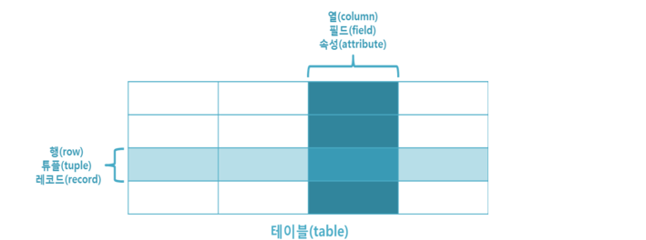

 
 
|파일 시스템|데이터베이스모델링|관계형 데이터베이스|
|---|---|---|
|파일(File)|	엔티티(Entity)|	테이블(Table)|
|레코드(Record)|	튜플(tuple)|	행(Row)|
|키(Key)|	식별자(Identifier)|	기본키(Primary Key), Unique|
|필드(Field)|	속성(Attribute)|	열(Column)|

- 테이블(Table) : 행(Row)과 열(Column)로 이루어진 데이터 집합을 의미. (=릴레이션(Relation))
- 행(Row) : 관계된 데이터의 묶음. 튜플(Tuple) 또는 레코드(Record)라고도 불림
- 열(Column) : 가장 작은 단위의 데이터를 의미. 필드(Field) 또는 속성(Attribute)라고도 불림
- 키(Key) : 테이블에서 행의 식별자로 이용되는 식별자

### 엔티티(Entity) : 현실 세계에 존재하는 객체를 데이터베이스 상에 표현하기 위해 사용하는 추상적인 개념.

예시) 학생을 관리하기 위해 사용하는 데이터베이스에서 학번, 이름, 나이, 학과 등등의 정보들을 통해 'Student'라는 Entity를 표현할 수 있습니다. 
 
#### 유일성과 최소성
- 유일성 : 하나의 키로 어떠한 행을 바로 찾아낼 수 있는 성질
(ex: 주민등록번호)

- 최소성 : 레코드를 식별하는 데 꼭 필요한 속성들로만 구성되어 있는 성질
(ex: [주민등록번호 + 학번]은 최소성을 만족하지 않음. Because, 주민등록번호로만 행을 구분할 수 있기 때문!)
 
#### Key의 종류
- 슈퍼 키(Super Key) : 테이블의 행을 고유하게 식별할 수 있는 속성 또는 속성의 집합
(유일성은 만족하지만 최소성은 만족하지 않음)
- 복합 키(Composite Key) : 2개 이상의 속성(Attribute)을 사용한 키
- 후보 키(Candidate Key) : 유일성과 최소성을 만족하는 키 (각 튜플을 유일하게 식별할 수 있는 속성의 집합)
- 기본 키(Primary Key) : 후보 키에서 선택된 키 (null 값 혹은 중복 값으로 가질 수 없음)
- 대체 키(Surrogate Key) : 후보 키에서 선택되지 않은 키
- 외래 키(Foreign Key) : 서로 다른 테이블 간의 관계를 맺어주는 키 (다른 테이블의 기본키를 참조)

그림으로 표현하면, 슈퍼키 안 후보키 안 (기본키 or 대체키)

#### Degre(차수)

하나의 Realtion 내에 있는 Attribute의 수
(예를 들어 어떠한 테이블의 열이 고객, 이름, 전화번호로 구성되어있다면 그 테이블의 차수는 3!)
 
#### Domain(도메인)

Relation에서 각각의 속성에 채워질 수 있는 데이터의 타입과 길이를 의미
(성별이라는 필드에는 남, 여 외에 다른 값이 들어갈 수 없음. 나이 또한 숫자 값만 가능)
 
#### Schema(스키마)

데이터베이스를 구성하는 데이터 객체, 속성, 레코드 간의 관계 등등,
데이터베이스의 골격 구조를 나타내는 일종의 도면.

스키마는 데이터베이스의 엔티티와 그 엔티티들 간의 관계를 정의하고 어떠한 타입의 데이터가 어느 위치에 적재되어야 하는지, 또 다른 테이블이나 엔티티와 어떠한 관계를 맺는지 정의.
 

#### Schema의 3 계층
  
 

    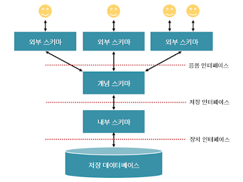

 

 

    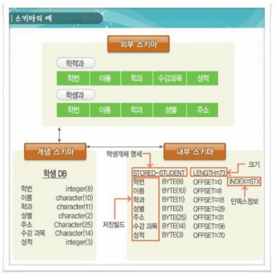

 

- 외부 스키마 (=서브 스키마=사용자 뷰(가상 테이블))

사용자 입장에서 정의한 데이터베이스의 논리 구조.

데이터들을 어떠한 형식, 구조, 화면을 통해 사용자에게 보여줄 것인가에 대한 명세를 뜻하며
하나의 데이터베이스에는 여러 개의 외부 스키마가 있을 수 있음
- 개념 스키마 (=전체적인 뷰)

데이터베이스의 전체적인 논리적 구조.

사용자가 필요로 하는 데이터를 통합한 조직 전체의 데이터베이스로 하나만 존재하며
객체 간의 관계와 제약조건, 데이터베이스의 접근 권한, 보안 및 무결성 규칙에 관한 명세를 뜻함
- 내부 스키마

물리적 저장장치의 입장에서 본 데이터베이스 구조.

데이터베이스에 저장될 레코드의 물리적인 구조, 저장 데이터 항목의 표현 방법, 내부 레코드의 물리적 순서 등을 나타냄
 
### Transaction(트랜잭션)
- 데이터베이스 내에서 한꺼번에 모두 수행되어야 할 연산들의 집합
- 하나의 작업 처리를 위한 논리적 작업 단위
 
#### 데이터베이스 언어 종류
- DML(Data Multipulation Language) - 데이터 조작어

데이터베이스 내의 자료를 검색, 삽입, 갱신, 삭제하기 위해 사용되는 언어
(주요 명령어 - INSERT, UPDATE, DELETE, SELECT 등)
- DDL(Data Definition Language) - 데이터 정의어

데이터베이스 구조를 정의하는 언어. 데이터를 생성, 수정, 삭제하는 등 전체 골격을 결정하는 역할
(주요 명령어 - CREATE, ALTER, DROP)
- DCL(Data Control Language) - 데이터 제어어

데이터베이스에 저장된 데이터 관리를 위해 데이터의 보안성, 무결성 유지 등을 제어하는 언어
(주요 명령어 - COMMIT, ROLLBACK, GRANT, REVOKE 등)
 
#### Integrity(무결성)
정보에 결점이 없도록 유지하는 성질

데이터베이스 내에 저장되는 데이터 값들이 항상 일관성을 갖고 데이터의 유효성(유효한 값만 입력), 정확성(중복X), 안정성(=일관성)을 유지할 수 있도록 하는 제약조건을 두는 데이터베이스의 특성
 
#### 원자값
더 이상 분해되지 않는 최소 구성의 단위
 
 #### Anomaly(이상 현상)
테이블 내에서 데이터 중복성에 의해 발생되는 데이터 불일치 현상
- 갱신 이상(Modification Anomaly)

중복 데이터 중 일부만 수정되어 데이터 불일치가 일어나는 현상

- 삽입 이상(Insertion Anomaly)

중복된 데이터 중 일부만 수정되어 데이터의 모순이 일어난 현상

- 삭제 이상(Deletion Anomaly)

특정 정보 삭제 시 다른 정보까지 삭제되어버리는 현상

 #### Normalization(정규화)
논리적 설계단계에서 발생할 수 있는 종속으로 인한 이상 현상의 문제점을 해결하기 위해,
속성들 간의 종속 관계를 분석하여 여러 개의 릴레이션으로 분해하는 과정

 
#### 데이터베이스
 - 특정 기업이나 조직 또는 개인이 필요에 의해 논리적으로 연관된 데이터를 모아 일정한 형태로 저장해 놓은 것

 
 #### DBMS(Data Base Management System)
 -  데이터베이스 관리 프로그램
 -  DBMS를 이용하여 데이터 조회, 입력, 수정, 삭제 등의 기능 제공
 -  ex) 오라클, DB2, MS-SQL 등

 
####  데이터베이스 특징
 -  통합된 데이터 : 데이터를 통합하는 개념
 -  저장된 데이터 : 저장장치에 저장된 데이터
 -  운영 데이터 : 조직의 목적으로 사용하거나 업무를 위한 검색할 목적으로 저장된 데이터
 -  공용 데이터 : 공동으로 사용하는 데이터
 
####  DBMS 장점
 - 데이터 중복(Redundancy)의 최소화
 - 데이터 공유(Sharing)
 - 일관성(Consistency) 유지
 - 무결성(Consistency) 유지
 - 보안(Security) 보장
 - 표준화(Standardization) 용이
 - 전체 데이터 요구의 조정
 
 #### 관계형 데이터베이스 특징
 - 2차원 테이블로 표현
 - 데이터 무결성
 - 데이터 처리를 위해 SQL 사용
 - 한 번에 레코드를 처리하는 것이 아니라 집합으로 처리
 

 #### 테이블
 - 실질적으로 자료가 저장되는 곳
 - 행(Row)과 컬럼(Column)으로 구성된 2차원 구조를 가진 데이터의 저장 장소
 - 특정한 목적과 성격에 의해 생성되는 집합체
 - 사용자의 접근이 가능한 모든 데이터 보유
 
  

    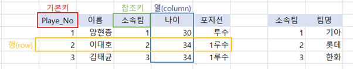

 
 테이블 예시
 
 #### 기본키(Primary Key)
 - 한 릴레이션에서 특정 튜플(행, row)을 유일하게 구별할 수 있는 속성
 - 제약조건 UNIQUE + NOT NULL
 
####  외래키(Foreign Key)
 - 참조키
 - 릴레이션 간 참조 관계를 표현

 

####  SQL(Structured Query Language)
 - 관계형 데이터베이스에서 데이터 조작과 데이터 정의를 하기 위해 사용하는 언어
 - 사용자는 데이터베이스에 자료를 입력/조회/수정/삭제 하기 위해 SQL 사용
 

 #### SQL 특징
 - 배우고 사용하기 쉬운 언어
 - 절차적인 언어가 아닌 선언적 언어
 - DBMS의 종류에 얽매이지 않고 사용 가능
 

####  DML 데이터 조작어
 - SELECT
 - INSERT
 - UPDATE
 - DELETE
 - MERGE : 데이터가 테이블에 존재하지 않으면 INSERT, 존재하면 UPDATE를 수행
 
####  DDL 데이터 정의어
 - CREATE
 - ALTER
 - DROP
 - RENAME
 - TRUNCATE
 
 #### TCL (Tool Command language)스크립트 언어 (관례상 Tcl)
 - COMMIT
 - ROLLBACK
 
####  DCL 데이터 제어어
 - GRANT
 - REVOKE
 
#### ERD
ERD(Entity relationship diagram) 은 데이터베이스를 구축할 때 가장 기초적인 뼈대 역할을 하며 릴레이션간의 관계들을 정의

#### <중요성>
-	시스템의 요구 사항을 기반으로 작성되고, 따라서 데이터베이스를 구축할 때 ERD를 기반으로 하게 된다
-	이후 디버깅이나 프로세스 재설계 등이 필요한 경우에 설계도 역할을 담당
-	그러나 ERD는 관계형 구조로 표현할 수 있어 데이터를 구성하는 데 유용할 수 있지만, 비정형 데이터를 표현하는데 한계가 있다는 단점이 있다

※ 비정형 데이터: 비구조화 데이터를 말하며, 미리 정의된 데이터 모델이 없거나 미리 정의된 방식으로 정리되지 않은 정보를 말한다.

#### 정규화 과정
정규화 과정은 릴레이션 간의 잘못된 종속관계로 인해 데이터베이스 이상현상이 일어나서 이를 해결하거나, 저장 공간을 효율적으로 사용하기 위해 릴레이션을 여러 개로 분리하는 과정이다.

***릴레이션이란 관계형 데이터베이스에서 정보를 구분하여 저장하는 기본 단위이다. 

**데이터 이상 현상이란,
회원이 한 개의 등급을 가져야 하는데 세개의 등급을 갖거나,
데이터 삽입 시, 하나의 필드값이 NULL이 되면 안 돼서 삽입하기 어려운 현상을 말한다.

정규화 과정은 정규형 원칙을 기반으로 정규형을 만들어 가는 과정을 의미한다.

기본 정규형인 제1, 제2, 제3, 보이스/코드(BCNF)와
고급 정규형인 제4, 제5 정규형이 있다.

#### 정규형 원칙
같은 의미를 표현하지만, 자료의 중복성은 감소시키고, 더 좋은 구조로, 독립적인 관계는 별개의 릴레이션으로, 각각의 릴레이션은 독립적인 표현이 가능해야 하는 것을 말한다

#### 제1 정규형
릴레이션의 모든 도메인이 더 이상 분해될 수 없는 원자 값만으로 구성되어야 한다 

릴레이션의 속성 값 중에서 한 개의 기본키에 대해 두 개 이상의 값을 가지는 반복 집합이 있어서는 안 된다.
 

    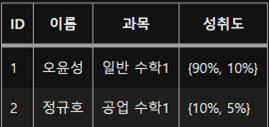

  
성취도에 반복 집합이 있기 때문에 제 1 정규형 조건에 위배된다
이를 수정하면,

 

    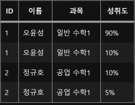

  
대부분 정규형에는 이상현상이 존재한다.

제 1정규형에는 아래와 같은 이상 현상이 존재한다.

#### 삽입 이상: 불필요한 정보가 필요함
#### 삭제 이상: 불필요한 정보까지 삭제됨
#### 갱신 이상: 불필요한 정보까지 갱신 필요

이러한 이상현상이 발생하는 이유는, 기본키가 아닌 속성들이 기본키에 완전 함수 종속되지 못하고 부분 함수 종속되어 있기 때문입니다. 즉, 기본키의 일부 속성에만 의존하고 있다는 의미입니다.

#### 제 2 정규형
: 릴레이션이 제1정규형이며, 부분함수의 종속성을 제거한 형태이다.
부분함수의 종속성 제거란 기본키가 아닌 모든 속성이 기본키에 완전 함수 종속적인 것을 말한다.

제 1 정규형이면서, 기본키에 속하지 않은 속성 모두가 기본키에 완전 함수 종속인 정규형
 

    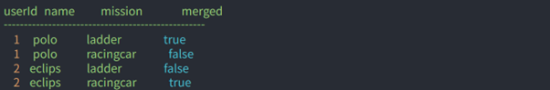

  
merged의 결과는 name + mission에 종속적이다. (위 테이블에선 userId + mission 도 가능)

1번 row를 문장으로 펼쳐보면,
userId가 1번인 폴로의 사다리 미션은 merge 되었다. 라는 문장으로 풀어쓸 수 있는데,
이 문장은 두개의 문장으로 쪼갤 수 있다.

폴로의 유저 아이디는 1번이다.

폴로의 사다리 미션은 merge 되었다. (또는 1번의 사다리 미션은 merge 되었다.)
정리해보면 …
 

    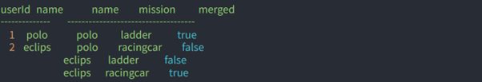

  
2 정규형에도 이상현상이 존재
: 여전히 이상현상이 발생하는 이유는 '이행적 함수 종속성' 때문.
이행적 함수 종속성은 속성이 A->B이고, B->C이면서 A->C의 관계가 있는 것을 말한다.
 
 

    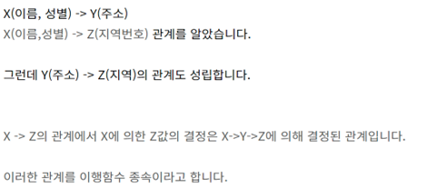

 

#### 제 3 정규형
: 제 2 정규형이면서, 이행적 함수 종속성을 제거한 정규형

- 기본키에 속하지 않은 모든 속성이 기본키에 이행적 함수 종속이 아닐 때
기본키 이외의 속성이 그 외 다른 속성을 결정할 수 없다
 

    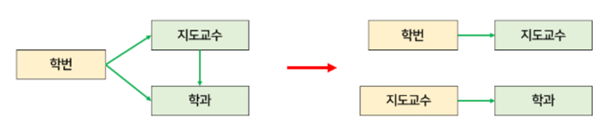

  
 

    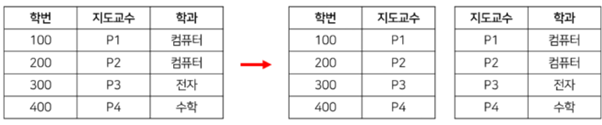

   

#### BCNF, 보이스/코드 정규형
: 제 3 정규형이고, 결정자가 후보키가 아닌 함수 종속 관계를 제거하여 릴레이션의 함수 종속 관계에서 모든 결정자가 후보키인 상태

#### 후보키?
함수 종속 관계에서 특정 종속자를 결정 짓는 요소

A->B 일때 A는 결정자, B는 종속자이다.

#### 결정자?
주어진 릴레이션에서 다른 속성을 고유하게 결정하는 하나 이상의 속성
 

    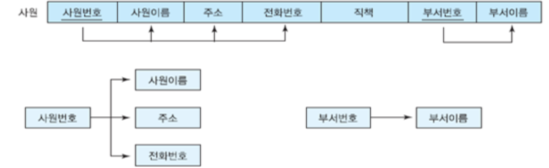

  
 
사원번호와 부서번호가 결정자이다

#### 제 4 정규형
: BCNF를 만족하고 다치 종속이 없어야 한다
여기서 다치 종속이란 다음과 같은 조건들을 만족할 때를 뜻한다.
1. A->B 일 때 하나의 A값에 여러 개의 B값이 존재하면 다치 종속성을 가진다고 하고 A↠B라고 표시한다
2. 최소 3개의 칼럼이 존재한다.
3. R(A, B, C)가 있을 때 A와 B 사이에 다치 종속성이 있을 때 B와 C가 독립적이다.
 
 

    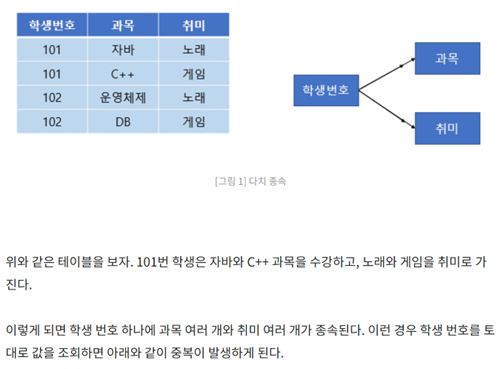

  
 

    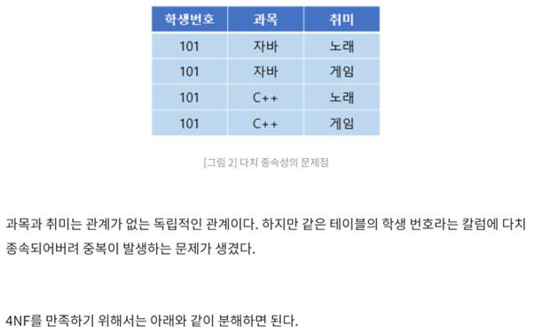

  
 

    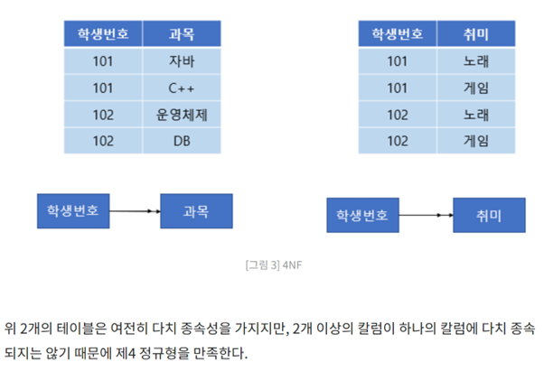

  
 
#### 제 5 정규형
: 중복을 제거하기 위해 분해할 수 있을 만큼 전부 분해하는 것
1. 4NF를 만족해야 한다.
2. 조인 종속(Join dependency)이 없어야 한다.
3. 조인 연산을 했을 때 손실이 없어야 한다.
조인 종속은 다치 종속의 좀 더 일반화된 형태이다. 만약 하나의 릴레이션을 여러 개의 릴레이션으로 무손실 분해했다가 다시 결합할 수 있다면 조인 종속이라고 한다.
 

    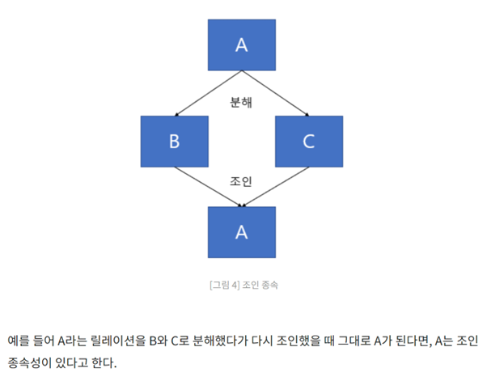

   
제 5 정규형 추가 설명 자료 : https://www.studytonight.com/dbms/fifth-normal-form.php

 
#### 트랜잭션이란?

은행 ATM이나 데이터베이스 등의 시스템에서 사용되는 더 이상 쪼갤 수 없는 업무 처리의 최소 단위이다.

데이터베이스에 접근하는 방법은 쿼리이므로, 여러 개의 쿼리들을 하나로 묶는 단위라고도 볼 수 있다.

 

    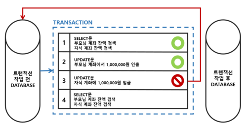

   
위 그림은 부모님이 자식에게 100만원을 입금해주는 과정이다.

부모님 계좌 100만원 인출 성공 -> 자식 계좌 100만원 입금 실패 = 이슈 발생

이 경우, 부모님 계좌에 100만원 입금 혹은 자식 계좌에 100만원을 재입금 처리가 필요하다.

하지만, 이런 방식에선 안전성을 보장하기 어렵고, 오류가 발생할 때의 대처가 쉽지 않다.

이에 방지책으로 1번부터 4번까지의 과정들이 모두 수행되어야 진행을 하는 것이 트랜잭션이다.

#### 트랜잭션의 특징 ( ACID 특징 )
-	원자성 (atomicity)
트랜잭션과 관련된 일이 모두 수행되었거나 되지 않았음을 보장하는 특징
트랜잭션 단위로 여러 로직을 묶을 때 외부 API 호출이 있는 것을 권장하지 않고, 있다면 롤백이 일어났을 때 어떻게 해야할 것인지에 대한 해결 방법이 있어야 한다.

 

    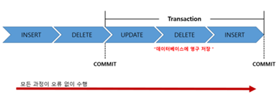

  
 
- 커밋 (commit) : 여러 쿼리가 성공적으로 처리되었다고 확정하는 명령어, 트랜잭션 단위로 수행되며, 변경된 내용이 모두 영구적으로 저장된다. (커밋 수행 == 트랜잭션 하나 수행)

 

    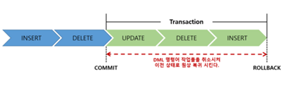

  
 
- 롤백(rollback) : 트랜잭션으로 처리한 하나의 묶음 과정을 일어나기 전으로 돌리는 일(취소)을 말한다. 보통 에러나 이슈 등으로 인하여 실행한다.

- 트랜잭션 전파 : 트랜잭션을 수행할 때 커넥션 객체를 넘겨 수행해야 하는데, 귀찮고 어려우므로 여러 트랜잭션 관련 메서드의 호출을 하나의 트랜잭션에 묶이도록 하는 것

// Spring의 경우 @Transactional 어노테이션을 이용하여 트랜잭션 전파를 이용

// django의 경우 @transaction.atomic 데코레이터를 이용하여 트랜잭션 전파를 이용

(혹은 with 명령어와 savepoint를 직접 지정해 설정도 가능하다)

 

    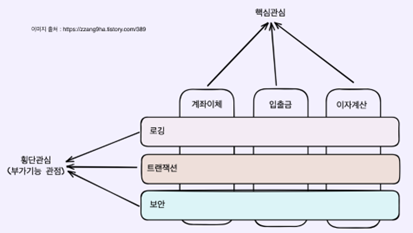

  

위 그림처럼 AOP(관점 지향 프로그래밍) 방식을 이용해 횡단관심을 따로 분리하여 관리

-	일관성 (consistency)

허용된 방식으로만 데이터를 변경해야 하는 것

Ex) 권근열 계좌에 1000만원이 있고, 이준혁 계좌에 0원이 있다. 이 때, 이준혁이 권근열에게 500만원 입금을 할 수 있는가?

-	격리성 (isolation)

트랜잭션 수행 시 서로 끼어들지 못하는 것을 말한다. 복수의 병렬 트랜잭션은 서로 격리되어 마치 순차적으로 실행되는 것처럼 작동되어야 하고, 데이터베이스는 여러 사용자가 같은 데이터에 접근할 수 있어야 한다. 여러 개의 격리 수준으로 나뉜다.

 

    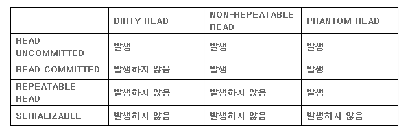

  

READ UNCOMMITTED에 가까울수록 동시성은 강해지지만 격리성이 약해진다.

Dirty Read : 아직 커밋되지 않은 다른 트랜잭션의 데이터를 읽는 것

Non-repeatable Read : 다른 트랜잭션이 커밋한 데이터를 읽는 것, 한 트랜잭션에서 같은 쿼리로 2번 이상 조회했을 때 결과가 다른 상황 ( 데이터의 수정 및 삭제 )

Phantom Read : 다른 트랜잭션이 커밋한 데이터가 있어도 자신의 트랜잭션에서 읽었던 데이터만 사용하는 것, 한 트랜잭션에서 같은 쿼리를 2번 이상 조회했을 때 없던 결과가 조회되는 상황 ( 데이터의 삽입 )

#### Read Uncommitted
어떤 트랜잭션의 내용이 커밋이나 롤백과 상관없이 다른 트랜잭션에서 조회가 가능

 

    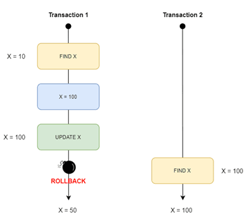

   

#### Read Committed
한 트랜잭션의 변경내용이 커밋되어야만 다른 트랜잭션에서 조회 가능 ( RDBMS,  대부분의 관계형 데이터베이스의 기본값 )

 

    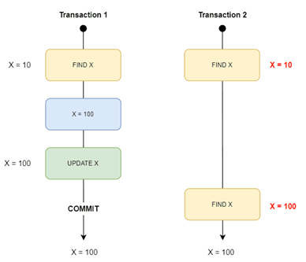

   

#### Repeatable Read
트랜잭션이 시작되기 전에 커밋된 내용에 대해서만 조회가 가능, MySQL에서 기본 사용

 

    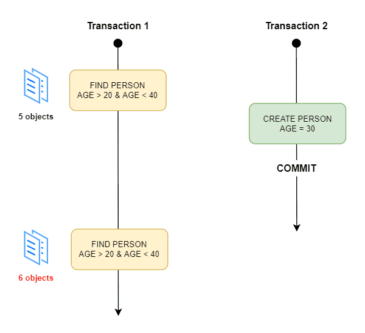

   

#### SERIALIZABLES
가장 단순하고 엄격한 격리지만 성능 측면에서 동시 처리 성능이 낮다. 거의 사용 X

-	지속성 (durability)
성공적으로 수행된 트랜잭션이 영원히 반영되어야 하는 것이다. 데이터베이스에 시스템 장애가 발생해도 원래 상태로 복구하는 회복 기능이 있어야 하며, 이를 위해 체크섬, 저널링, 롤백 등의 기능을 제공한다.

- 체크섬 : 중복 검사의 한 형태로, 오류 정정을 통해 송신된 자료의 무결성을 보호하는 단순한 방법

- 저널링 : 파일 시스템 또는 데이터베이스 시스템에 변경 사항을 커밋하기 전에 로깅하는 것, 트랜잭션 등 변경 사항에 대한 로그를 남기는 것

