# RDBMS (Relational DataBase Management System)
## 관계형 데이터 베이스 관리 시스템
관계형 데이터 모델은 데이터 간의 상관관계에서 개체간의 관계를 2차원의 테이블 형태로 표현

### 관계형 데이터베이스를 SQL이라고 부르는 이유는?
-	관계형 데이터베이스는 데이터베이스의 한 유형을 말한다.
-	하나의 데이터 조직화 컨셉이다.
-	RDBMS 솔루션까지 묶어서 관계형 데이터베이스라고도 한다. (즉, ‘MySQL은 관계형 데이터베이스다.’ 라고도 말한다.)
-	이러한 관계형 데이터베이스에서는 모두 초창기 관계 데이터베이스 시스템을 위해 만들어진 SQL이라는 언어를 사용 하므로(문법이 조금씩 다른 부분도 있다.) 관계형 데이터베이스를 이퀄 SQL이라고 부르는 것이다.
-	즉, SQL은 관계형 데이터베이스 전용 프로그래밍 언어이다.
-	RDBMS 프로그램에서 기본적인 SQL을 지원한다.
-	마치 각기 다른 브라우저가 있지만 JavaScript 표준이 있는 것처럼 말이다.
-	그래서 결론은 관계형 데이터베이스를 SQL이라고도 부른다.
### 특징
-	분류, 정렬, 탐색 속도가 빠르다.
-	데이터 무결성을 보장
-	부하분산이 잘 되지 않는다.
### 장점
-	범용적이며 고성능
-	데이터의 일관성을 보증할 수 있음
-	한번에 이뤄져야 하는 작업의 경우 데이터 불일치 상황 방지(데이터 무결성 보장) -> 데이터베이스 설계 시 이미 불필요한 중복이 삭제됨
-	정규화를 전제로 하고 있기 때문에 업데이트 시 비용이 적음(동일 컬럼은 동일 장소에 존재)
-	복잡한 형태의 쿼리도 가능(Join 등)
### 단점
-	대량의 데이터 입력 처리 어려움
-	테이블의 인덱스 생성이나 스키마 변경 어려움

### 어떤 상황에 사용하는가?
-	관계를 맺고 있는 데이터가 자주 변경(수정)되는 어플리케이션일 경우 (내용)
-	변경될 여지가 없고, 명확한 스키마가 사용자와 데이터에게 중요한 경우 (틀)
### 모델링 과정
-	저장하고자 하는 도메인 모델 분석
-	개체 간의 관계 식별
-	테이블 추출
-	테이블을 이용한 쿼리 구현
### 관계형 데이터 베이스 관리 시스템
-	MySQL, Oracle, SQLite, MariaDB, PostgresSQL

 

    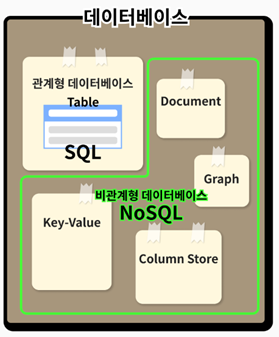

 

## NoSQL
기존 RDBMS의 단점을 보완해주는 형태
### 특징
-	페타바이트급의 대용량 데이터를 저장
-	join연산은 대부분 불가능
-	분산형 구조를 통해 데이터를 여러 대의 서버에 분산해 저장하고, 분산 시에 데이터를 상호 복제해 특정 서버에 장애가 발생했을 때에도 데이터 유실이나 서비스 중지가 없는 형태
-	컬럼은 각기 다른 이름과 다른 데이터 타입을 가질 수 있다.
### 유형
-	Key-Value 타입
    - 속성을 Key-Value의 쌍으로 나타내는 데이터를 배열의 형태로 저장한다.
    - 여기서 Key는 속성 이름을 뜻하고, Value는 속성에 연결된 데이터 값을 의미한다.
    - 	Redis, Dynamo 등이 대표적인 Key-Value형식의 데이터베이스이다.
-	문서형(Document) 데이터베이스
    - 데이터를 테이블이 아닌 문서처럼 저장하는 데이터베이스를 의미한다.
    - 많은 문서형 데이터베이스에서 JSON과 유사한 형식의 데이터를 문서화하여 저장한다.
    - 각각의 문서는 하나의 속성에 대한 데이터를 가지고 있고, 컬렉션이라고 하는 그룹으로 묶어서 관리한다.
    - 대표적인 문서형 데이터베이스에는 MongoDB 가 있다.
-	Wide-Column Store 데이터베이스
    - 데이터베이스의 열(column)에 대한 데이터를 집중적으로 관리하는 데이터베이스이다.
    - 각 열에는 key-value 형식으로 데이터가 저장되고, 컬럼 패밀리(column families)라고 하는 열의 집합체 단위로 데이터를 처리할 수 있다.
    - 하나의 행에 많은 열을 포함할 수 있어서 유연성이 높다.
    - 데이터 처리에 필요한 열을 유연하게 선택할 수 있다는 점에서 규모가 큰 데이터 분석에 주로 사용되는 데이터베이스 형식이다.
    - 대표적인 wide-column 데이터베이스에는 Cassandra, HBase 가 있다.
-	그래프(Graph) 데이터베이스
    - 자료구조의 그래프와 비슷한 형식으로 데이터 간의 관계를 구성하는 데이터베이스이다.
    - 노드(nodes)에 속성별(entities)로 데이터를 저장한다.
    - 각 노드간 관계는 선(edge)으로 표현한다.
    - 대표적인 그래프 데이터베이스에는 Neo4J, InfiniteGraph 가 있다.
### 장점
-	특정 용도로 특화되어 있음
-	데이터 분산에 용이
-	유연한 데이터 모델
-	수평적 확장
-	빠른 쿼리
### 단점
-	각 솔루션의 특징을 이해할 필요가 있음
-	버그가 상대적으로 많이 있음
-	데이터 중복으로 인한 수정 작업의 번거로움
### 어떤 상황에 사용하는가?
-	데이터에 대한 캐시가 필요한 경우
-	배열 형식의 데이터를 고속으로 처리할 필요가 있는 경우
-	어쨌든 모든 데이터를 저장하고 싶은 경우(막대한 양의 데이터를 다뤄야하는 경우)
-	읽기 처리를 자주하지만, 데이터를 자주 변경하지 않는 경우

### 데이터 모델링 과정
-	도메인 모델 분석
-	쿼리 결과 도출
-	테이블(데이터 저장 모델) 설계

### SQL NoSQL 차이점
-	SQL 데이터베이스는 관계형 데이터베이스입니다. 즉, 데이터가 테이블로 구성되고 각 테이블에는 특정 구조가 있습니다. 테이블은 관계를 통해 서로 연결됩니다. 따라서 SQL 데이터베이스는 특정 방식으로 액세스해야 하는 데이터를 저장하는 데 매우 강력합니다.
-	NoSQL 데이터베이스는 비관계형 데이터베이스입니다. 이는 데이터가 문서 모음에 저장됨을 의미합니다. 이러한 문서에는 특별한 구조가 없으며 관계를 통해 서로 연결되지 않습니다. 따라서 특정 방식으로 액세스할 필요가 없는 데이터를 저장하는 데 더 적합합니다.
-	SQL과 NoSQL 데이터베이스의 한 가지 주요 차이점은 확장 방식입니다. SQL 데이터베이스는 수직 확장 접근 방식을 사용합니다. 즉, 서버에 더 많은 기능을 추가하여 확장합니다. NoSQL 데이터베이스는 수평 확장 접근 방식을 사용합니다. 즉, 더 많은 서버를 추가하여 확장됩니다.
-	또 다른 차이점은 SQL 데이터베이스는 일반적으로 NoSQL 데이터베이스보다 유지 관리 비용이 더 많이 든다는 것입니다. SQL 데이터베이스는 인덱스 및 뷰 생성 및 유지 관리와 같은 추가 관리가 필요합니다. NoSQL 데이터베이스는 관리가 덜 필요하기 때문에 비용이 적게 드는 경우가 많습니다.
-	SQL 데이터베이스는 일반적으로 NoSQL 데이터베이스보다 더 복잡합니다. 이는 SQL 데이터베이스가 ACID 규칙(원자성, 일관성, 격리 및 내구성)을 따라야 하므로 속도가 느려지고 복잡해질 수 있기 때문입니다. 반면에 NoSQL 데이터베이스는 ACID 규칙을 따를 필요가 없기 때문에 더 간단하고 더 빠를 수 있습니다.

### 인덱싱 
-	인덱스 ? 테이블에 대한 동작의 속도를 높여주는 자료구조로, 메모리 영역의 일종의 목차를 생성하는 개념이다.
-	인덱싱 : 데이터베이스에 색인을 남기는 것으로, 해당 칼럼의 데이터를 정렬한 후 별도의 메모리 공간에 데이터의 물리적 주소와 함께 저장된다.
-	데이터 = 책의 내용, 인덱스 = 책의 목차, 물리적 주소 = 책의 페이지 번호
-	인덱싱을 사용하면 좋은 경우
    - 데이터의 양이 많고, 검색이 변경보다 잦은 경우
    - 인덱스를 사용하고자 하는 컬럼의 값이 다양한 경우
-	인덱스는 인덱스 – 데이터레코드로 구성된다
-	인덱스는 일반적으로 select쿼리의 where 절에 사용될 컬럼에 대한 조회 성능을 개선할 때 사용된다.
-	인덱스의 종류 : b-tree 인덱스, r-tree 인덱스, 비트맵 인덱스 등
 
-	EMPLOYEE 테이블의 EMPNO 컬럼에 대해 인덱스를 걸어주었을 때, EMPNOINDEX라는 인덱스 값에 따른 포인터 값이 실제 데이터 레코드를 향하고 있다. 

 

    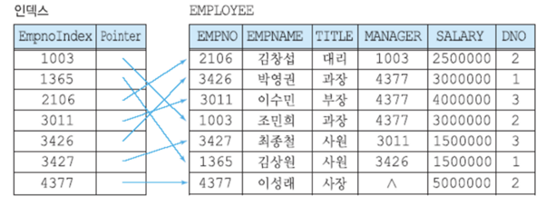

 

### 인덱싱 알고리즘
1.	해시테이블
-	Key -value 쌍으로 데이터를 저장하는 자료구조.
-	데이터의 Key를 알고 있으면, 데이터에 O(1)의 시간 복잡도로 접근할 수 있다.
-	하지만, 실제로 많은 DBMS들은 해시 테이블을 사용하지 않는다. 왜 그럴까? 해시 테이블은 부등호 연산에 부적합하기 때문이다. 해시 테이블의 데이터는 정렬되어 있지 않으므로, 'Key가 500보다 작은 데이터'를 찾기 위해서는 하기 위해서는 모든 데이터에 접근해야한다.
2.	B-Tree
 

    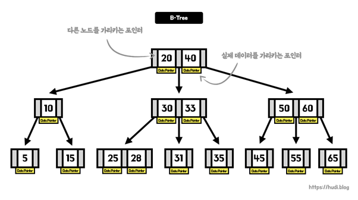

 

-	B-Tree 는 메모리에 담기 어려운 큰 크기의 데이터를 다루기 위해 사용된다.
-	파일 시스템이나 데이터베이스에 적합하다.
-	B-Tree : 이진탐색트리의 일반화된 형태이다. 이진탐색트리는 자식노드가 2개 이하인 트리라면, B-Tree는 자식노드가 2개 이상인 트리이다. 즉, 노드의 개수를 늘리고 트리의 전체 높이를 줄 여서 빠른 탐색속도를 얻을 수 있다. 
-	B-TREE는 리프노드가 모두 같은 레벨을 갖는다. 의도적으로 리프노드의 레벨을 동일하게 유지함으로써 한쪽 방향으로만 편향될 가능성을 없앤다. -> Self Balanced Search Tree
-	B-tree 의 키와 포인터 : 한 노드에 여러 데이터를 가질 수 있다. 
- 페이지 (블록) : B-Tree 의 노드
- 키 : 노드 내의 데이터로, 실제 데이터의 물리적 위치를 가리키고 있는 데이터 포인터를 가지고 있다. 키를 기준으로 데이터를 탐색한 뒤, 일치하는 키를 발견한 경우, 데이터 포인터가 가리키는 곳으로 이동해 실제 데이터를 찾을 수 있다.
- 컬럼의 값 = 키 / 테이블의 행 = 데이터 포인터
- 조회는 빠르지만 삽입, 수정 , 제거는 느리다 : 항상 정렬된 상태를 유지하기 때문.
 
3.	B+Tree
- B-Tree를 개선시킨 자료구조로, 데이터베이스에서 더 자주 쓰인다. 
- 오직 리프 노드의 키만 데이터 포인터를 가지고있다. -> 노드에 더 많은 키를 보관할 수 있게 된다. -> 트리의 높이가 낮아지고, 탐색 속도가 빨라진다. -> but, 중복된 키가 존재할 수도 있다.
- 순차 검색에 유리하다. 연결리스트로 연결하여 정렬된 상태의 리프 노드를 순차 검색할 수 있게 되며, B-Tree보다 부등호 연산 시간이 덜 걸린다. (부등호 연산은 db에서 많이 다룸)

### 인덱스 대상 컬럼 선택 기준, 카디널리티
인덱스 대상 컬럼은 카디널리티(cardinality)가 높은 컬럼을 우선적으로 선택해야 유리하다. 카디널리티란 데이터 집합에서 유일한 데이터의 개수를 의미한다. 특정데이터 집합의 유니크한 값의 개수. (중복도가 낮으면 카디널리티가 높다. 중복도가 높으면 카디널리티가 낮다)

예를 들어 대한민국 국민 테이블을 인덱싱할때 카디널리티가 낮은 성별 컬럼 대신 카디널리티가 높은 주민번호 컬럼을 인덱싱 하는 것이 바람직한다.

### <인덱스(Index) 설계>
1. 인덱스에 사용할 컬럼을 선택하고, 순서를 정하는데 중요한 2가지 기준
    1) 조건절에 항상 또는 자주 사용되는 컬럼을 선택
    2. “=” 조건으로 자주 조회되는 컬럼들을 앞쪽에 둔다.

2. 인덱스 설계는 공식이 아닌 전략과 선택의 문제
최소의 인덱스 구성으로 모든 접근 경로를 제공할 수 있어야 전략적인 인덱스 설계가 된다. 따라서 인덱스 선정은 테이블에 접근하는 모 든 경로를 수집하고 수집된 결과를 분석하여 종합적인 판단에 의해서 결정되는 것이 바람직하다.

3. 인덱스(Index) 설계절차
인덱스 설계절차는 크게 3 부분으로 이루어져 있습니다.
1. 접근경로 수집
2. 분포도에 의한 후보 컬럼 선정
3. 컬럼 조합 및 순서 결정

### (1) 접근 경로 수집
접근 경로는 테이블에서 데이터를 검색하는 방법으로, 테이블 스캔과 인덱스 스캔 등이 있다. 접근 경로를 수집한다는 의미는 SQL이 최적화되었을 때 인덱스 스캔을 해야 하는 검색 조건들을 수집하는 것이므로 데이터베이스 설계 시 혹은 완성되지 않은 프로그램에서 사용될 모든 접근 경로를 예측 하기는 불가능하다. 따라서 프로그램 설계서, 화면 설계 자료, 프로그램 처리 조건 등을 고려하여 예상되는 접근 경로를 수집하여야 한다. 수집은 테이블 단위로 진행하고, 다음과 같은 점을 고려하여 접근 유형을 목록화한다.

- 반복 수행되는 접근경로 

대표적인 것이 조인 칼럼이다. 조인 칼럼은 FK 제약 대상이기도 하다. 주문 1건당 평균 50개의 주 문 내역을 갖는다면 주문 테이블과 주문 내역 테이블을 이용하여 주문서를 작성하는 SQL은 조인 을 위해 평균 50번의 주문 내역 테이블을 반복 액세스한다.

- 분포도가 양호한 컬럼

주문번호, 청구번호, 주민번호 등은 단일 칼럼 인덱스로도 충분한 수행 속도를 보장 받을 수 있는 후보를 수집한다.

- 조회조건에 사용되는 컬럼

성명, 상품명, 고객명 등 명칭이나 주문일자, 판매일, 입고일 등 일자와 같은 칼럼은 조회 조건으 로 많이 이용되는 칼럼이다.

- 자주 결합되어 사용되는 컬럼

판매일 + 판매부서, 급여일+급여부서와 같이 조합에 의해서 사용되는 칼럼 유형을 조사한다.

- 데이터 정렬 순서와 그룹핑 컬럼

조건뿐만 아니라 순방향, 역방향 등의 정렬 순서를 병행하여 찾는다. 인덱스는 구성 칼럼 값들이 정렬되어 있어 인덱스를 이용하면 별도의 ORDER BY에 의한 정렬작업이 필요 없다. 동일한 원리 로 그룹핑 단위(GROUP BY)로 사용된 칼럼도 조사한다.

- 일련번호를 부여한 컬럼

이력을 관리하기 위해서 일련번호를 부여한 칼럼에 대해서도 조사를 실시한다. 마지막 일련번호를 찾는 경우가 빈번히 발생하므로 효과적인 액세스를 위해서 필요하다.

- 통계 자료 추출 조건

통계 자료는 결과를 추출하기 위해서 넓은 범위의 데이터가 필요하다. 따라서 다양한 추출 조건을 사전에 확보하여 인덱스 생성에 반영하여야 한다.

- 조회 조건이나 조인조건 연산자

위에 제시되는 유형의 칼럼과 함께 적용된 =, between, like 등의 비교 연산자를 병행 조사한다. 이는 인덱스 결합 순서를 결정할 때 중요한 정보로 사용된다.

### (2) 분포도에 의한 후보 컬럼 선정 
수집된 접근 경로 칼럼들을 대상으로 분포도를 조사한다. 설계 단계에서는 실제 분포도를 예측할 수 없으므로 현재 시스템 데이터를 참고하거나 업무에서 예상한 상황을 고려하여 분포도를 예측한다.

- 분포도 10~15% 선정 추천

분포도(%) =  ( 데이터별 평균 row 수 / 테이블의 총 row수 ) X 100
 
### (3) 컬럼 조합 및 순서 결정
단일 칼럼의 분포도가 양호하면 단일 칼럼 인덱스로 확정한다. 하지만 하나 이상의 칼럼 조합이 필 요한 경우는 아래와 같은 요소를 고려하여 인덱스 칼럼 순서를 결정한다.

- 항상 사용되는 컬럼을 선두컬럼 선정

결합 인덱스는 선행되는 칼럼이 존재하지 않을 경우 인덱스를 이용하지 못한다. 따라서 항상 접근 경로에 있는 칼럼을 선두 칼럼 또는 선행 칼럼으로 사용해야 한다.

- 등치(=) 조건으로 사용되는 컬럼을 선행컬럼으로 선정

인덱스 특성상 <, >, <=, >=, BETWEEN, LIKE 등의 비교 연산이 적용된 결합 인덱스는 해당 칼럼 이후는 Range scan이 실시된다.

예를 들어 접근경로가 col1 LIKE ‘A100%’AND col2 = ‘20051010’인 경우

인덱스가 COL1 + COL2로 구성된 경우는 A100으로 시작하는 모든 일자에 대한 인덱스를 검색한다.

인덱스가 COL2 + COL1로 구성된 경우는‘20051010’을 만족하는 데이터 중 A100으로 시작 된 데이터만 인덱스를 검색한다.

- 분포도가 좋은 칼럼을 선행 칼럼으로 한다.

분포도가 좋은 칼럼을 선두로 하는 결합 인덱스를 구성하면 후행 칼럼 조건이 없을 경우에도 효과적으로 인덱스 사용이 가능하다.

- ORDER BY, GROUP BY 순서 적용

칼럼 값이 정렬되어 있으므로 ORDER BY나 GROUP BY 절에 사용되는 칼럼 순으로 인덱스를 생성하며 별도의 정렬 부하를 줄일 수 있다.

4. 예시

(예1)

분포도(selectivity)가 좋다(우수하다)는 것은 서로 다른 데이터 값들이 중복없이 존재 한다는 의미를 나타낸다. 우선 선택성(Selectivity)란 전체 행수(데이터건수) 분에 해당 데이터 값(중복되지않는)으로 계산한다.

예를 들어 회원 테이블에 1만 건의 데이터가 있다고 가정

회원테이블에 회원이 사는 거주지 시도구분과 회원아이디 칼럼이 있다.

회원아이디는 고유한 값을 가지기 때문에 1/100,00의 선택성(Selectivity)을 갖는다.

반면, 시도구분은 중복된 값이 많이 있을 수 있다. 10개의 시도구분이 있고 각각 1000행씩있다면 1,000/10,000의 선택성(Selectivity)을 가지게 된다.

이러한 경우, 당연히 시도구분보다는 회원아이디의 선택성이 더 좋다.

따라서 선택성만을 가지고 인덱스를 선정한다면, 시도구분보다 회원아이디가 더 좋은 인덱스 후보가 된다.  물론, WHERE 절 및 기타 조건에 어떤 칼럼이 오느냐에 따라 인덱스의 후보는 달라질 수 있다
 

(예2) 

성별을 분석해보면

  - 분포도(selectivity)가 너무 안 좋다
  - 모든 자료의 값이 남/여 2가지중 하나이다
  - 이러한 데이터를 가지고 인덱스를 생성하면 효과를 보기보다는 오히려 손해를 본다

이러한 경우에는 (이름, 나이, 성별)의 순으로 인덱스를 생성하는것이 좋다

        - create index idx_1 on <table_name>(이름, 나이, 성별)  

반대로, '성별' 이 맨 앞에 위치하는 인덱스를 생성 하면 총 데이터에서 1/2 을 추출한 이후에 '나이' 를 check 하고 다음으로 '이름; 을 check 하므로 전체 데이터를 check(table full scan) 하는 것보다 더 나은 것이 없는 결과를 초래한다

추가 자료
https://jaeho4646.tistory.com/m/26

이해가 더 잘 가는 추가자료
8. 인덱스 설계 - [종료]구루비 DB 스터디 - 개발자, DBA가 함께 만들어가는 구루비 지식창고! (gurubee.net)

### 조인

- 조인 : 한 데이터베이스 내의 여러 테이블의 레코드를 조합하여 하나의 열로 표현한 것으로, 조인은 테이블로서 저장되거나, 그 자체로 이용할 수 있는 결과 set을 만들어낸다.

- 조인의 필요성
	1. 관계형 database의 구조적 특징으로 정규화를 수행하면 의미 있는 데이터의 집합으로 테이블이 구성되고, 각 테이블끼리는 관계를 갖게 된다. -> 저장공간의 효율성과 확장성이 향상하게 된다. -> 서로 관계 있는 데이터가 여러 테이블로 나뉘어 저장되므로 각 테이블에 저장된 데이터를 효과적으로 검색하기 위해 조인이 필요하다.

 

    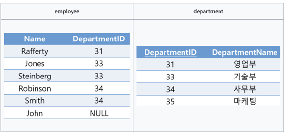

  

### 조인의 종류

1.	내부조인 (Inner join)

- 가장 흔한 결합 방식으로 기본 조인 형식

- 조인 구문에 기반한 2개의 테이블의 컬럼 값을 결합함으로써 새로운 결과 테이블 생성

 

    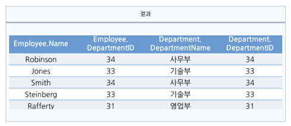

  
2. 동등조인

- 비교자 기반 조인으로, 조인구문에서 동등비교만 사용

- 다른 비교 연산자를 사용하는 것은 동등 조인으로서의 조인의 자격을 박탈하는 것

 
3. 교차 조인	

- 조인되는 두 테이블의 곱집합을 반환한다.

- 두번째 테이블로부터 각 행과 첫번째 테이블에서의 각 행이 한번씩 결합해 열을 만듬 
 
 

    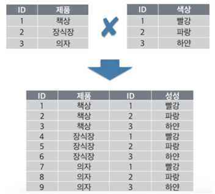

 

    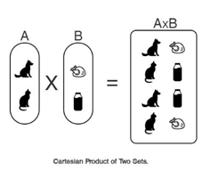

  
4. 외부조인

- 조인 대상 테이블에서 특정 테이블의 데이터가 모두 필요한 상황에서 외부 조인을 활용하여 효과적으로 결과 집합을 생성할 수 있다.

- 왼쪽 외부조인(우측테이블에 조인할 컬럼의 값이 없는 경우), 오른쪽 외부조인(좌측테이블에 조인할 컬럼의 값이 없는 경우), 완전외부조인(양쪽 테이블 모두 outer join 이 필요할 때)
 

 

    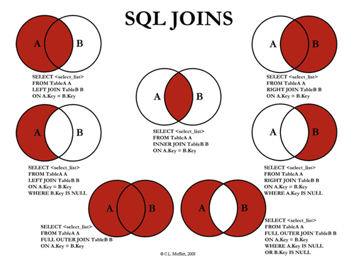

 

### 조인 수행 원리
### < 개념 >
-	조인 : 두개 이상의 테이블을 하나의 집합으로 만드는 연산

-	조인 연산 : 두 테이블 사이에서 수행된다.

(예시) A, B, C 라는 세 개의 테이블이 존재하더라도, 세 개의 테이블이 동시에 조인이 수행되는 것이 아니라, 세 개의 테이블 중에서 먼저 두개의 테이블에 대해 조인이 수행되고, 그 수행된 조인 결과와 나머지 테이블 사이에서 조인이 수행된다. 이러한 작업은 나열된 모든 테이블을 조인할 때까지 반복 수행된다. (A->B->C, A->C->B 순서로 조인 실행 가능)

### < 조인 수행 방법 3가지 >
1.	NL(Nested Loop) join
- 루프를 돌며 두 테이블의 row(행)를 연결하는 형식
- 선행 테이블이 작을수록 유리
- 두 테이블의 크기 차가 있는 경우 유리
- 후행테이블은 반드시 인덱스가 존재해야 함
- 절차적 / for, while문과 같은 구조
2.	Sort-Merge join
- 참조할 인덱스가 없는 두 테이블을 정렬하여 순차적으로 연결시켜주는 방식
- 인덱스가 없어도 가능
- 조인시 '='이 아닌 경우, NL보다 유리 (대체로 NL 보다 유리)
- 두 테이블의 사이즈가 비슷한 경우 유리
- 사이즈가 차이가 큰 경우에는 불리하고 비효율적(NL이 유리)
- 사전에 Sorting작업 필요
3.	Hash join
- 두 테이블이 너무 큰 경우, 해쉬맵에 저장하여 연결시켜 조인하는 방식
- 인덱스 필요 X
- 작은 테이블을 memory에 올리는 선행테이블로 사용
- 대용량 테이블 조인 시 유리
- 동등 조인 시에만 사용 가능 -> Non Equal Join 불가능.  Equal Join만 가능
 
  

    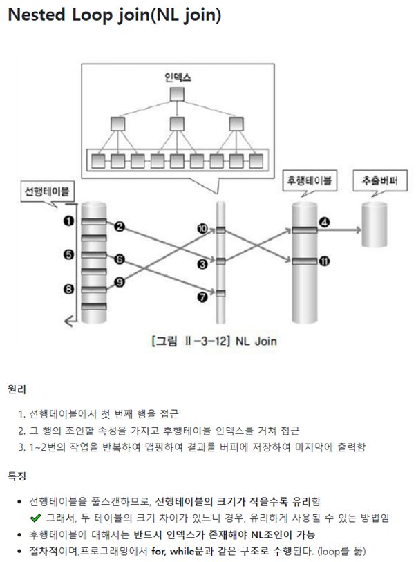

 

오타 : (밑에서 3번째) 두 테이블의 크기 차이가 있는 경우, 유리하게 사용될 수 있는 방법
 

    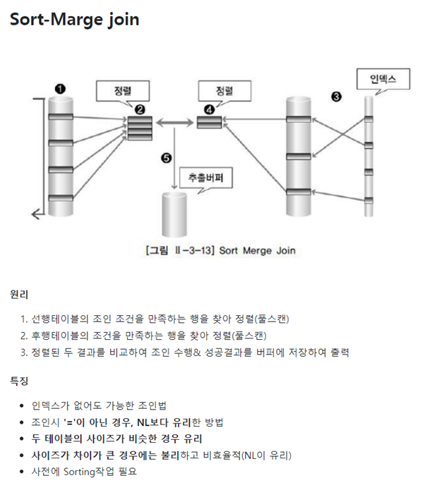

  
 

    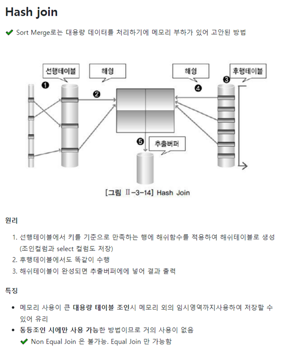

 
 
오타 : (밑에서 6번째) 해쉬테이블이 완성되면 추출버퍼에 넣어 결과 출력

+) non equal join일경우는 cross join을 한다 (cross조인은 tbl1의 컬럼수 X tbl2의 컬럼수) 

<추가> 해시함수

-	정의 : 해시 함수(Hash function)는 임의의 길이를 갖는 데이터를 고정된 길이의 데이터로 변환시켜주는 함수입니다. 블록체인에서는 해시 함수가 하는 역할은 ‘암호화'로, 해시값 비교를 통해서 위변조 여부를 판별하고, 무결성을 검증하는 데 사용됩니다. 비트코인의 블록체인에 사용된 해시 함수는 SHA-256(Secure Hash Algorithm-256)입니다. -> 데이터 식별에 사용 (일종의 ‘지문’)

-	SHA-256 : 2256 만큼의 경우의 수를 만들 수 있어 붙여진 이름입니다. 다음과 같이 입력된 값을 SHA-256 알고리즘을 통해 암호화하면 원본 데이터를 알아볼 수 없도록 특수한 문자열로 변환됩니다.

  

    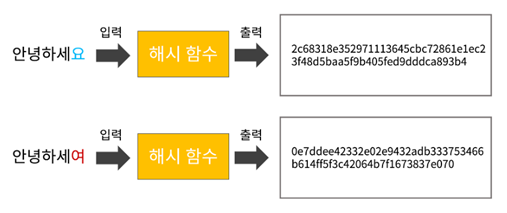

 
 
 

    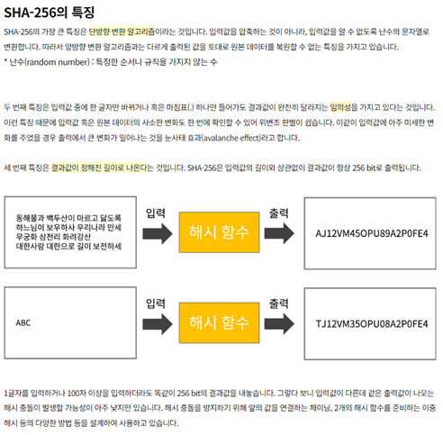

 