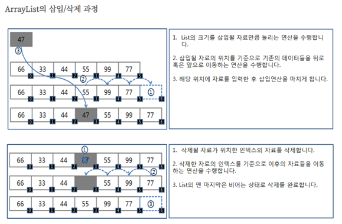

<사전지식>

파이썬, 자바 에는 배열(array)과 list를 묶어버려서 같이 이용할 수 있도록 제공하고 있다. 

<추가자료>

https://opentutorials.org/module/1335/8821

https://www.geeksforgeeks.org/data-structures/linked-list/ 

# List
### 1.	리스트란?

-   순서가 있는 데이터의 집합 ( 데이터의 중복 가능 )

-   배열이 가지고 있는 인덱스를 버리고, 빈틈없는 데이터의 적재를 장점으로 함

<br>

### 2.	리스트의 특징
-	자료를 순서대로 한 줄로 저장하는 자료구조
-	여러 자료가 일직선으로 서로 연결된 선형 구조
-	처음 데이터를 Head, 마지막 데이터를 Tail이라 부른다.
-	배열과 달리 크기가 유동적이다.

<br>

### 3.	리스트의 기능
-	엘리먼트를 추가/삭제하는 기능 (*삭제 시 인덱스 값 변경)
-	리스트에 데이터가 있는지 체크하는 기능
-	리스트의 모든 데이터에 접근할 수 있는 기능

<br>
 
### 4. 선형 리스트 -> <span style="color: red">**빈자리를 채워야 하는 것이 리스트의 특징!**</span>
-	선형 리스트 내부의 각각의 데이터는 서로 간의 연결 관계가 존재하지 않으며 순수한 리스트의 개념처럼 리스트 내부에 데이터를 일정하게 나열해둔 구조

<br>

<div align='center'>
    
</div>

<br>

예시)

    요소의 개수가 7인 studentList 배열이 존재합니다. 이 상황에서 만약 배열 속 인덱스 값이 2인 최진우 학생이 전학을 간다고 하면 기존의 배열은 어떻게 될까요? 최진우 학생 바로 뒤에 위치한 배열 속 인덱스 값이 3인 신중빈 학생이 한 칸 앞으로 올 것이며 뒤에 있는 학생들 마찬가지로 자리를 한 칸씩 앞으로 당깁니다.

<br>

<div align='center'>
    
</div>

<br>

    최진우 학생이 전학을 갔으므로 기존의 배열 크기가 7이던 studentList의 6번째 인덱스 자리는 공백이 됩니다. 며칠 뒤 새로운 학생이 공백을 막기 위해 전학을 왔으나 그 학생은 정말 독특하게도 0번째 인덱스 자리에 위치하고 싶어 합니다. 기존의 학생들은 자리 이동이 정말 귀찮았지만 전학생의 부탁을 들어주기 위해 0번째 자리에 위치한 김주엽 학생을 시작으로 한 칸씩 모두 뒤로 물러납니다.
 
<div align='center'>
    
</div> 

이처럼 리스트의 가장 기초적인 선형 리스트는 특정 요소를 리스트에서 삭제하거나 새롭게 삽입하는 경우 많은 양의 요소들을 뒤로 밀거나 앞으로 당겨야 하는 <span style='color: red'>불필요한 작업이 생기므로 과정이 복잡하기도 하면서 효율적이지 못하다</span>고 많이 평가되고 있다.

 
### 5.	자료구조의 두 가지 구현 방법

자료구조는 구현 방법에 따라 크게 두 갈래로 분류할 수 있다.

“**순차(Sequential)** 자료구조와 **연결(Linked)** 자료구조”
 
순차 자료구조는 구현할 자료들을 논리적인 순서대로 메모리에 연속하여 저장하는 자료구조이다.
 
데이터가 컴퓨터 메모리에 저장될 때, 저장 시작 위치부터 **빈자리 없이 순서대로** 저장된다는 것을 의미함.
 
자료의 논리적인 순서와 물리적인 순서가 일치하는 구현 방식이라고 할 수 있다.

<br>

<div align='center'>
    
</div>

<br>

 데이터가 연속된 메모리 공간 안에 존재. (int 타입이 4byte이므로 메모리 주소 4씩 증가)
 
반면 **연결 자료구조**는 메모리에 저장된 물리적 위치나 순서와 상관없이, 링크에 의해 논리적인 순서를 표현하는 자료구조이다.
 
연속적인 메모리에 저장되는 방식이 아니라 노드라는 각각의 독립된 공간을 사용해 데이터를 담는다.
 
노드는 실제 데이터가 저장되는 공간인 **데이터 필드**와 다음 노드의 주소 값을 가진 **링크 필드**로 이루어져 있다.

<br>

<div align='center'>
    
</div>

<br>

데이터가 메모리 상에서 연속적인 공간에 존재하지 않음.
 
리스트 역시 위의 두 가지 방법으로 구현 가능 하다.

순차 방식으로 구현한 리스트는 **순차 리스트**, 연결 방식으로 구현한 리스트는 **연결 리스트**라고 한다.

### 6.	순차 리스트 VS 연결 리스트
그럼 리스트는 왜 두 가지로 구분되어 있을까요? 각 리스트의 차이점을 살펴보면 그 이유를 알 수 있습니다.

두 리스트는 데이터를 **삽입·삭제** 그리고 **탐색**하는 과정에서 뚜렷한 차이를 보인다.

### 순차 리스트 삭제 과정

<br>

<div align='center'>
    
</div>

<br> 

**순차 리스트**는 데이터를 삽입하거나 삭제하고 나면, 연속적인 물리적 위치를 유지하기 위해 **원소를 옮기는 추가 작업**을 해야 함.
 
따라서 삽입이나 삭제 연산이 많다면 그만큼 시간이 든다.

### 연결 리스트의 삭제 과정

<br>

<div align='center'>
    
</div>

<br>
 
**연결 리스트**는 특정 노드를 삽입하거나 삭제할 때 노드의 링크 필드(다음 노드 주소)만 수정하면 되므로 순차 리스트에 비해 연산 속도가 빠르다.


두 그림을 비교해 보면 순차 리스트는 데이터의 삭제 작업이 이루어진 뒤 원래 데이터가 담겨있던 **주소에 변화가 생겼지만**, 연결 리스트는 **주소가 변경된 노드가 X**
 
연결 리스트가 **추가·삭제**에서 더 효율적이었다면, **탐색**은 순차 리스트가 더 효율적.
 
**순차 리스트**는 **배열**로 구현하기 때문에 **인덱스**를 통해 원소를 탐색할 수 있지만, 연결 리스트는 이전 노드를 통해서만 다음 노드를 참조할 수 있다는 특성 때문에 리스트의 **처음부터** 다음 노드들을 탐색해야 하기 때문입니다.
 
결과적으로 <span style="color:red"> 추가·삭제에서는 연결 리스트가, 탐색에서는 순차 리스트가 더 효율적인 자료구조</span>라고 할 수 있다.

<br>

<div align='center'>
    
</div>

<br> 
 
# Array
- 정적(static) 자료구조 이며 입력된 데이터들이 메모리 공간에서 연속적으로 저장되어있는 자료구조이다.
 

## Array 특징
- 정적(statatic) 자료구조이며 입력된 데이터들이 메모리 공간에서 연속적으로 저장되어 있는 자료구조다.

<br>

<div align='center'>
    
</div>

<br>

- 특징
    - 크기가 고정이고, 인덱스를 가지고 있어 원하는 곳에 접근할 수 있다.
    - 검색이 쉽고 속도가 빠르다
    - 시간복잡도 O(1) <인덱스로 바로 접근>
    - 연속적이므로 메모리 관리에 좋다.
    - 배열의 특성상 삽입/ 삭제가 매우 불편하다. (삽입 후에는 뒤의 자료들을 한칸씩 밀어야하고 삭제후에는 한칸씩 당겨야 하기 때문 + 배열의 꽉 찬 경우에는 메모리를 재할당하는 과정을 거쳐야하고, 최악의 경우에는 삽입이 불가능하다.)
    - 배열의 크기는 처음 생성할 때 정하며 이후에는 변경할 수 없다.

 
## Array List
- 동적 자료 구조(크기가 유동적)이며 배열과 같이 연속되는 기억장소에 저장되는 리스트를 말한다
- 초기화/ 삽입, 삭제/ 정렬 과정을 통해 구현한다.

<br>

<div align='center'>
    
</div> 

<br>

### Array List 특징
- 특징
    - 가장 간단한 자료구조이다.
    - 접근 속도가 빠르다.
    - 중간에 자료를 삽입하기 위해서는 연속된 빈 공간이 있어야 한다.
    - 삽입, 삭제 시 자료의 이동이 필요하기 때문에 작업이 번거롭다.
    - 데이터 추가와 삭제가 느리다. 
 
## Linked List

<br>

<div align='center'>
    
</div>

<br>

### 정의
- 선형 데이터 구조로, 비연속적인 메모리 위치에 저장된 값을 엘리먼트와 엘리먼트 간의 연결(link)을 이용해서 리스트를 구현한 것
- 각 노드가 데이터와 포인터를 가지고 한 줄로 연결되어 있는 방식으로 데이터를 저장하는 자료 구조.

#### 엘리먼트
- element, 요소
- 리스트에 저장된 각 값

#### 노드
- 컴퓨터 과학에 쓰이는 기초적인 단위.
- 여기서는 리스트 일부분 하나하나.
- 각 노드는 다음 노드를 가리키는 포인터를 포함함.
- 맨 앞, 맨 끝 노드를 머리(Head), 꼬리(Tail) 노드라고 함.

#### 포인터
- 다른 변수, 혹은 그 변수의 메모리 공간주소를 가리키는 변수.
- C, C++ 등에서는 쓸 수 있지만 JAVA에서는 완전히 숨겨져 쓸 수 없음.
- 값으로 다음 노드의 주소를 가짐.

### 특징
- 비연속적인 메모리 구조로 저장됨.
- 삽입 / 삭제에서 뛰어난 성능을 보임.
    - 시간복잡도는 O(1) 또는 O(N).  -> **시간복잡도: 괄호 안 숫자 작을수록 굿!!**
    - 특히 첫번째 위치나 마지막 위치일 경우 시간복잡도가 O(1)이라는 것에서 이점을 보임

- 공간의 제약이 없음.
    - 멀리 떨어져 있어도 연결하면 되기 때문에 붙어 있을 필요가 없음.
    - 특정 자료의 탐색 시간에 많은 시간이 필요.

 
#### 단일 연결 리스트

<div align='center'>
    
</div>

- 노드가 다음 노드를 가리키는 리스트

#### 이중 연결 리스트

<div align='center'>
    
</div>

- 각 노드들이 이전과 다음 노드를 가리키는 리스트

 
#### 다중 연결 리스트

<div align='center'>
    
</div>

- 각 노드가 2개 이상의 노드를 가리키는 리스트

#### 원형 연결 리스트

<div align='center'>
    
</div>

- 마지막 노드, 즉 꼬리 노드가 멀리 떨어져 있는 다른 노드를 가리키는 리스트.
- 보통 다른 노드는 첫번째 노드인 머리 노드를 가리킴.

## 언어별 리스트 구현 방식

#### C언어 Array List 
```c
// 배열이 기본 제공되지만, 리스트가 없으므로 구현
#define MAX 100
typedef struct listRecord
{ int Count;
	int Date[MAX];
} listType;

void Insert (listType *Lptr, int Position, int Item); // 추가   <- ‘ * ‘이 포인터!!
void Delete (listType *Lptr, int Position) // 삭제
void Retrieve(listType *Lptr, int Position, int *ItemPtr); // 검색

void Init(listType *Lptr); // 초기화
bool IsEmpty(listType *Lptr); // 비어있는지 확인
int Length (listType *Lptr); // 리스트 내 데이터 개수
```

 
#### C언어 Linked List
```c
typedef struct nodeRecord
{ int Data;
	nodeRecord* Next;
} node;
typedef node* Nptr;
typedef struct
{ int Count;
	Nptr Head;
} listType;

void Insert (listType *Lptr, int Position, int Item); //추가
void Deletee (listType *Lptr, int Position); // 삭제
void Retrieve(listType *Lptr, int Position, int *ItemPtr); // 검색

void Init(listType *Lptr); // 초기화
bool IsEmpty(listType *Lptr); // 비어있는지 확인
int Length (listType *Lptr); // 리스트 내 데이터 개수
```
 
#### Java Script
```javascript
// 배열에 리스트를 포함
numbers = [10, 20, 30, 40, 50]; 
numbers.splice(3,1); //인덱스 3의 값을 제거
for(i = 0; i < numbers.length; i++){
console.log(numbers[i]);
}
(If, 각각의 엘리먼트가 고유한 인덱스를 가지고 있게 하기 위해선 splice 대신 number[3] = null;을 사용)
```


#### Python
```python
// JS와 동일하지만 리스트만 있고 배열에 포함
numbers = [10, 20, 30, 40, 50];
numbers.append(100); // 리스트 끝에 값 추가
numbers.remove(100); // 특정 값 찾아서 제거
numbers.pop(3); // 맨 마지막 값 반환 후 삭제
numbers.insert(0, 1); //특정 위치에 값 추가
for number in numbers:
    print(number);
```


#### JAVA
```java
// 배열과 리스트를 개별적으로 지원
Import java.util.ArrayList; // import
List<String> names = new ArrayList<>(); // 객체 생성
names.add(“이준혁”); //원소추가
names.add(“권근열”); //원소추가
names.set(0, “임태수”); // 수정

names.get(1); // 가져오기
names.remove(0); //인덱스를 활용한 삭제
names.remove(“이준혁”); //값을 이용한 삭제
names.clear(); // 전부삭제
```