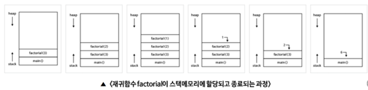
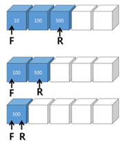
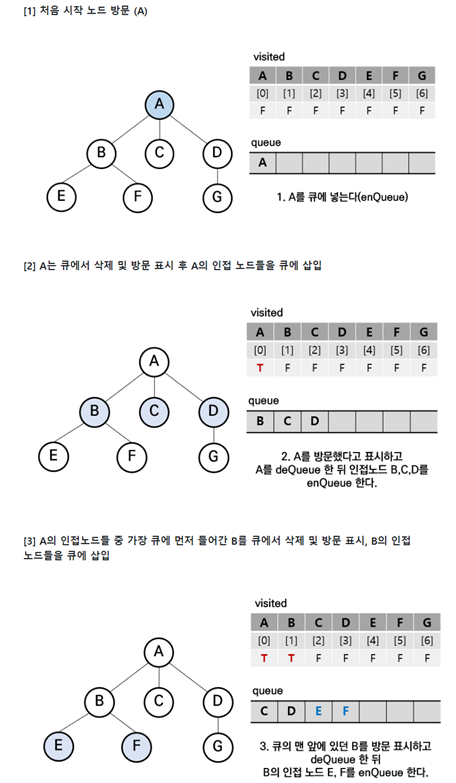

# 스택
### 스택의 개념

#### Stack의 사전적 정의
- 동사: 쌓다[포개다]; 쌓이다, 포개지다
- 명사: 무더기

#### 개념 
- 후입선출(Last In First Out—LIFO) 특성을 가지는 자료구조.

#### 생활 속의 스택
햄버거 놀이, 뒤로가기, undo(가장 최근에 실행한 명령어부터 취소), 컴파일러 출력 에러

#### 스택의 의의
단순화. 안정성 (기능을 제한 함으로 인한 잘못 사용할 가능성 최소화)

#### 구조:  Top(=Peek)
- 제일 최근에 들어 간 데이터(최상위 데이터)
- 메모리에 새로 들어오는 데이터의 위치. 한 방향으로만 입력 가능(중간에 끼워서 저장 불가)
- 내보내는 데이터 역시 메모리 말단을 거친다.

<br>

<div align='center'>
    
</div> 

<br>
 
## 추상자료형 스택
### 추상 자료형(ADT; Abstract Data Type)이란?
구현하고자 하는 구조에 대해 구현 방법은 명시하지 않고 자료 구조의 특성들과 어떤 operation이 들어있는지 설명하는 자료 구조의 한가지 형태.

즉, 규칙들의 나열. (대표적 예 : 스택, 큐)

스택과 큐는 일종의 규칙이므로 실제로 프로그래밍 언어들에서 존재하지 않는다. 자료구조가 스택 혹은 큐로 구분되기 위한 규칙! 이걸 추상 자료형(ADT)이라고 한다.

-> 밥솥: 추상자료형 / 밥: 함수 <-> 클래스 / 인스턴스

### 추상자료형 스택 (기본 기능)
- push(‘x’ ) : (집어넣는다.)스택의 가장 윗 데이터로 top이 가리키는 자리 위에 (top = top + 1) 메모리를 생성, 데이터 x를 넣는다. 

- pop() : (빼낸다) top위치에 있는 값 삭제하고, 해당 데이터 반환. 그 아래 값이 top으로 변경

- isempty : 스택이 비어있는지 확인

- 기타 
 clear, peak (top위치에 있는 값을 삭제하지 않고, 해당 데이터 반환) 
 -> 기본기능들을 조합해서 구현 가능!!


### (리스트에 의한) 스택 구현
1.	배열을 이용한 스택 구현

    - 처음으로 스택을 위한 배열을 만들고, index 값을 0으로 잡는다. index가 0이면 스택이 비어 있는 것이고, 스택에 뭔가를 집어넣을 때는 index의 자리에 집어넣고 index를 하나 올리면 된다. 스택에서 뭔가를 뺄 때는 index에 있던 값을 돌려주고 index를 하나 뺀다.


2.	연결 리스트에 의한 스택 구현
    - 메모리 상에 아이템을 위한 공간을 할당하고 새로운 아이템이 추가될 때 마다 포인터로 연결.


3.	배열과 연결 리스트에 의한 스택 구현 비교

<br>

<div align='center'>
    
</div> 

<br> 

- 배열에 의한 스택: 
    -	1부터 5까지 각 요소가 접시 쌓듯 차곡차곡 놓임.
    -	장점: 구현이 쉽다.
    -	단점 : 들어올 크기를 미리 알아야 한다.

- 연결 리스트에 의한 스택 : 
    -	메모리 상에는 순서와 관계 없이 무작위로 배치되고 포인터로 가리키게 될 것이다.
    -	장점: 크기를 몰라도 된다.
    -	단점: 구현이 어렵다. 메모리를 좀 더 사용한다.

4.	파이썬에 의한 구현
 
```python
top = [] # 리스트 사용

# isEmpty 구현
def isEmtpy():
    return len(top) == 0

print(isEmpty()) # True

#push 구현
def push(item): 
    top.append(item)

push(1)
push(2)
print(top) # [1, 2] 
print(isEmpty()) # False

#pop 구현
def pop():
    if not isEmpty(): 
        return top.pop()

print(pop(), top) 
# 2 [1], if isEmpty =True, None [] 
# cf. 일반적인 pop: # IndexError: pop from empty list


#peek 구현 
def peek():
    if not isEmpty():
        return top[-1] #삭제하지 않음

def peek():
    # 사실 기본연산들의 조합이다.
    if not isEmpty():
        a=pop()
        push(a) 
        return a
print(peek(),top) #1 [1]


# clear 구현 
def clear(): 
    global top #전역 변수임을 지정
    top=[] #초기화

def clear():
    # 사실 기본연산들의 조합이다.
    for i in range(len(top)):
        pop()

clear()
print(top) #[]

# class
class Stack:
    def __init__(self):
        self.top = []

    def isEmpty(self):
        return len(self.top) == 0
    
    def pop():
        if not self.isEmpty():
            return self.top.pop()
```


5.	자바에 의한 구현
https://freestrokes.tistory.com/82


#### 논외 
꽉 찬 스택에 요소를 삽입하고자 할 때 스택에 요소가 넘쳐서 에러가 발생하는 것을 스택 버퍼 오버플로(Stack Buffer Overflow)라고 부른다. 개발자들이 즐겨 이용하는 질의응답 서비스 사이트인 스택 오버플로의 명칭 또한 여기서 유래했다.


## 스택 응용
#### 1. 괄호검사 : 괄호들이 같은 유형들끼리 쌍을 이루어 잘 사용되어야 한다.
    -	조건1 : 왼쪽 괄호의 개수 = 오른쪽 괄호의 개수
    -	조건2 : 같은 타입의 괄호에서, 왼쪽 괄호가 오른쪽 괄호보다 먼저!
    -	조건3 : 서로 다른 타입의 괄호쌍이 서로 교차하면 안됨! (스택 특)

```python
def checkBrackets(statement):
    stack = Stack()
    for ch in statement:
        if ch in ('{', '[', '('):
            stack.push(ch)
        elif ch in ('}', ']', ')'):
            if stack.isEmpty():
                return False
            else:
                left = stack.pop()
                if (ch == '}' and left != '{') or (ch == ']' and left != '[') or (ch == ')' and left != '('):
                    return False
    return stack.isEmpty()
``` 
 
### < 괄호 검사 알고리즘 > 
위의 코드들을 자세히 살펴보면 가장 가까운 거리에 있는 괄호들끼리 서로 쌍을 이루어야 됨을 알 수 있다. 다라서 입력 문자열에서 왼쪽 괄호가 나오면 스택에 삽입하고, 오른쪽 괄호가 나오면 스택에서 가장 최근에 삽입된 괄호를 거내 짝을 맞추어보면 오류를 검사할 수 있다.

- 문자를 저장하는 스택을 준비한다. 처음에는 공백 상태가 되어야 한다.
- 입력 문자열의 문자를 하나씩 읽어 왼쪽 괄호를 만나면 스택에 삽입한다.
- 오른쪽 괄호를 만나면 pop()연산으로 가장 최근에 삽입된 괄호를 거낸다. 이때 스택이 비었으면 조건 2에 위배된다.
- 꺼낸 괄호가 오른쪽 괄호와 짝이 맞지 않으면 조건 3에 위배된다.
- 끝까지 처리했는데 스택에 괄호가 남아 있으면 조건 1에 위배된다.

하나의 조건이라도 위배하면 오류이므로 False를 반환하고 그렇지 않으면 성공이므로 True를 반환한다. 다음 그림은 몇 가지 경우에 대한 처리과정을 보여준다.
<br>

<div align='center'>
    
</div> 

<br> 
(파이썬으로 풀어쓴 자료구조 p.135)
		 
 
#### 2. 수식의 계산 : 사용자의 계산은 보통 중위 표기법 ( ex. 5 + A * B )
컴퓨터의 계산은 ‘후위 표기법’ ( ex. 5 A B * + )
-	장점 : 괄호 사용 안해도 계산 순서 알 수 있음 / 연산자의 우선순위 생각할 필요 없음 / 수식을 읽으면서 바로 계산 가능

#### < 스택을 이용한 후위표기 수식의 계산 >

8 2 / 3 - 3 2 * + 를 계산해 보자. 후위표기이므로 괄호는 수식에 포함되어 있지 않다.
계산의 순서를 괄호를 이용해 나타내면 다음과 같은 순서가 될 것임을 쉽게 예상할 수 있 을 것이다.

1단계: ( 8 2 / ) 3 - 3 2 * +        ==> 4 3 - 3 2 * + 

2단계: ( ( 8 2 /) 3 - ) 3 2 * +     ==> 1 3 2 * + 

3단계: ((8 2 /) 3 -) (3 2 *) +      ==> 1 6 +

4단계: (((8 2) 3 -) (3 2 *) +)      ==> 7

이 식의 계산에 스택이 사용된다. 알고리즘을 정리해 보자. 수식을 왼쪽에서 오른쪽으로 스캔하다가 피연산자가 나오면 무조건 스택에 저장한다. 연산자가 나오면 스택에서 피연산 자 두 개를 꺼내 연산을 실행하고 그 결과를 다시 스택에 저장한다. 이 과정은 수식이 모 두 처리될 때 까지 반복되고, 마지막으로 스택에는 최종 계산 결과만 하나 남는다.

다음은 8 2 / 3 - 3 2 * +를 계산하는 과정을 보여준다. 수식은 왼쪽부터 오른쪽으로 스캔하고 다음과 같이 처리된다.

<br>

<div align='center'>
    
</div> 

<br> 

<참고 코드>
```python
def evalPostfix(expr):
    s = Stack() #스택 객체 생성
    for token in expr: #리스트의 모든 항목에 대해
        if token in "+-*/": # 항목이 연산자이면
            val2 = s.pop() #피연산자2
            val1 = s.pop() #피연산자1
            if (token =='+'): #각 연산 수행
                s.push(val1 + val2)
            elif (token == '_'): # 결과는 스택에
                s.push(val1 - val2)
            elif (token == '*'): #다시 저장
                s.push(val1 * val2)
            elif (token == '/'): 
                s.push(val1 / val2):
        else: # 항목이 피연산자이면
            s.push(float(token)) #실수로 변경해서 스택에 저장
    return s.pop() #최종 결과를 반환

float(str), int(str) 등은 문자열 str을 실수나 정수로 변환하는 형 변환 함수이다.
``` 
 
#### 3. 미로탐색 : 키워드, ‘깊이 우선 탐색(DFS, Depth First Search)’

##### 탐색 알고리즘
모든 칸의 위치는 (열, 행)으로 표시하자((x,y)순서), 생쥐의 현재위치(시작위치)를 스택에 넣으면서 탐색이 시작된다. 알고리즘을 생각해 보자.
- Step1: 시작위치를 스택에 넣는다. 현재 스택에는 시작위치만 들어 있다.
- Step2: 스택이 공백이 아니면 하나의 위치를 꺼낸다. 이것이 현재위치이다. 현재 위치에 "방문했음" 표시를 한다. 만약 스택이 공백이라면 이 미로에는 출구가 없는 것이므로 종료한다.
- Step3: 만약 현재위치가 출구이면 탐색은 성공으로 끝난다.
- Step4: 그렇지 않으면 이웃(상하좌우)방들을 살펴본다. 만약 이웃 방들이 아직 방문되 지 않았고 갈 수 있는 방이라면 그 방의 위치를 모두 스택에 삽입한다. 다시 Step2 돌아간다.

만약 이웃 방들을 탐색하는 순서가 "상하좌우"가 아니라 "좌우상하"라면 탐색 순서는 달 라진다. 이웃 위치가 스택에 들어가는 순서가 달라지기 때문이다. 그러나 길이 있다면 반드 시 결과를 찾는다.
 
<br>

<div align='center'>
    
</div> 

<br>

< 탐색 알고리즘 – 스택을 이용한 DFS 코드 >
```python

def isValidPos(x, y): #(x,y)가 갈 수 있는 방인지 검사하는 함수
    if x < 0 or y < 8 or X >= MAZE_SIZE or y>= MAZE_SIZE :
        return False # (x,y)가 미로 밖이면 갈 수 없음 
    else: #출구('x')이거나 방('0')이면 갈 수 있음
        return map[y][x] '0' or map[y][x] == 'x'

def DFS(): #깊이우선탐색 함수
    stack = Stack() #사용할 스택 객체를 준비
    stack.push( (0,1)) #시작위치 삽입. (0,1)은 튜플
    print('DFS: ')
       
    while not stack.isEmpty(): #공백이 아닐 동안
        here= stack.pop() # 항목을 꺼냄(pop)
        print(here, end='->')
        (x, y) = here #스택에 저장된 튜플은 (x,y) 순서임.
        if (map[y][x] == 'X'): # 출구이면 탐색 성공. True 반환
            return True
        else:
            map[y][x] = '.' # 현재위치를 지나왔다고 표시
            #4방향의 이웃을 검사해 갈 수 있으면 스택에 삽입 
            if isValidPos(x, y - 1): 
                stack.push((x, y - 1)) # 상 
            if isValidPos(x, y + 1): 
                stack.push((x, y + 1)) # 하 
            if isValidPos(x-1, y): 
                stack.push((x-1, y)) #좌 
            if isValidPos(x+ 1, y): 
                stack.push((x+ 1, y)) # 우 
        print('현재 스택:', stack) # 현재 스택 내용 출력 
    return False #탐색 실패. False 반환

result = DFS()
if result: 
    print('--> 미로탐색 성공')
else: 
    print(' -> 미로탐색 실패')
```
 

## 깊이 우선 탐색 (DFS, Depth-First Search) 
루트 노드(혹은 다른 임의의 노드)에서 시작해서 다음 분기(branch)로 넘어가기 전에 해당 분기를 완벽하게 탐색하는 방법

-	모든 노드를 방문하고자 하는 경우에 이 방법을 선택
-	넓게 탐색하기 전에 깊게 탐색!
-	너비 우선 탐색(BFS)보다 좀더 간단 & 단순 검색 속도 자체는 느림
-	자기 자신을 호출하는 순환 알고리즘 형태를 가짐
-	구현 방법 2가지 : 순환 호출 이용 / 명시적인 스택 사용

<br>

<div align='center'>
    
</div> 

<br>

순서1) a 노드(시작 노드)를 방문한다. : 방문한 노드는 방문했다고 표시한다.

순서2) a와 인접한 노드들을 차례로 순회한다. : a와 인접한 노드가 없다면 종료한다.

순서3) a와 이웃한 노드 b를 방문했다면, a와 인접한 또 다른 노드를 방문하기 전에 b의 이웃 노드들을 전부 방문해야 한다. : b를 시작 정점으로 DFS를 다시 시작하여 b의 이웃 노드들을 방문한다.

순서4) b의 분기를 전부 완벽하게 탐색했다면 다시 a에 인접한 정점들 중에서 아직 방문이 안 된 정점을 찾는다. : 즉, b의 분기를 전부 완벽하게 탐색한 뒤에야 a의 다른 이웃 노드를 방문할 수 있다는 뜻이다. -> 아직 방문이 안 된 정점이 없으면 종료 / 있으면 다시 그 정점을 시작 정점으로 DFS를 시작

( 출처 : https://gmlwjd9405.github.io/2018/08/14/algorithm-dfs.html  )

### 스택과 재귀호출
1. 재귀(Recursion) : 컴퓨터 과학에 있어서 재귀는 자신을 정의할 때 자기 자신을 재참조하는 방법을 뜻하며, 프로그래밍에서는 함수가 자기 자신의 함수를 호출하도록 구현한다. 보통 알고리즘을 구현할 때, 반복문으로 구현한 코드보다 재귀호출로 구현한 코드가 더 직관적이고 이해하기 쉬운 경우가 많다. (by. 위키피디아)
<br> -> 재귀함수 사용시 반드시 종료 조건을 생성해야 한다! (무한반복에 빠지지 않기!)

<br>

<div align='center'>
    
</div> 

<br> 

2. 재귀 함수와 스택 메모리 -> 모든 재귀함수는 스택으로 손쉽게 변환 가능!
재귀 함수에서는 동일한 함수를 계속해서 호출될 때마다 함수를 위한 메모리가 계속해서 할당된다. 함수가 호출될 때마다 사용되는 임시 저장 메모리를 **스택**이라고 부른다.

스택은 LIFO(후입선출) 구조이기 때문에 가장 마지막에 호출된 함수 factorial(1)를 먼저 완료하고, 값을 아래로 전달하여 최초로 호출된 함수 factorial(3)가 최종 값을 계산한다.

재귀 함수를 이용하다 보면 함수가 종료되지 않고, 함수가 계속해서 호출이 되는데 이 경우 스택 공간이 초과되는 스택 오버플로(stack overfolw)가 발생하여 오류가 생긴다. 그렇기 때문에 재귀를 사용할 때는 과도하게 스택 메모리가 사용되지 않도록 주의해야 한다.

참고: https://bentist.tistory.com/57

<br>

<div align='center'>
    
</div> 

<br> 
출처: NAVER Connect 모두를 위한 컴퓨터 과학 자료

+추가 : JAVA 코드 참고 https://techvu.dev/83


# 큐

##  개념 
큐는 한쪽 끝에서만 삽입이 이루어지고, 다른 한쪽 끝에서는 삭제 연산만 이루어지는 유한 순서 리스트이다. 데이터간 순서를 약속한 추상 자료형의 자료구조.
-	First in first out (FIFO): 선입선출, 먼저 들어온 것이 먼저 나가는 형식. 나중에 집어넣은 데이터가 먼저 나오는 스택과는 반대되는 개념
-	선형 자료구조
-	티켓 판매부스에서 줄을 서서 기다리는 사람 생각하면 됨.
-	그래프의 넓이 우선 탐색(BFS)에서 사용되고, 컴퓨터 버퍼에서 주로 사용된다. 마구 입력이 되었으나 처리를 하지 못할 때 큐를 만들어 대기 시킨다.

<br>

<div align='center'>
    
</div> 

<br>

-	Front : 가장 먼저 입력된 데이터를 가리킴, 삭제 연산(Dequeue)만 수행하는 곳이다.
-	Rear : 가장 최근에 입력된 데이터를 가리키는 곳으로 삽입 연산(Enqueue)만 수행하는 곳이다.
-	Enqueue : 맨 끝에 원소 삽입
-	Dequeue : 맨 앞의 원소 삭제하고 나머지 원소 앞으로 옮기기. 맨 앞 원소를 삭제하며 return하고, 나머지 원소들을 모두 한 칸 씩 앞으로 옮겨야 한다. 
-	큐의 시간 복잡도 O (big O) : 
    - 삽입 : Insertion O(1)
    - 삭제 : Deletion O(1)(dequeue) / O(N)(remove)


## 큐의 주요 동작
1.	Queue 선언 
    - 자바 : Queue<Element> queue = new LinkedList<>()
    - 파이썬 : queue 라이브러리를 임포트해서 사용가능 : q = queue.Queue()
2.	Queue 값 추가
    -	자바 : Add메서드는 삽입연산에 성공하면 true 반환하고, 큐에 여유 공간이 없어 삽입에 실패하면 IllegalStateException을 발생시킨다. 자바에서는 offer메서드로도 값을 추가할 수 있다.
    -	파이썬 : q.put()
3.	Queue 값 삭제
    -	자바에서 Poll()이나 remove 메서드 사용
        -   Poll() : 큐가 비어 있으면 null 반환
        -    Pop : 가장 앞쪽에 있는 원소의 값이 제거된다
        -   Clear() : 큐의 모든 요소가 제거된다.
    -	파이썬 : q.get()
4.	Queue에서 가장 먼저 들어간 값 출력
    -	Peek() : 첫번째로 저장된 값을 참조
	
## 추상 자료형과 큐
추상 자료형(ADT) : 기능의 구현 부분을 나타내지 않고 순수한 기능이 무엇인지 나열한 것. 자바와 같은 객체지향 언어에서는 클래스와 유사함 -> stack, queue
-	구현자와 사용자 분리
-	라이브러리 쓰거나 내장함수 사용도 추상 자료형이 정의한다
-	은닉(encapsulation)이 이루어진다
-	추상 자료형에는 스택, 큐, 리스트, 맵 등이 있다. 
-	즉, 자료와 연산이 추상적으로 구현되어 있어 실제 내부 구현은 몰라도 연산을 통해 자료에 접근할 수 있는 자료형태이다. 

## 큐 구현
-	큐는 리스트로 구현할 수 있지만 효율적이지 않기 때문에 양끝에서 덧붙이기와 꺼내기가 빠르도록 설계된 collections.deque를 사용하거나, 파이썬에서 제공하는 Queue모듈을 이용해 큐를 구현해야한다. 혹은 원소를 추가, 삭제하는데 효율적인 linkedlist활용 가능.
-	-> linkedlist와 배열로 구현가능
-	자바에서는 스택을 클래스로 구현하여 제공하지만, 큐는 큐인터페이스만 있고 별도의 클래스가 없기 때문에 큐인터페이스를 구현한 클래스들을 사용해야한다.
1.	큐 인터페이스를 통한 구현
2.	배열을 이용한 큐 구현 : push, pop 등이 간단하지만 배열의 크기가 유한해 큐의 크기가 다 차버리면 사용할 수 없다.
3.	LinkedList를 이용한 큐 구현 : 똑같이 노드를 이용해서 큐를 구현한다. 값이 들어갈 노드와 큐를 관리할 NodeManager 클래스를 만들면 된다.
https://go-coding.tistory.com/6

-	파이썬 : 
1.	Python List로 구현하기
2.	Python singly linked list로 구현하기
https://somjang.tistory.com/entry/%ED%8C%8C%EC%9D%B4%EC%8D%AC%EC%9C%BC%EB%A1%9C-%EA%B5%AC%ED%98%84%ED%95%98%EB%8A%94-%EC%9E%90%EB%A3%8C%EA%B5%AC%EC%A1%B0-%ED%81%90-Queue


### 큐의 활용 예시
-	우선순위가 같은 작업 예약 (프린터의 인쇄 대기열)
-	콜센터 고객 대기시간
-	프로세스 관리
-	너비우선 탐색
-	캐시 구현

### 큐의 응용 사례
1.	운영체제의 스케쥴러
자원의 할당과 회수를 하는 스케쥴러 역할을 큐가 할 수 있다.
자원관리자의 역할로써, 운영체제의 첫번째 목적이라고 할 수 있다.
메모리에 적재된 다수의 프로세스 중 어떤 프로세스에게 자원을 할당할 것인가, 그 순서를 결정하는 것이 자원의 효율적인 사용에 있고, 가장 단순한 형태의 스케쥴링 정책이 선입선처리(first come first served), 즉 큐라고 할 수 있다.

2.	메시징 시스템
윈도우 운영체제에서 동작하는 어플리케이션들은 메시지를 기반으로 한다. 키보드, 마우스 등의 입력 신호 또한 메시지이고, 이 또한 시스템 큐로 입력되어 처리를 기다린다. FIFO의 쉬운 예라고 할 수 있다. 앱 또한 자신만의 메시지 저장소로 앱큐를 하나씩 갖는다. 언급한 시스템큐, 앱큐들은 메시지를 생산하고 소비하는 주체가 다르고, 서로 방해받지 않기 위해 메시지를 투입하고 꺼내 쓰는 방향을 구별한다. 이때, 메시지의 전달자 역할을 큐가 할 수 있고, 이때의 큐를 버퍼라고 한다. 여러 대의 컴퓨터에서 분산 동작하는 메시징 시스템으로 카프카가 있다고 한다.


## 선형 큐
일반적인 큐의 형태

Push가 될 때 rear(back) 포인터를 하나 증가, pop이 될 때마다 front 포인터를 증가하는 방식으로 구현

큐에 데이터를 넣는 경우 : 프론트는 고정, 리어가 추가되는 데이터를 가리키며 이동함
<br>

<div align='center'>
    
</div> 

<br> 
데이터를 삭제시(Front가 고정) : 데이터가 삭제될 때 마다 데이터를 한칸씩 이동해야 한다.
<br>

<div align='center'>
    
</div> 

<br>
데이터를 삭제시(Rear가 고정) : 프론트의 포인터가 증가하며 내보낼 데이터를 순차적으로 가리킴
<br>

<div align='center'>
    
</div> 

<br> 
<br>

<div align='center'>
    
</div> 

<br>
 
- 선형 큐 문제점
<br>Rear가 배열의 끝까지 이동이 되면 더 이상 새로운 데이터를 받을 수 없음. 가득 찼다고 판단.
이런 경우를 해결하려면 재정렬이 필요하다

### 원형(환영)큐 (circular Queue)
정해진 개수의 저장 공간을 빙 돌려가며(원형으로) 이용하는 큐 입니다.

큐가 가득차면 더 이상 원소를 넣을 수 없습니다. 따라서, 큐의 길이를 기억하고 있어야 합니다.

대기열을 구현하기 쉽습니다.
<br>

<div align='center'>
    
</div> 

<br>
https://velog.io/@mcc919/Data-Structure-%EC%9B%90%ED%98%95-%ED%81%90Circular-Queue-%EC%95%8C%EC%95%84%EB%B3%B4%EA%B8%B0 


- 원형 큐 구현
```python

class CircularQueue:
    def __init__(self, n):
        self.maxCount = n
        self.data = [None] * n
        self.count = 0
        self.front = -1
        self.rear = -1

    def size(self):
        return self.count

    def isEmpty(self):
        return self.count == 0

    def isFull(self):
        return self.count == self.maxCount

    def enqueue(self, x):
        if self.isFull():
            raise IndexError('Queue full')
        self.rear (self.rear + 1) % self.maxCount
        self.data[self.rear] = X
        self.count += 1

    def dequeue(self):
        if self.isEmpty():
            raise IndexError('Queue empty')
        self.front (self.front + 1) % self.maxCount 
        x = self.data[self.front]
        self.count -= 1
        return x

    def peek(self):
        if self.isEmpty():
            raise IndexError('Queue empty')
        return self.data[(self.front+1) % self.maxCount]
``` 

## 우선순위 큐(Priority Queue)
큐의 선입선출 방식을 따르지 않고, 원소들의 우선순위에 따라 순서대로 빠져나오는 방식의 큐 입니다.

예) CPU 스케쥴러

우선순위 큐 파이썬 구현
```python
from doublylinkedlist import Node 
from doublylinkedlist import Doubly LinkedList

class PriorityQueue:
    def __init__(self):
        self.queue = DoublyLinkedList()
    
    def size(self):
        return self.queue.getLength()
    
    def isEmpty(self):
        return self.size() == 0

    def enqueue(self, x):
        newNode = Node(x)
        curr = self.queue.head
        while curr.next != self.queue.tail and x < curr.next.data:
            curr = curr.next
        self.queue.insertAfter(curr, newNode)

    def dequeue(self):
        return self.queue.popAt(self.queue.getLength())
    
    def peek(self):
        return self.queue.getAt(self.queue.getLength()).data
```

파이썬 구현
https://codingsmu.tistory.com/123

 
## 너비 우선 탐색

### 너비 우선 탐색이란
- 루트 노드(혹은 다른 임의의 노드)에서 시작해서 인접한 노드를 먼저 탐색하는 방법
- 시작 정점으로부터 가까운 정점을 먼저 방문하고 멀리 떨어져 있는 정점을 나중에 방문하는 순회 방법이다. 즉, 깊게(deep) 탐색하기 전에 넓게(wide) 탐색하는 것이다.
- 사용하는 경우: 두 노드 사이의 최단 경로 혹은 임의의 경로를 찾고 싶을 때 이 방법을 선택한다.
- 깊이 우선 탐색의 경우 - 모든 친구 관계를 다 살펴봐야 할지도 모른다.
- 너비 우선 탐색의 경우 - Ash와 가까운 관계부터 탐색
- 너비 우선 탐색(BFS)이 깊이 우선 탐색(DFS)보다 좀 더 복잡하다.

### 너비 우선 탐색(BFS)의 특징
- 직관적이지 않은 면이 있다.
- BFS는 시작 노드에서 시작해서 거리에 따라 단계별로 탐색한다고 볼 수 있다.
- BFS는 재귀적으로 동작하지 않는다.
- 이 알고리즘을 구현할 때 가장 큰 차이점은, 그래프 탐색의 경우 어떤 노드를 방문했었는지 여부를 반드시 검사 해야 한다는 것이다.
- 이를 검사하지 않을 경우 무한루프에 빠질 위험이 있다.
- BFS는 방문한 노드들을 차례로 저장한 후 꺼낼 수 있는 자료 구조인 큐(Queue)를 사용한다. 즉, 선입선출(FIFO) 원칙으로 탐색
- 일반적으로 큐를 이용해서 반복적 형태로 구현하는 것이 가장 잘 동작한다.
- ‘Prim’, ‘Dijkstra’ 알고리즘과 유사하다.
    - Prim알고리즘이란 : 가중치가 있는 연결된 무향 그래프의 모든 꼭짓점을 포함하면서 각 변의 비용의 합이 최소가 되는 부분 그래프인 트리, 즉 최소 비용 생성나무를 찾는 알고리즘
    <br>추가 정보 :
https://ko.wikipedia.org/wiki/%ED%94%84%EB%A6%BC_%EC%95%8C%EA%B3%A0%EB%A6%AC%EC%A6%98
    - Dijkstra알고리즘이란 : 도로 교통망 같은 곳에서 나타날 수 있는 그래프에서 꼭짓점 간의 최단 경로를 찾는 알고리즘
    <br>추가 정보 : 
https://ko.wikipedia.org/wiki/%EB%8D%B0%EC%9D%B4%ED%81%AC%EC%8A%A4%ED%8A%B8%EB%9D%BC_%EC%95%8C%EA%B3%A0%EB%A6%AC%EC%A6%98


### 너비 우선 탐색(BFS)의 과정
깊이가 1인 모든 노드를 방문하고 나서 그 다음에는 깊이가 2인 모든 노드를, 그 다음에는 깊이가 3인 모든 노드를 방문하는 식으로 계속 방문하다가 더 이상 방문할 곳이 없으면 탐색을 마친다.

### 너비 우선 탐색(BFS)의 시간 복잡도
인접 리스트로 표현된 그래프: O(N+E)

인접 행렬로 표현된 그래프: O(N^2)

깊이 우선 탐색(DFS)과 마찬가지로 그래프 내에 적은 숫자의 간선만을 가지는 희소 그래프(Sparse Graph) 의 경우 인접 행렬보다 인접 리스트를 사용하는 것이 유리하다.

<br>

<div align='center'>
    
</div> 

<br>
<br>

<div align='center'>
    
</div> 

<br>
<br>

<div align='center'>
    
</div> 

<br>
<br>

<div align='center'>
    
</div> 

<br>
 


#### 너비 우선 탐색 java 참고
```java
import java.io.*;
import java.util.*;

/* 인접 리스트를 이용한 방향성 있는 그래프 클래스 */
class Graph {
  private int V; // 노드의 개수
  private LinkedList<Integer> adj[]; // 인접 리스트

  /** 생성자 */
  Graph(int v) {
    V = v;
    adj = new LinkedList[v];
    for (int i=0; i<v; ++i) // 인접 리스트 초기화
      adj[i] = new LinkedList();
  }

  /** 노드를 연결 v->w */
  void addEdge(int v, int w) { adj[v].add(w); }

  /** s를 시작 노드으로 한 BFS로 탐색하면서 탐색한 노드들을 출력 */
  void BFS(int s) {
    // 노드의 방문 여부 판단 (초깃값: false)
    boolean visited[] = new boolean[V];
    // BFS 구현을 위한 큐(Queue) 생성
    LinkedList<Integer> queue = new LinkedList<Integer>();

    // 현재 노드를 방문한 것으로 표시하고 큐에 삽입(enqueue)
    visited[s] = true;
    queue.add(s);

    // 큐(Queue)가 빌 때까지 반복
    while (queue.size() != 0) {
      // 방문한 노드를 큐에서 추출(dequeue)하고 값을 출력
      s = queue.poll();
      System.out.print(s + " ");

      // 방문한 노드와 인접한 모든 노드를 가져온다.
      Iterator<Integer> i = adj[s].listIterator();
      while (i.hasNext()) {
        int n = i.next();
        // 방문하지 않은 노드면 방문한 것으로 표시하고 큐에 삽입(enqueue)
        if (!visited[n]) {
          visited[n] = true;
          queue.add(n);
        }
      }
    }
  }
}


public static void main(String args[]) {
  Graph g = new Graph(4);

  g.addEdge(0, 1);
  g.addEdge(0, 2);
  g.addEdge(1, 2);
  g.addEdge(2, 0);
  g.addEdge(2, 3);
  g.addEdge(3, 3);

  g.BFS(2); /* 주어진 노드를 시작 노드로 BFS 탐색 */
}
```

파이썬 자바 참고 코드
https://freedeveloper.tistory.com/373


## 덱 (Deque, Double-ended Queue)
큐의 양쪽 끝에서 데이터의 삽입과 삭제가 모두 가능하게 만든 큐로서, 스택과 큐의 성질을 모두 가지고 있는 자료 구조

<br>

<div align='center'>
    
</div> 

<br>

### 스택 연산
Front를 스택의 top으로 생각했을 때, 덱의 insertFront()연산과 deleteFront()연산읜 push()연산, pop()연산과 같습니다.

Rear를 스택의 top으로 생각했을 때, 덱의 insertRear() 연산과 deleteRear() 연산은 push연산, pop() 연산과 같습니다.

### 큐 연산
insertRear() 연산과 deleteFront() 연산은 일반 큐의 enQueue()연산, deQueue() 연산과 같습니다.

java구현 방법

https://leejinseop.tistory.com/39

파이썬 구현

https://it-garden.tistory.com/146

 
#### 빅-오 관련 추가내용
 
<br>

<div align='center'>
    
</div> 

<br> 
 
<br>

<div align='center'>
    
</div> 

<br>  
 
<br>

<div align='center'>
    
</div> 

<br>

<br>

<div align='center'>
    
</div> 

<br>  