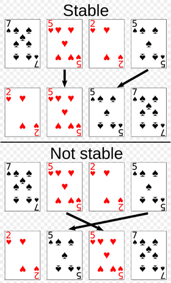
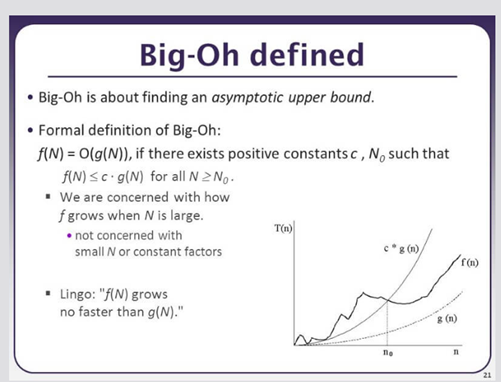
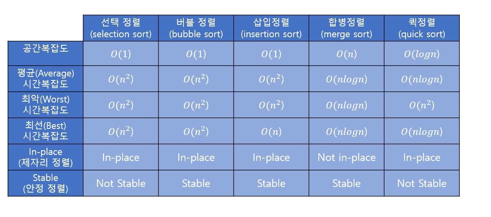
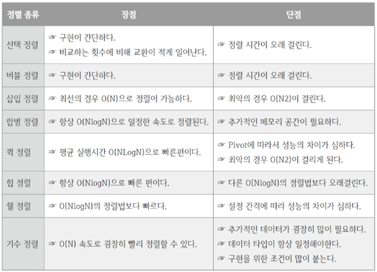
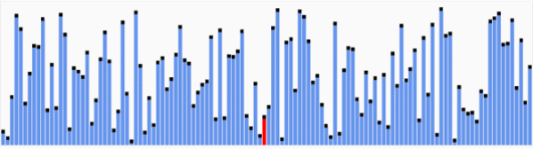
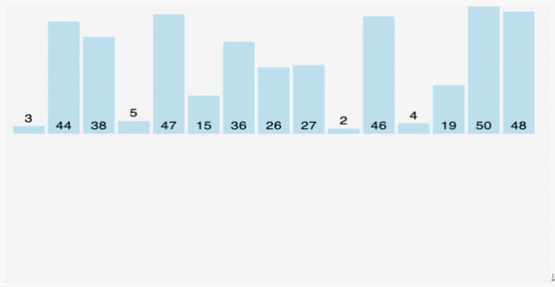
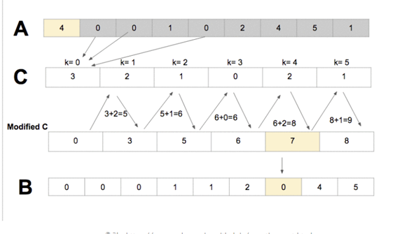
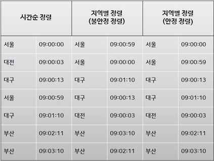
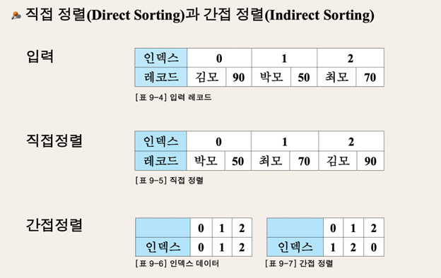
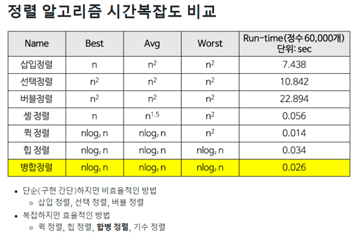

참고자료 : https://roytravel.tistory.com/m/328
# 정렬 알고리즘
- 원소들을 번호순이나 사전 순서와 같이 일정한 순서대로 열거하는 알고리즘

### 분류 및 비교기준
- Stable: 동일한 값에 대해 먼저 등장한 순서대로 정렬

Ex.
<br>

<div align='center'>
    
</div> 

<br> 
 
- In-Place: 새로운 배열을 만들 필요 없이 입력 배열 내부에서 정렬
<br>입력 자료에 할당된 메모리 이외 일정 상수만큼 작은 추가 메모리만을 필요로 함.
- Comparison: 두 값의 상대적 순서를 정할 때 크기를 비교하는 것에 기반하여 정렬
<br>다음과 같은 조건을 만족할 때 비교 정렬이 작동
    1. 타동성: a ≤ b이고 b ≤ c이면 a ≤ c이다.
    2. 완전성 또는 3분법: a와 b 모두 a ≤ b 또는 b ≤ a이다.

### 빅오 표기법
- 알고리즘의 효율성을 분석하기 위해 컴퓨터 공학자들이 쓰는 가장 기본적인 도구들 중 하나
- 인자가 특정한 값이나 무한대로 향할 때 함수의 극한적인 동작을 설명하는 수학적인 표기법
<br>

<div align='center'>
    
</div> 

<br>  
- 빅오는 점근선의 상한 범위를 찾는 것

- 빅오의 공식적인 정의는
<br>f(N) = O(g(N)), 양수인 상수 c가 있다면, N₀는 다음과 같다.
<br>모든 N ≥ N₀에 대해 f(N) ≤ c * g(N) 이다.
- 우리는 N이 커질 때에 f가 어떻게 증가하는지를 구하고 싶다
- 작은 N이나 상수 인자는 고려하지 않는다
- 용어: "f(N)은 g(N)이 증가하는 만큼만 증가한다."
정렬 기법 비교
<br>

<div align='center'>
    
</div> 

<br>  
<br>

<div align='center'>
    
</div> 

<br>  
 
## 비교 정렬
https://modoocode.com/274

단순하지만 비효율적인 방법

- 버블 정렬: 비교 정렬, 제자리 정렬
    - 버블 정렬은 기본적으로 배열의 두 수(a, b)를 선택한 뒤, 만약 그 두 수가 정렬되었다면 놔두고 아니라면 두 수를 바꾸는 방식으로 진행됨
    - 오름차순으로 정렬할 때는 a<b, 내림차순이라면 a>b여야 정렬된 것으로 판단, 이를 배열의 처음부터 끝까지 반복하며 배열에 아무 변화가 없을 때까지 반복하는 것
    - 이미 정렬이 되어 있는 경우, 어느 정도 정렬이 되어 있는 경우 효과적

- 선택 정렬: 비교 정렬, 제자리 정렬
    - 가장 작은 숫자를 선택해서 앞쪽으로 옮기는 방법
    - 아직 정렬되지 않는 오른쪽과 정렬이 완료된 왼쪽으로 나누어지는데 오른쪽에서 가장 작은 숫자를 선택하여 왼쪽의 맨 뒤로 이동하는 작업을 반복하는 것
    - 입력 자료의 구성과 상관없이 자료 이동 횟수가 결정된다는 장점이 있음

- 삽입 정렬: 비교 정렬, 제자리 정렬
    - 주어진 리스트 중에 최소값을 찾고 그 값을 맨 앞에 위치한 값과 교체하고, 정렬이 안된 부분의 항목수가 줄어든 채로 나머지를 같은 방법으로 교체하는 방법
    - 숫자를 도중에 삽입을 하는 것이기 때문에 교체되는 수보다 큰 수들은 모두 뒤로 하나씩 이동되며 비교하는 것이 상수 시간에 이루어진다는 가정 아래, n개의 주어진 리스트를 이와 같은 방법으로 정렬하는 데에는 최악의 경우 O(N^2)이고 정렬이 된 경우에는 O(N)
    - 대부분의 요소들이 정렬되어 있는 경우나 요소의 수가 적을 경우 효과적
 
## 퀵 정렬 (Quick Sort)

퀵 정렬은 분할정복법과 재귀를 사용해 정렬하는 알고리즘이다. 
<br>

<div align='center'>
    
</div> 

<br>   

퀵 정렬에는 피봇(Pivot)이라는 개념이 사용된다. 피봇은 한 마디로 정렬될 기준 원소를 뜻한다. 피봇 선택 방법에 따라 퀵 정렬의 성능이 달라질 수 있다. 최적의 피봇 선택이 어려우므로 임의 선택을 해야 한다. 보통 배열의 첫 번째 값이나 중앙 값을 선택한다. 퀵 정렬의 동작방식은 다음과 같다. 가령 예를 들어 배열 [5, 6, 1, 4, 2, 3, 7]이 있고, 피봇을 임의로 4를 선택했다 가정하자. 이후 4를 기준으로 작은 것은 왼쪽으로 큰 것은 오른쪽으로 보내 [1, 2, 3] < 4 < [5, 6, 7]를 생성한다. 다시 왼쪽에서부터 임의의 피봇 2를 설정하여 [1] < 2 < [3]을 생성하고 오른쪽에선 임의의 피봇 6를 설정하여 [5] < 6 < [7]로 나눈다. 만약 배열 길이가 1이 된다면 가장 정렬 완료된 것이므로 분할된 배열을 합쳐 줌으로써 정렬을 마친다. 이를 알고리즘으로 구현하면 다음 코드와 같다.

```python
def quick_sort(array: list) -> list:
    """ Best: O(nlogn) Average: O(nlogn) Worst: 0(n^2) | O(nlogn) """ 
    if len(array) <= 1:
        return array
    pivot = array[len(array) // 2]
    small, equal, big = [], [], []
    for num in array:
        if num < pivot:
            small.append(num)
        elif num > pivot:
            big.append(num)
        else:
            equal.append(num)
    return quick_sort(small) + equal + quick_sort(big)
```


### 퀵정렬과 이분탐색?
- 후라이드와 양념을 반반씩 시킴
- 종이를 반으로 접음

퀵정렬과 이진탐색은 행위의 유사성(반으로 나눠가며...)만 있을 뿐 둘은 차이점을 논할 대상들이 아닙니다.

**정렬**은 임의의 데이터들을 특정 기준에 맞춰서 **줄을 세우는 거고**, **이진탐색**은 이렇게 줄서있는 데이터들을 대상으로 "빠르게" **값을 찾는** 테크닉

## 병합 정렬 (Merge Sort)
병합 정렬은 분할정복과 재귀 알고리즘을 사용하는 정렬 알고리즘이다.

<br>

<div align='center'>
    
</div> 

<br>

퀵 정렬과 함께 두 개의 알고리즘이 사용된다는 측면에서 공통점을 가진다. 하지만 차이점은 퀵 정렬이 피봇 선택 이후 피봇 기준으로 대소를 비교하는 반면, 병합 정렬은 배열을 원소가 하나만 남을때까지 계속 이분할 한 다음, 대소관계를 고려하여 다시 재배열하며 원래 크기의 배열로 병합한다. 예를 들어 배열 [6, 5, 1, 4, 3, 2, 8, 7]이 있을 때, 첫 번째로 [6, 5, 1, 4]와 [3, 2, 8, 7]로 분리한다. 두 번째로 [6, 5], [1, 4], [3, 2], [8, 7]로 나눈다. 세 번째로 [6], [5], [1], [4], [3], [2], [8], [7]로 나눈다. 이렇게 모든 원소가 분리되면 대소 관계를 고려하여 병합 과정을 거친다. 첫 번째로 [5, 6], [1, 4], [2, 3], [7, 8]이 되며, 두 번째는 [1, 4, 5, 6], [2, 3, 7, 8]이 된다. 마지막으로 하나의 배열로 병합되면서 [1, 2, 3, 4, 5, 6, 7, 8]와 같이 정렬이 완료되면서 알고리즘이 종료된다. 이를 코드로 나타내면 아래 코드와 같다.

```python
def merge_sort(array: list) -> list:
    """Best: O(nlogn) Average: O(nlogn) Worst: O(nlogn) | O(n) """ 
    if len(array) < 2:
        return array

    mid = len(array)//2

    low = merge_sort(array[:mid]) 
    high = merge_sort(array[mid:])

    merged_array = []
    I, h = 0, 0

    while I < len(low) and h< len(high):
        if low[I] < high[h]:
            merged_array.append(low[I])
            I += 1
        else:
            merged_array.append(high[h])
            h += 1

    merged array += low[I:]
    merged array += high[h:]
    return merged_array
```

## 퀵정렬 vs 병합정렬


### 정렬 방법
### 퀵 정렬
배열을 pivot의 값을 기준으로 값이 작은 배열과 큰 배열로 정렬한다.

부분 배열의 크기가 충분히 작다면 그냥 정렬하고, 아니라면 재귀 호출을 통해 다시 이 과정을 반복한다.

매 정렬마다 pivot 하나는 위치가 정해짐이 보장되었으므로 끝남을 보장 가능.

pivot을 어떻게 정하냐에 따라 최적화 가능.

### 병합 정렬
입력 배열을 2개의 부분 배열로 분할한다.

부분 배열의 크기가 충분히 작다면 그냥 정렬하고, 아니라면 재귀 호출을 통해 다시 이 과정을 반복한다.

정렬된 부분 배열을 하나의 리스트로 병합한다.


#### 차이점
-	퀵정렬은 불안정 정렬, 병합 정렬은 안정 정렬이다.
-	퀵정렬은 최악의 경우(오름차순 정렬이거나 내림차순 정렬일 경우) O(n^2)의 시간 복잡도를 가지지만 병합 정렬은 O(n log n)으로 동일하다.
-	퀵 정렬이 평균의 시간 복잡도에서는 빠를 수도 있다.
-	병합 정렬은 추가 메모리 공간을 필요로 한다.
#### 공통점
-	둘 다 분할 정복 알고리즘이다.
-	속도가 빠르다.

 
## 자료구조 – 정렬
### 1.	버블 정렬
* 이중 포문을 이용하여 i 가 0부터 n-2까지 순회하면서 j를 이용하여 바로 다음 인덱스 값과 비교해가면서 작다면 위치를 바꾸고 크다면 바꾸지 않고 다음 j 로 넘어간다.
* 끝에서부터 큰 값이 차곡차곡 쌓이는 모습이 물방울이 수면에 맺히는 모습 같다
### 2.	삽입 정렬
* 뒤에서부터 탐색 시작 
* 역순으로 인덱스를 탐색하면서 자기보다 작은 값을 갖는 인덱스를 만났을 때 탐색과 인덱스 교환을 멈추고 마지막으로 반환한 인덱스를 이용하여 교환한다.

### 3.	선택 정렬
* 모든 경우를 탐색한다는 점에서 버블 정렬과 비슷하지만 교환을 적게 한다는 점이 다르다.
* 그 이유는 최소값의 인덱스를 지속적으로 업데이트 해주는 방식에 있다. 이중 포문에서 진행하면서 남은 범위의 최소값이 발견할 때까지 탐색을 한 뒤 최소값이 저장되어 있는 인덱스를 이용해서 현 위치와 교환하기 때문이다.

### 4.	카운팅 정렬
* 주어진 리스트의 최대값을 크기로 갖는 리스트를 생성한 뒤 그 리스트의 인덱스를 이용하여 주어진 리스트의 요소의 개수를 세준다
* 그 리스트를 누적연산한다. 주어진 리스트 인덱스용이라고 생각하면 편함.
* 최대값이 작고 요소 내에 중복되는 값이 많을 때 효율적이다
* 정렬의 길이 N, 최대값 K >>> O(N+K)
* 정렬하고자 하는 배열의 원소를 순회하며 count[원소]의 위치에서 누적합 되어 있는 값을 index로 지정해준다. 이후 새로 생성한 배열 result에 그 값을 넣어주고 누적합된 값을 -1을 해준다. 여기서 누적합 값에 -1을 해주는 것은 result의 index에 차례대로 같은 수를 담는 것이 아니라 역순으로 담아야 하기 때문이다. 역순으로 값을 담는 이유는 현재 알고리즘 구조상 역순으로 담아야 하기 때문이다. 이중 루프를 통해서 차례대로 값을 담을 수 있지만 코드 가독성과 동작 효율성을 고려하면 위와 같이 작성하는 것이 더 좋다.

```python
def counting_sort(array : list) -> list:
    """ Best: 0(n) Average: 0(n+k) Worst: 0(n+k) | 0(n+k)"""

    count = [0] * (max(array) + 1) # 1. create a count array to check how many numbers each
    
    for num in array: # 2. check how many numbers each have.
        count [num] += 1
    
    for i in range(1, len(count)): # 3. do cumulative sum
        count [i] += count [i-1]

    arr = [0] * len(array) # 4. create a new array to contain the numbers to be sorted.
    
    for num in array: # 5. sort.
        idx= count [num] 
        arr[idx-1] = num
        count [num] -= 1
    return arr
``` 
<br>

<div align='center'>
    
</div> 

<br>
 
### 정렬을 왜 할까?
-	정렬된 자료가 필요하니까! (인기순, 판매량순, 가까운 순… 최신메일 등)
-	이진 탐색 알고리즘 : 43억 개의 정렬된 자료에서 최악이라도 2^32번만에 찾음!

### 정렬의 구분
- 정렬은 오름차순(1-2-3-4)과 내림차순(4-3-2-1)의 형태로 나뉜다.
- 내부 정렬과 외부 정렬로 나눌 수 있다.
    - 내부 정렬 : 정렬할 정보를 모두 메인 메모리 내부에 올린 채 정렬
    - 외부 정렬 : 정렬할 정보들이 메인 메모리에 비해 클 때, 사용
        - 방식 : 메모리의 양만큼만 가져다 정렬하고, 결과를 외부 기억장치에 저장을 반복
- 안정 정렬과 불안정 정렬로 나눌 수 있다.
- 직접 정렬과 간접 정렬로 나눌 수 있다.

### 안정 정렬 vs 불안정 정렬
 
<br>

<div align='center'>
    
</div> 

<br>
<br>

<div align='center'>
    
</div> 

<br>
<br>

<div align='center'>
    
</div> 

<br>

 
추가자료 : n log n 예시

https://www.codeit.kr/community/questions/UXVlc3Rpb246NWUzNDUyMjU4MGU1MTMzNzNkOTYyZTcz
