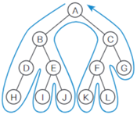
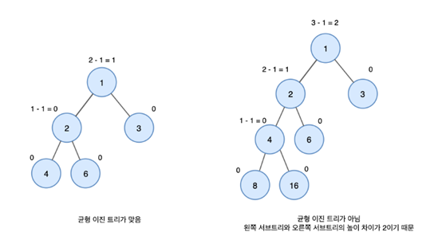
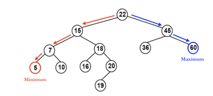
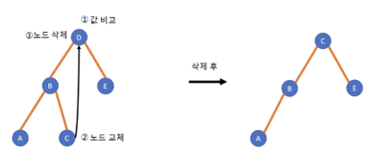

# 트리
(1)	정의
1)	그래프의 일종. 데이터 사이의 계층 관계를 표현. 비선형
2)	나무(거꾸로)

(2)	구조: 노드(node)와 가지(edge)
 

    

 

   

(3)	용어
1)	루트(root) : 가장 위쪽에 있는 노드. 단 1개만 존재
2)	리프(leaf, 단말 노드terminal node) : 가장 아래쪽에 있는 노드. 가지가 더 이상 뻗어 나갈 수 없는 마지막에 노드가 있다는 뜻
3)	비단말 노드(내부 노드) : 리프 제외한 노드
4)	자식, 부모, 형제 : 자식은 제한 없지만 부모는 1개, 부모가 같은 노드는 형제
5)	조상, 자손 : 위/아래로 가지를 따라가면 만나는 모든 노드
6)	레벨 : 루트에서 얼마나 멀리 떨어져 있는지를 나타냄. 가지가 하나씩 뻗어 내려갈 때마다 레벨이 1씩 증가
7)	차수(degree) : 각 노드가 갖는 자식의 수, 모든 노드의 차수가 n이하의 트리는 n진 트리, 그림은 삼진 트리
8)	높이(height): 루트에서 가장 멀리 있는 리프까지의 거리. 즉 leaf 레벨의 최대값. 그림에서 트리의 높이는 3
9)	서브 트리: 어떤 노드를 루트로 하고, 그 자손으로 구성된 트리
 

    

 

   

(4)	특성 (그래프와 차이)
-	서로 다른 두 노드를 연결하는 길이 하나 뿐인 그래프
-	사이클이 없음
-	루트 노드를 제외한 모든 노드는 단 하나의 부모노드를 가짐
-	노드가 n개인 트리는 항상 n-1개의 간선(edge)을 가짐.
-	트리가 아닌 경우
 

    
    

 

      
-1번은 루트 노드가 2개, 2번은 부모노드가 2개이고 사이클이 있으므로

(5)	사용 사례 
1)	계층적 데이터 저장 ex) 폴더 및 파일
2)	효율적인 검색 속도
3)	힙 등

(6)	순서 트리와 무순서 트리
-	형제 노드의 순서 관계가 있는지
-	순서관계가 있으면 순서 트리 (a와 b는 다른 트리)
-	구별하지 않으면 무순서 트리 (a와 b는 같은 트리)
 

    

 

    

## 순서 트리의 검색
(1)	너비 우선 검색 
-	낮은 레벨부터 왼쪽에서 오른쪽으로 검색하고
-	한 레벨에서 검색을 마치면 다음 레벨로 내려감
 

    

 

    

(2)	깊이 우선 검색
-	리프에 도달할 때까지 아래쪽으로 내려가면서 검색하고
-	리프에 도달해서 더 이상 검색할 곳이 없으면 일단 부모 노드로 돌아가고 그 후 다른 자식 노드로 내려감

 

    

 

    
-	어느 시점에 실제로 노드를 방문하는지에 따라(순회 방법) 3 종류의 스캔방법으로 나뉨 (지나가는 것과 방문하는 것은 다른 개념)
 
  

## 순회
 

    

 

 

(1)	전위 순회 (preorder)
1)	순서: 노드 방문 -> 왼쪽 자식 -> 오른쪽 자식
2)	A에 대하여:  A 방문 -> B로 내려감 -> C로 내려감  
3)	트리 스캔 순서 : A - B - D - H - E – I – J – C – F – K – L -G   

(2)	중위 순회 (inorder)
1)	순서 : 왼쪽 자식 -> 노드 방문 -> 오른쪽 자식
2)	A에 대하여: B로 내려감 -> A 방문 -> C로 내려감  
3)	트리 스캔 순서 : H - D - B - I - E – J – A – K – F – L – C -G   

(3)	후위 순회 (postorder)
1)	왼쪽 자식 -> 오른쪽 자식 -> 노드 방문
2)	A에 대하여: B로 내려감 -> C로 내려감 -> A 방문 
3)	트리 스캔 순서 : H - D - I - J - E – B – K – L – F – G – C - A   

< plus > 
BFS, DFS 모두 자식 노드들을 한 번씩 순회하기 때문에 시간복잡도는 동일하다.

하지만 공간 복잡도의 경우 너비가 넓은 트리의 경우 깊이 우선 탐색이 더 유리하고, 트리의 깊이가 깊을수록 너비 우선 탐색이 더 유리하다.

< 추가 자료 >

1.	그래프와 트리의 비교
https://bigsong.tistory.com/33

2.	순회 https://velog.io/@kimdukbae/%EC%9E%90%EB%A3%8C%EA%B5%AC%EC%A1%B0-%ED%8A%B8%EB%A6%AC-Tree

# 힙(heap)
-	(영단어 뜻) 무엇인가를 차곡차곡 쌓아올린 더미
-	항상 **완전 이진 트리**의 형태를 띠어야 함 (삽입/삭제의 속도 때문에 사용)
(우선순위 큐를 위하여 만들어진 자료구조)
-	여러 개의 값들 중에서 **최댓값이나 최솟값을 빠르게 찾아내도록** 만들어진 자료구조
→ 부모의 값은 항상 자식(들)의 값보다 크거나, 작아야 하는 규칙이 있음
-	일종의 ‘반정렬 상태(느슨한 정렬 상태)’를 유지
→ 큰 값이 상위 레벨에 있고, 작은 값이 하위 레벨에 있다는 정도
→ 간단히 말하면, 부모노드의 키 값이 자식노드의 키 값보다 항상 큰(작은) 이진 트리

## 힙 트리(Heap tree)
-	여러 개의 값 중에서 가장 크거나 작은 값을 빠르게 찾기 위해 만든 이진 트리
-	짧게 ‘힙’이라고 줄여서 부르기도 함
-	데이터의 삽입과 삭제는 모두 **O(log N)**이 소요됨 [최대최소 찾기에 배열 사용하면 O(n)]
-	완전 이진트리 구조를 가지고 있기 때문에 레벨이 늘어날수록 노드의 수는 두배씩 증가
(레벨이 i라고 가정했을 때, i레벨의 노드수는 2^(i-1)개. 이는 완전이진트리의 특성 때문)
-	힙 트리에서는 중복된 값을 허용 (이진탐색트리에서는 중복된 값을 허용하지 않음)
-	따라서 트리의 높이는 노드의 수를 통해 알 수 있음
(트리의 높이는 log(2)I + 1에서 소수점을 버린 값)

 

    

 

 
 
 
### 힙의 종류
1.	최대 힙 : key(부모 노드) >= key(자식 노드)
2.	최소 힙 : key(부모 노드) <= key(자식 노드)

 

    

 

 
### 힙의 구현

-	힙을 저장하는 표준적인 자료구조는 **‘배열’**
-	구현을 쉽게 하기 위하여 배열의 첫 번째 인덱스인 0은 사용하지 않음
-	특정 위치의 노드 번호는 새로운 노드가 추가되어도 변하지 않음 
(예를 들어, 루트 노드의 오른쪽 노드의 번호는 항상 3)
-	힙에서의 부모 노드와 자식 노드의 관계

→ 왼쪽 자식의 인덱스 = (부모의 인덱스) * 2

→ 오른쪽 자식의 인덱스 = (부모의 인덱스) * 2 + 1

→ 부모의 인덱스 = (자식의 인덱스) // 2
 
 

    

 

 
### 힙의 데이터 삽입
1.	가장 끝의 자리에 노드를 삽입한다.
2.	그 노드와 부모 노드를 서로 비교한다.
3.	규칙에 맞으면 그대로 두고, 그렇지 않으면 부모와 교환한다. (부모노드는 삽입된 위치의 인덱스 번호에서 /2를 하면 쉽게 구할 수 있다.)
4.	규칙에 맞을 때까지 3번 과정을 반복한다.
 

    

 

 
 
### 데이터 삭제
최댓값 혹은 최솟값이 저장된 루트 노드만 제거할 수 있다.
1.	루트 노드를 제거한다.
2.	루트 자리에 가장 마지막 노드를 삽입한다.[3]
3.	올라간 노드와 그의 자식 노드(들)와 비교한다.
4.	조건에 만족하면 그대로 두고, 그렇지 않으면 자식과 교환한다.

    - 최대 힙
        1.  부모보다 더 큰 자식이 없으면 교환하지 않고 끝낸다.
        2.	부모보다 더 큰 자식이 하나만 있으면 그 자식하고 교환하면 된다.
        3.	부모보다 더 큰 자식이 둘 있으면 자식들 중 큰 값과 교환한다.
    - 최소 힙
        1.	부모보다 더 작은 자식이 없으면 교환하지 않고 끝낸다.
        2.	부모보다 더 작은 자식이 하나만 있으면 그 자식하고 교환하면 된다.
        3.	부모보다 더 작은 자식이 둘 있으면 자식들 중 작은 값과 교환한다.
5. 조건을 만족할 때까지 4의 과정을 반복한다.

 

    

 

 
 
참고자료
-	나무위키 ‘힙 트리’ : https://namu.wiki/w/%ED%9E%99%20%ED%8A%B8%EB%A6%AC
-	C언어를 이용한 구현 : https://gmlwjd9405.github.io/2018/05/10/data-structure-heap.html
-	간단한 그림으로 이해하기 좋음 : https://velog.io/@gnwjd309/data-structure-heap

# 이진 트리

컴퓨터 과학에서 **이진 트리(二進-, 영어: binary tree)**는 각각의 노드가 최대 두 개의 자식 노드를 가지는 트리 자료 구조로, 자식 노드를 각각 왼쪽 자식 노드와 오른쪽 자식 노드라고 한다. 단순히 집합론의 개념을 사용하는 재귀적 정의에서 (비어있지 않은) 이진 트리는 하나의 튜플 (L, S, R)로, L과 R은 이진 트리 또는 공집합이고 S는 싱글턴 집합(하나의 원소만을 가지는 집합)이다. 일부 구현자는 공집합인 이진 트리도 허용한다.

수학에서, 이진 트리라고 명명한 것이 저술자마다 현저히 다를 수 있다. 어떤 이들은 컴퓨터 과학에서 보통 사용되는 정의를 사용하지만, 다른 이들은 정확하게 두 개의 자식 노드를 가진 잎이 없는 모든 트리로 정의하고 꼭 (왼쪽과 오른쪽으로) 자식 노드를 정렬하지도 않는다
 

    

 

 
### 이진 트리 용도
-	수식 트리(Expression Tree)
-	허프만 코딩 트리(Huffman coding Tree)
-	이진 검색 트리(Binary Search Tree, BST)
-	우선 순위 큐(PQ)

### 이진 트리 구현
https://math-coding.tistory.com/164 > 자바 구현 코드
https://it-garden.tistory.com/406 > 파이썬 구현 코드

## 이진 트리 종류
### 전 이진트리 - Full binary tree
모든 노드가 0개 또는 2개의 자식 노드를 갖는 트리, 2*h+1 <= node <= 2^(h+1)-1
 

    

 

### 포화 이진 트리 - Perfect binary tree
Full binary tree 이며 complete binary tree인 경우
모든 리프 노드의 레벨이 동일하고, 모든 레벨이 가득 채워져 있는 트리
즉, 모든 노드가 두개의 자식 노드를 가지며 모든 노드가 동일한 깊이 또는 레벨을 갖는다.
트리의 노드 개수가 정확히 2^k-1개여야 하며 k는 트리의 높이이다.
 

    

 

### 완전 이진 트리 - Complete binary tree
마지막 레벨을 제외하고 모든 레벨이 완전히 채워져 있는 트리
 
1)	완전 이진 트리는 마지막 레벨을 제외하고 모든 레벨이 완전히 채워져 있다.
2)	마지막 레벨은 꽉 차 있지 않아도 되지만, 노드가 왼쪽에서 오른쪽으로 채워져야 한다.
3)	트리의 높이가 h일 때 2^(h-1).~2^h-1개의 노드를 가질 수 있다.
4)	완전 이진 트리는 배열을 사용해 효율적으로 표현 가능하다.
 

    

### 무한 완전 이진 트리 – Infinite complete binary tree
모든 노드는 두개의 자식 노드를 갖는다(그래서 레벨 집합은 가산 무한 이다.). 모든 노드 집합은 가산 무한이지만, 루트로부터의 모든 무한한 경로 집합은 연속체의 원소 개수를 가지고 있어 셀수 없다. 

### 편향 이진 트리 - Skewed binary tree
같은 높이의 이진 트리 중에서 최소 개수의 노드 개수를 가지면서 왼쪽 혹은 오른쪽 서브 트리만 가지는 이진 트리, h <= node <= 2^h-1
즉, 모든 노드가 왼쪽에 있거나 반대로 오른쪽에 있는 트리
각 부모 노드가 오직 한 개의 연관 자식 노드를 갖는 트리
사향 이진 트리(Degenerate (or {Pathological} Tree)라고도 부름
Linked List 성능과 동일하다.

 

    

### 균형 이진 트리 - Balanced binary tree
높이 균형이 맞춰진 이진 트리
왼쪽과 오른쪽 트리의 높이 차이가 모두 1만큼 나는 트리

 

    

# 이진 탐색 트리(binary search tree, BST)
-	이진탐색트리란? 이진 트리 기반의 탐색을 위한 자료구조로 이진탐색과 연결리스트를 결합한 자료구조이다. (이진탐색 : 계산복잡성은 빠르지만 입력과 삭제가 불가능/ 연결리스트 : 자동입력과 삭제에 필요한 계산복잡성은 빠르지만, 탐색하는데의 계산복잡성이 상당함)
-	이진 탐색의 효율적인 탐색 능력을 유지하면서, 빈번한 자료입력과 삭제를 가능하게끔 고안됨. 
1.	모든 원소의 키는 유일한 키를 가진다. (중복된 노드가 없다)
2.	왼쪽 서브트리 키들은 루트 키보다 작다.
3.	오른쪽 서브 트리의 키들은 루트의 키보다 크다
4.	왼쪽, 오른쪽 서브 트리 모두 이진 탐색 트리이다.
 
 

    

-> 15의 값을 가진 노드의 왼쪽 서브트리에 있는 값들이 루트 노드인 15보다 모두 작고, 오른쪽 서브트리에 있는 값들은 모두 15보다 크다. 이진탐색 트리가 어느정도 정렬된 상태를 유지하고 있다.

## 이진 탐색 트리의 핵심연산
### 1.	검색연산(탐색연산)

 

    

루트 노드를 기점으로 찾고자 하는 값의 크기에 따라 왼쪽 서브 트리나 오른쪽 서브 트리로 이동하여 노드를 탐색한다. 현재 노드의 값보다 찾는 값이 크면 오른쪽 서브 트리에서 탐색을 진행하고 값이 작다면 왼쪽 서브트리에서 검색을 진행한다. 검색은 재귀적인 방법과 반복적인 방법으로 구현이 가능하다.
만약 값이 트리에 없다면? 끝까지 검색한 후 오른쪽 서브트리로 이동한다. 그러나 찾고자 하는 값이 없을땐 NULL의 상태를 가지므로, 다른 트리가 없는 것을 뜻하므로, 검색에 실패했다는 것을 알 수 있다. (NULL = 검색실패)

### 2.	삽입연산

 

    

탐색과정에서 NULL을 만나면 삽입을 진행하는 방식으로 구현할 수 있다. 이 때 이진 탐색 트리의 특성인 중복된 키 값이 존재하지 않는다는 특성을 유지하기 위해 탐색에 성공하면 삽입을 하지 않는다. 위 그림에서는 F 삽입

### 3.	삭제연산

이진 탐색 트리의 삭제는 삽입과 반대. 우리가 삽입을 할 때 키 값이 존재하면 삽입 연산을 하지 않았는데, 삭제 과정에서는 반대로 키 값이 존재하면 삭제 연산을 수행한다. 다만, 삭제를 할 때는 삭제하려는 노드의 자식 노드의 개수에 따라 삭제 방법이 달라진다.
1.	자식 노드가 없는 경우(G)
 

    

 
G의 자식 노드가 없다. 이 때는 삭제할 키 값을 탐색하고 삭제할 키 값이 존재하면 삭제 연산을 진행하고, 키 값이 존재하지 않으면 삭제 연산에 실패했음을 알린다.

2.	자식 노드가 1개인 경우(F)
 

    

  
자식노드가 1개인 경우, 삭제하는 노드의 서브 트리를 삭제할 노드의 위치로 가져온다.

3.	자식 노드가 2개인 경우(D)

 

    

자식노드가 2개인 경우 : 먼저 삭제할 노드를 탐색하고, 삭제할 노드가 존재하면 삭제할 노드를 대체할 노드를 선택한 후 바꿔준다. 대체 노드를 선택하는 방법은 두가지가 있다.
1.	삭제할 노드의 왼쪽 서브 트리에서 가장 큰 노드로 대체하는 방법
2.	삭제할 노드의 오른쪽 서브트리에서 가장 작은 노드로 대체하는 방법.

이진 탐색 트리의 기타 연산
1.	이진탐색트리 생성
2.	이진탐색트리 삭제
3.	해당 이진탐색트리가 비어있는지 확인
4.	트리순회

### m원 탐색 트리(multiway search tree)
다원 탐색 트리 :  한 노드안에 최대 m-1개의 요소와 m개의 자식을 가질 수 있다. 이진탐색트리는 m=2인 다원 탐색 트리이다. 

 

    

1.	각 노드는 0<= 서브트리개수 <= m 만큼의 서브 트리를 갖는다.
2.	k개의 자식 노드를 가지는 노드는 k-1 개의 요소를 갖는다 (k<= m)
3.	각 노드안에 있는키는 오름차순으로 정렬되어 있다
4.	항상 아래 조건을 만족한다. : i번째 key <= i번째 서브 트리 내의 모든 키 값 <= i+1번째 key
5.	모든 서브트리는 m-원 탐색 트리이다.
    -	트리의 높이가 h이면 트리의 작업 속도는 O(h), 높이를 낮춤으로써 작업 속도를 높일 수 있다. 노드에 저장할 수 있는 요소의 수를 늘림으로써 트리의 높이를 줄일 수 있다.
    -	다원 검색 트리는 이진 검색 트리보다 많은 요소를 저장할 수 있어 낮은 높이를 유지할 수 있다. 
    -	그러나, 다원탐색트리는 스스로 균형을 유지하기 못하기 때문에 불균형이 발생할 수 있다. 검색 성능도 떨어진다. 단점을 보완하기 위한 방안 : b-tree

## AVL 트리
#### AVL트리 고안 배경
완전 이진탐색트리는 편향된 이진탐색트리와 다르게 항상 O(log n)의 검색 속도를 보장한다. 그러나 완전 이진 탐색 트리의 단점은 트리에 자료가 삽입될 때마다 완전 이진 탐색 트리의 형태를 유지하기 위해 트리의 모양을 바꾸어야 한다. 즉, 삽입할 때 많은 시간이 소요된다. 삽입하는 빈도수가 높아지면 높아질수록 효율성이 떨어지는데, 이런 불편함을 해결한 것이 AVL 트리이다. 
 
 

    

-	AVL 트리 : 트리 내의 모든 노드에 대해 왼쪽 서브 트리의 높이와 오른쪽 서브 트리의 높이가 1 이상 차이나지 않는 높이 균형 이진 트리이다. 
-	검색 속도, 삽입/삭제 연산 속도 : O(log n)
-	균형인수 : 왼쪽 서브트리의 높이와 오른쪽 서브트리의 차. BF(T)로 나타내며, 트리 T의 양쪽 서브 트리에 대한 높이의 차. BF(T) = h(left tree) – h(right tree)에서 BF가 -1, 0, 1만의 값을 갖는다면 이 이진 탐색트리를 AVL 트리라고 한다.

### AVL 트리의 회전 연산
-	삽입, 삭제 과정은 이진탐색트리에서의 삽입, 삭제와 동일 그후 재조정 과정 추가적으로 거친다.
-	트리를 재조정하는 경우는 균형인수의 절대값이 2를 넘어가는 경우이다. 트리의 재조정은 회전 연산을 통해 이루어진다. 
  
 

    
    

 
 

    

 
### LL 회전
: LL회전(LL rotation)은 왼쪽 서브 트리의 왼쪽 서브 트리에 노드가 추가되면서 불균형이 발생했을 떄 사용한다. 아래 그림을 보면 왼쪽 A 노드가 삽입되면서 C 노드의 균형인수가 깨졌다. 이를 해결하기위해 LL회전을 하여 다시 균형인수를 맞춘게 된다.

 

    

### RR 회전
: RR회전(RR rotation)은 오른쪽 서브 트리의 오른쪽 서브 트리에 노드가 추가되면서 불균형이 발생했을 때 사용한다. 아래 그림을 보면 오른쪽 G 노드가 삽입되면서 D 노드의 균형인수가 깨졌다. 이를 해결하기위해 RR회전을 하여 다시 균형인수를 맞춘게 된다.

 

    

 
 
### LR 회전
: LR회전(LR rotation)은 오른쪽 서브 트리의 왼쪽 서브 트리에 노드가 추가되면서 불균형이 발생했을 때 사용한다. 아래 그림을 보면 L 노드가 삽입되면서 G 노드의 균형인수가 깨졌다. 이를 해결하기위해 LR회전을 하여 다시 균형인수를 맞춘게 된다. LL회전과 RR회전을 순서대로 하면 LR회전이 된다.

 

    

### RL 회전
: RL회전(RL rotation)은 왼쪽 서브 트리의 오른쪽 서브 트리에 노드가 추가되면서 불균형이 발생했을 때 사용한다. 아래 그림을 보면 B 노드가 삽입되면서 G 노드의 균형인수가 깨졌다. 이를 해결하기위해 RL회전을 하여 다시 균형인수를 맞춘게 된다. RR회전과 LL회전을 순서대로 하면 RL회전이 된다.
 
 

    

 

이진탐색트리 구현

자바 : https://st-lab.tistory.com/300

파이썬 : https://wikidocs.net/195269

AVL 구현

자바 : https://velog.io/@iamtaehoon/AVL-%ED%8A%B8%EB%A6%AC

파이썬 : https://health-coding.tistory.com/17

