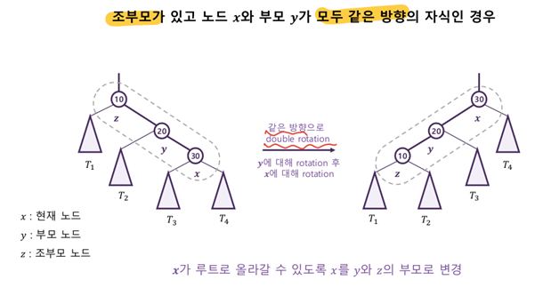
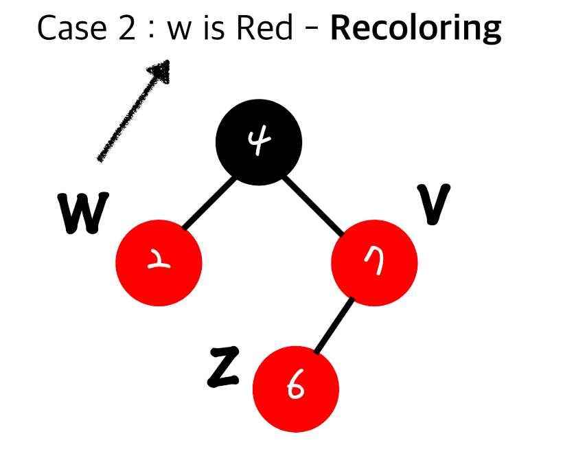
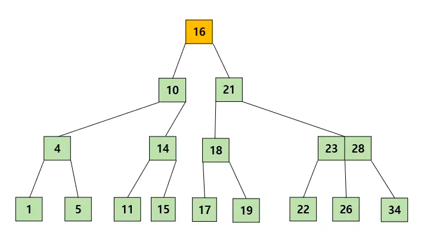

## 레코드
: 개체에 대해 수집된 모든 정보를 포함하고 있는 저장단위
## 필드
: 레코드에서 각각의 정보를 나타내는 부분
## 키
- 다른 레코드와 중복되지 않는 각 레코드를 대표하는 필드
- 키는 하나의 필드로 이루어질 수도 있고 두 개 이상의 필드로 이루어질 수도 있다. 

ex) 학생이라는 레코드는 이름, 학번, 점수 등의 키를 가진다

# 이진탐색
: 정렬이 돼있다는 전제하에 절반씩 쪼개며 찾는 탐색 방식
 
 

    

 

  

보간 탐색
- 이진탐색과 마찬가지로 정렬된 리스트에서 범위를 줄여가며 검색하는 알고리즘
- 그러나 이진탐색과는 탐색 위치를 정하는 방식이 다르다

 

    

 

  
 

    

 

  

 
- 이진 탐색은 항상 중간 위치로 탐색 위치를 결정하는 반면
- 보간 탐색은 검색키 값에 따라 다른 위치로 이동하게 된다. 보간 탐색 방식에 의하면 만약 값이 상대적으로 앞에 있다고 판단되면 중앙이 아닌 앞쪽에서 탐색을 진행하고 반대의 경우 뒤쪽에서 탐색을 진행한다
- 만약 데이터가 선형으로 분포되어 있다면 보간탐색을 사용할 시 한번에 값을 찾을 수도 있다

참고) 보간 탐색 시 탐색 위치 공식유도
 

    

 

  
	 

보간 탐색의 동작 방식
1. 탐색 위치(pos)를 가져옵니다.
2. 탐색 위치에 있는 값과 검색 값을 비교합니다.

    1) 값이 같다면(arr[pos] == key) 종료합니다.

    2) 검색 값이 크다면(arr[pos] < key) 탐색 위치 기준 배열의 오른쪽 구간을 대상으로 탐색합니다. (low = pos+1)

    3) 검색 값이 작다면(arr[pos] > key) 탐색 위치 기준 배열의 왼쪽 구간을 대상으로 탐색합니다. (high = pos-1)

3.	값을 찾거나 간격이 비어있을 때까지 반복합니다.

 

    

 

  
 

    

 

  
 

    

 

     
 
 

    

 

   
 
 

    

 

  

# 기수탐색
- 탐색 키의 디지털 성질(0과1)을 이용해 탐색을 위한 이진 트리를 만들어 탐색을 진행
- 탐색 키의 해당 비트가 0 이면 왼쪽 자식, 1이면 오른쪽 자식 방문(디지털 탐색 트리)
- 탐색 키가 클 때는 비효율적일 수 있으므로 기수 탐색 알고리즘은 비교 횟수를 줄이면서 기억 장소의 낭비를 줄이고 쉽게 구현하는 방향으로 개발되어 오고있음
 
 

    

 

  

장점 : 이해가 쉽고 구현이 간단

단점 : 탐색 키가 큰 경우 비교에 많은 시간이 소요
 
# 해시 탐색(Hash Search)

## 해시
### 해시 ( = 해시 함수)
영어단어 hash는 "고기와 감자를 잘게 다져 섞어 요리하여 따뜻하게 차려 낸 음식" 또는 "자르다"는 의미가 있다. 아마 해시 함수는 이와 같은 의미로 어떤 것을 받아서 적절하게 섞어서 고유한 값을 만들어 낸다는 의미로 사용되는 것 같다.

임의의 길이를 갖는 임의의 데이터를 ‘고정된 길이’의 데이터로 매핑하는 단방향 함수를 말한다.

즉 데이터를 키로 변환하는 함수. 예를 들어 길고 복잡한 문자열을 짧고 단순한 문자열로 변경.  아무리 큰 숫자를 넣더라도 정해진 크기의 숫자가 나오는 함수이다.

어떤 숫자를 10으로 나누었을 때 그 나머지를 구하는 함수도 해시 함수라 할 수 있다.

이러한 해시 함수를 적용해서 나온 고정된 길이의 값을 해시 값, 해시 코드, 해시 섬(sum), 체크 섬 등으로 부른다.
암호, 자료구조 등에 쓰인다.

### 해시관련 용어
  

    

 

  

### 해시함수종류
제곱법 : 키 값을 제곱한 후에 중간의 몇 자리를 선택하고 그 중간 값을 주소로 이용

제산법 : 레코드 키 값을 소수로 나누어 나머지 값을 주소로 결정

중첩법(폴딩법) : 길이를 동일하게 여러 부분으로 나누고, 더하거나 택 하여 주소 이동

숫자 분석법 : 각 숫자의 분포를 이용해서 균등한 분포의 숫자를 선택해서 사용

기수 변환법 : 주어진 키의 값을 다른 진법으로 변환하여 얻은 값을 주소로 사용

무작위 방법 : 난수를 발생, 탐색을 위한 해시의 경우 충돌이 발생하면 다음 난수를 이용  

### 해시의 특징
#### 무결성
해시는 특정한 데이터를 이를 상징하는 더 짧은 길이의 데이터로 변환하는 행위를 의미한다. 여기서 상징 데이터는 원래의 데이터가 조금만 달라져도 확연하게 달라지는 특성을 가지고 있어 무결성을 지키는 데에 많은 도움을 준다. 예를 들어 'A'라는 문자열의 해시와 'B'라는 문자열의 해시는 고작 한 알파벳이 다를뿐이지만 해시 결과값은 완전히 다른 문자열이 나오게 된다.
#### 보안성
해시는 기본적으로 복호화가 불가능하다는 특징이 있다. 이는 당연히 입력 데이터 집합이 출력 데이터 집합을 포함하고 있으므로, 특정한 출력 데이터를 토대로 입력 데이터를 찾을수 없기 때문이다. 즉, 동일한 출력 값을 만들어낼 수 있는 입력 값의 가짓수는 수학적으로 무한개라고 볼 수 있다. 만약에 해시 결과 값에 대해서 복호화를 수행할 수 있다면, 이는 압축률이 무한인 압축 알고리즘과도 같다. 해시는 애초에 복호화를 수행할 수 없도록 설계되었으며, 실제로도 해커가 쉽게 복호화를 할 수 없다는 점에서 강한 보안성을 가진다. 
#### 비둘기집 원리
요약

데이터와 저장 장소를 미리 연계해 둠으로써 매우 짧은 시간에 값을 찾을 수 있도록 하는 알고리즘.

즉, 원소가 저장될 자리가 원소의 값에 의해 바로 결정되는 구조

## 해시 탐색(Hash Search)
해시 함수를 이용하여 해시 테이블을 만들어서 사용하는 것

 

    

 

 
 

    

 

    
 
해시는 리스트를 사용하는 접근법은 동일하지만 여기에 색인 개념이 추가되어 있다. 일단 충분히 큰 공간을 할당 받은 다음 해시 함수를 이용하여 고유 색인을 생성한다.

하나의 해시 값에 여러 값이 들어가는 것을 충돌이라고 하는데 이 경우를 해결하기 위해 보통 두가지 방법이 적용된다

 

    

 

  

#### 개별 체이싱 방식
충돌시 링크드 리스트를 이용해서 기존의 값과 연결

자바는 개별 체이싱 방식

 

    

 

  

#### 오픈 어드레싱 방식
충돌시 빈공간을 탐색함.

파이썬은 오픈 어드레싱 방식

## 균형 탐색트리
왜 균형을 맞출까?

  

    

 

   

- 이진탐색트리의 경우, 좌측 서브트리의 값은 늘 작고, 우측 서브트리의 값은 늘 크다.
- 그렇기에 한쪽으로 치우쳐진 트리의 경우 높이만큼이 시간 복잡도에 영향을 준다.
- 즉, O(h)를 줄이는 것이 빠른 탐색의 지름길이다!

 

    

 

  

   
- 이렇게 순차적으로 삽입을 진행하면 균형이 많이 깨지는 모습을 확인할 수 있다.

# AVL 트리
- 항상 균형을 유지하는 이진 탐색트리
- 삽입, 삭제가 일어날 때마다 트리의 균형 상태를 점검 ( -1, 0, 1인 경우에만 해당 ) = 즉, 높이차이가 최대 1이다!
    - 점검에는 균형인수를 사용 ( 오른쪽 하위트리의 높이 - 왼쪽 하위트리의 높이 )
- 탐색 효율 : O(logN)
- 균형이 깨진 경우, 트리의 모습을 변형(회전)하여 균형을 복원

##### LL회전
 

    

 

    
##### RR회전
 

    

 

    

##### LR회전
 

    

 

    
##### RL회전
 

    

 

    

•	예시
 

    

 

     
 

    

 

    
 

    

 

   
 

### 스플레이 기법

- 균형 트리는 최악의 경우에도 logN 탐색을 하는 것을 목표로 하기에 루트와 리프의 경로를 최소화하는 것이다.
- 그러나 모든 노드가 동일한 빈도로 탐색되는 것이 아니기에 자주 탐색되는 노드를 루트 근처에 놓으면 탐색에 유리할 수 있다.
- 자체 조정 트리
    1. 어떤 노드가 탐색될 때마다 그 노드를 바로 위 부모 노드로 올리기
    2.	어떤 노드가 탐색되면 그 노드를 전체 트리의 루트로 올리는 방법 (*이를 개선하기 위해 스플레이 사용)

 

    

 

     
 
- 스플레이 : 어떤 노드를 루트로 올리되 한 번에 두 레벨씩 위로 올리는 방식
o	Ex)
 

    

 

   

- L-L 이나 R-R 처럼 한 방향으로만 올릴 경우를 지그지그라고 한다.

 

    

 

   

- L-R 이나 R-L 처럼 양 방향으로 올릴 경우 지그재그라고 한다.

 

    

 

    

## 2-3 트리
- 완전 균형트리 ( 모든 리프노드가 같은 위치여야한다!!!! )
- 2-노드(자식노드가 2개, 키 1개) 또는 3-노드(자식노드가 3개, 키 2개)로 구성된다.
= 왼쪽 자식은 부모의 왼쪽 키보다 작고, 오른쪽 자식은 부모의 오른쪽 키보다 크다.
- 기분 및 분할 추가

 

    

 

    
 

    

 

  
  

    

 

   
  

- 병합 추가
 

    

 

    
 

    

 

    
  

    

 

  

- 삭제

 

    

 

  

- 회전삭제

 

    

 

   

- 병합 삭제

  

    

 

  
 

    

 

   
 

    

 

  

- 탐색 효율 : O(log_2 N) ~ O(log_3 N)
 

## 2-3-4 트리
- 2-3 트리에서 4-노드(자식노드가 4개, 키가 3개)를 추가한 트리
- Ex)

 

    

 

   
추가할 원소를 탐색하다 비교할 노드가 없는 경우 현재 리프 노드에 원소를 추가한다. 단, 4-노드를 만나면 노드 분할이 일어난다.

노드 분할 : 4-노드를 2-노드 3개로 분할하는 것

- 부모 노드가 있다면 가운데 키가 부모 노드에 추가
- 부모 노드가 없다면 가운데 키로 만든 2-노드가 부모 노드가 되고, 나머지 두 개의 2-노드가 자식 노드가 된다.

1. 25를 추가하기 위해 탐색 진행
2. 루트 노드가 3-노드이므로 노드 분할 x
3. 31보다 작기에 왼쪽으로 내려감
4. 4-노드이므로 노드 분할
5. 5, 10, 15 노드로 나뉘는데 부모 노드가 있으므로 부모 노드에 10을 추가
6.	더 이상 비교할 노드가 없으므로 20의 오른쪽에 25 추가

- 내려가면서 트리 모습을 조정한다.
- 단일 패스에 의한 삽입, 삭제 가능 
    - 4-노드가 3-노드의 자식 노드인 경우, 마지막 리프노드에 삽입이 일어나더라도 키가 넘치지 않는다. 즉, 올라갈 필요없이 내려간 위치에서 단번에 삽입, 삭제가 가능해지므로 편리하다.
- 파이프 라이닝에 의한 처리 
    - 하나의 삽입 작업이 트리 모습을 바꿔서 내려가는 동안, 동시에 두 번째 삽입 작업이 이뤄질 수 있다. ( 쉽게 말하면 동시처리 가능)
- 탐색 효율 : O(log_2 N) ~ O(log_4 N)
 

## 레드블랙 트리
- 각 노드에 색깔을 저장하는 공간을 추가하여 색깔을 기준으로 균형을 맞춘다. (포인터 변수에 색깔이라는 속성을 추가)
- 2-3-4 트리를 이진트리로 표현한 것
- 실제 구현할 때에는 NIL을 개별적으로 사용하지 않고 하나의 NIL 값을 가리키게 설계하는 것이 공간을 아낄 수 있다.
- 시간 복잡도 : O(logN)

### 레드블랙 트리 규칙
- 모든 노드는 BLACK이나 RED이다.
- 루트는 BLACK이다.
- 모든 리프(NIL)은 BLACK이다.
- 노드가 RED면 그 자식들은 모두 BLACK이다.
- 각 노드부터 리프(NIL)까지 가는 경로에 BLACK 노드 수는 같다.
- 위 조건일 경우, 루트로부터 가장 긴 경로가 가장 짧은 경로의 길이의 2배를 넘지 않는다. 이것을 개략적으로 균형이 잡혀있다고 말한다.
  

    

 

  

 
- 삽입 과정 예시
  

    

 

   
루트 노드( BLACK, 4 )가 있다.
 

    

 

   
2와 8을 삽입한다 ( 삽입하는 노드는 무조건 RED )
 

    

 

   
3을 삽입하면 RED의 자식이 RED가 되어 규칙을 벗어난다. 이럴 때, 두 과정 중 하나를 거친다.

1.	Restructuring

2.	Recoloring

### Restructuring

 

    

 

   

- z를 기준으로 볼 때 w(부모의 형제)가 검정(Black)일 땐 Restructuring을 수행한다.
- z를 기준으로 볼 때 w(부모의 형제)가 빨강(Red)일 땐 Recoloring을 수행한다.

  

    

 

  
부모의 형제가 BLACK이므로 Restructuring을 수행한다.
  

    

 

  
가장 먼저 리프 노드의 부모와 조부모를 정렬한다.
 

    

 

  

부모 노드를 BLACK으로 만들고, 자식을 RED로 만든 후, 기존의 자식을 추가한다.

이 과정은 BLACK의 Depth가 동일하므로 다른 서브트리에 영향을 주지 않고, O(1)의 시간복잡도를 가진다.
 
### Recoloring
 

    

 

   
부모의 형제가 Red이므로 Recoloring을 수행한다.
 

    

 

   

부모와 부모의 형제를 BLACK으로 바꾸고, 조부모를 RED로 바꾼다.

이 때, 조부모가 Root가 아니라면 빨간색 노드의 자식이 검정색이 아닐 수 있다.

그럴 경우, 조건을 만족할 때까지 거슬러 올라가며 Recoloring을 수행한다.

 

    

 

   

서브 트리의 조부모 노드가 루트일 경우, BLACK으로 바꿔준다.

Recoloring의 시간 복잡도는 O(log N)
 
## B-트리
- 2-3 트리, 2-3-4 트리 개념의 확장이다.
- 노드 하나에서 나오는 최대 링크 수를 M으로 일반화
- M-갈래 트리라고도 불린다.
- 외부 탐색 방법이다. 
    - 외부 저장 장치인 파일로부터 레코드 하나를 읽어오기 위한 데이터베이스 탐색 방법의 일종
    - 단위는 페이지
- 페이지를 몇 번 입출력 했는가에 의해 알고리즘의 효율이 결정된다. ( 즉, 페이지 입출력을 줄여야 좋음 )

### 특징
- 노드에는 2개 이상의 데이터가 들어갈 수 있고, 항상 정렬된 상태로 저장된다.

  

    

 

   

- 내부 노드는 M/2 ~ M개의 자식을 가질 수 있다. 최대 M개의 자식을 가질 수 있는 경우, M-갈래(M차) B트리

  

    

 

   

- 특정 노드의 데이터가 K개라면, 자식 노드의 개수는 K+1개
  

    

 

   

- 특정 노드의 왼쪽 서브 트리는 특정 노드의 key보다 작은 값들로, 오른쪽 서브 트리는 큰 값들로 구성된다.

  

    

 

   
 
- 노드 내에 데이터는 floor(M/2)-1개부터 최대 M-1개까지 포함될 수 있다 ( floor : 내림 함수 Ex-floor(3.7) = 3 )

 

    

 

  

- 모든 루트 노드들이 같은 레벨에 존재한다.

 

    

 

    
 

#### 탐색과정 

 

    

 

   
루트부터 비교하며 위치를 탐색한다.
삽입과정 (분리 x)
  

    

 

   

비교하여 집어넣으면 된다.
 

#### 삽입과정 (분리 o)

 

    

 

   

탐색 후 일단 삽입을 하지만, 3차 트리이기에 한 노드에 2개만 담을 수 있으므로 분리를 진행한다.

 

    

 

   

14-16-18의 위치가 3개이므로 다시 분리

  

    

 

   

10 - 16 - 21 역시 3개이므로 분리

 

    

 

   

삽입 과정 종료
 
리프 노드 삭제 ( 최소 유지 개수 조건을 만족하는 경우 )
 

    

 

  

바로 제거를 진행하면 된다.

#### 리프 노드 삭제 ( 최소 유지 개수를 만족하지 않지만, 옆 형제 노드에 값을 빌려올 수 있는 경우 )

 

    

 

   

19를 삭제할 때, 형제 노드에 키 값이 2개이므로 빌려올 수 있다.

 

    

 

    

삭제할 값 K를 부모의 값으로 바꿔준다.

  

    

 

  

빌릴 값을 부모의 값으로 바꿔준다.

 

    

 

   

빌린 값을 삭제하면 최소 유지 개수를 만족한다.
리프 노드 삭제 ( 최소 유지 개수 x , 형제 노드 빌리기 x, 부모 노드 분할 가능 )

  

    

 

   

K를 삭제한다.

 

    

 

 
  

부모 노드를 분할하여 형제 노드에 붙여준다.

리프 노드 삭제 ( 최소 유지 개수 x, 형제 노드 빌리기 x, 부모 노드 분할 x )

내부 노드에서 삭제 ( 현재 노드와 자식 노드 모두 key 개수가 최소 )는 동작이 같으므로 밑에서 설명

 
#### 내부 노드 삭제 ( 현재 노드 혹은 자식 노드의 최소 유지 개수의 최소보다 큰 경우 )

  

    

 

 
 
21을 삭제하는 경우, 자식 노드가 3개이다.

  

    

 

  

21의 왼쪽중 가장 큰 값인 19나, 오른쪽 가장 작은 값인 22와 값을 바꾼다.

이후 리프 노드에서의 삭제와 동일하게 진행한다.

 
#### 내부 노드 삭제 ( 현재 노드와 자식 노드 모두 key 개수가 최소인 경우 ) or 리프 노드 삭제 모두 불가능할 때

1.	K를 삭제하고 K의 자식을 하나로 합친다. 합쳐진 노드를 N1이라고 하자.
2.	K의 Parent를 K의 형제 노드에 합친다. 합쳐진 노드를 N2라고 하자.
3.	N1을 N2의 자식이 되도록 연결한다. 4-1. 만약 N2의 key수가 최대보다 크다면 key 삽입 과정과 동일하게 분할한다. 4-2. 만약 N2의 key수가 최소보다 작다면 2번 과정으로 돌아가서 동일한 과정을 반복한다.

  

    

 

  

4를 제거하면 현재 노드 및 자식 노드들의 최소 유지 개수가 만족되지 않는다.

  

    

 

  

삭제한 노드의 자식 노드를 합친다.

  

    

 

  

K의 부모 노드인 10을 형제 노드로 내려주고, 이 위치에 K의 합친 자식 노드를 연결해준다.

이 경우, 3차 트리인데 10 - 14 - 17로 key의 수가 3개이므로 분할을 진행한다.
