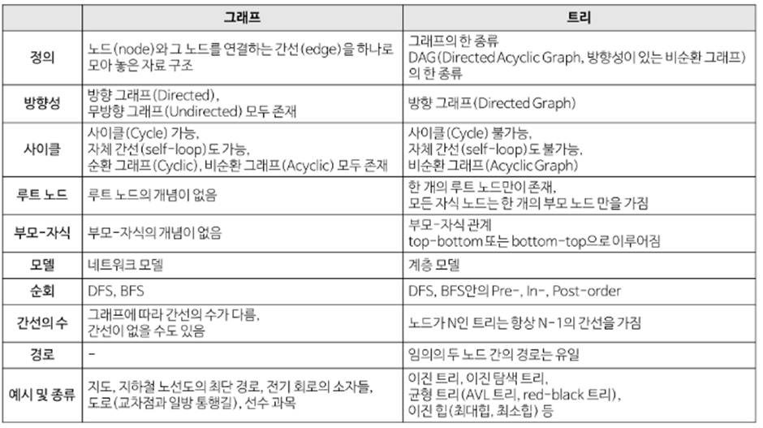
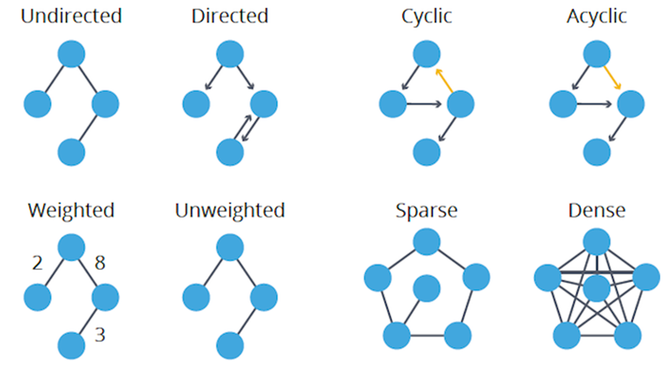
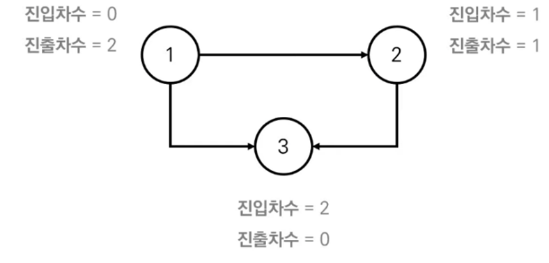
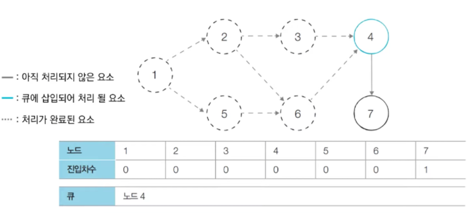
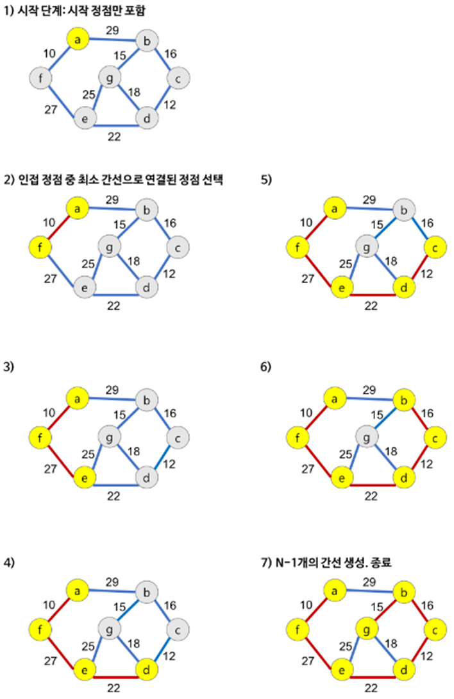
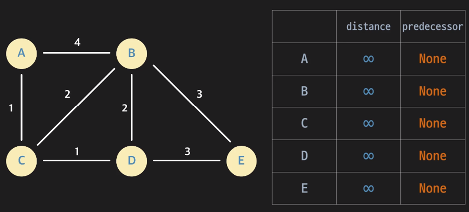

# 그래프

## 정의

그래프는 vertex와 edge로 구성된 한정된 자료구조를 의미한다. vertex는 정점, edge는 정점과 정점을 연결하는 간선이다.

 

    

 

   

## 표현

 

    

 

   

### 1. 인접 행렬 

인접 행렬은 서로 다른 정점들이 인접한 상태인지를 표시한 2차원 배열 형태의 행렬이다. 이어져있다면 1(true), 그렇지 않다면 0(false)로 표시한다. 인접 행렬은 정점 간 관계 유무를 파악하는데 주로 사용하며, 이때의 시간 복잡도는 O(1)이다. 가장 빠른 경로를 찾고자 할 때도 많이 사용된다. 구현은 쉽지만, 데이터가 커짐에 따라 2차원 배열도 계속 커지기 때문에 많은 공간을 낭비하고, 모든 정점에 대한 간선 정보를 대입해야 해서 O(n^2)의 시간 복잡도가 소요된다. 그래프에 간선이 많이 존재하는 밀집 그래프(Dense Graph) 의 경우 주로 쓰인다

### 2. 인접 리스트 (일반적)

인접 리스트는 각 정점이 어떤 정점과 인접하는지를 리스트의 형태로 표현한다. 인접 리스트는 인접 행렬에 비해 공간 낭비가 적어서 메모리를 효율적으로 사용할 수 있다. 또한 연결 정보를 탐색할 때도 O(n)의 시간이면 충분하다. 다만 특정 점들이 연결되어 있는지 확인하려면 시간이 오래 걸리고, 구현이 비교적 어렵다는 단점이 있다. 그래프 내에 적은 숫자의 간선만을 가지는 희소 그래프(Sparse Graph) 의 경우 주로 쓰인다.

## 종류

 

    

 

   

- 무방향그래프 : 간선을 통해서 양 방향으로 갈 수 있다.
- 방향그래프: 간선에 방향성이 존재하는 그래프
- 가중치 그래프 (Weighted Graph) : 간선에 비용이나 가중치가 할당된 그래프. 네트워크(Network)’ 라고도 한다. 두 정점을 이동할 때, 비용이 드는 그래프
- 사이클 그래프(Cyclic Graph) : 단순 경로의 시작 정점과 종료 정점이 동일한 경우            (단순 경로(Simple Path): 경로 중에서 반복되는 정점이 없는 경우. 한붓 그리기)
- 비순환 그래프(Acyclic Graph)
- 완전 그래프: 그래프에 속해 있는 모든 정점이 서로 연결되어 있는 그래프
- 연결 그래프(connected Graph), 비연결 그래프(Disconnected Graph)

 

    

 

   

연결그래프 : 무방향 그래프에 있는 모든 정점 쌍에 대해서 항상 경로가 존재하는 그래프. 즉, 노드들이 하나도 빠짐없이 간선에 의해 연결되어 있는 그래프로 트리(Tree)가 대표적인 예이다

비연결 그래프 : 무방향 그래프에서 특정 정점 사이에 경로가 존재하지 않는 그래프 즉, 노드들 중 간선에 의해 연결되어 있지 않은 그래프이다.

## 연결성분(=연결 요소) 검사 

#### 1. 연결 성분(Connected Component)이란? (=연결요소)

여러개의 노드의 집합에서 간선으로 연결된 나누어진 각각의 그래프. 즉, 연결된 부분 그래프들 중에서 크기가 최대인 것. 쉽게 말해서 서로 분리되어 있는 그래프. 영역

#### 2. 연결 성분의 조건

(1) 연결성분 안의 모든 노드들은 동일한 성분 내의 다른 노드와 연결되어 있어야한다.

(2) 연결성분 밖에 있는 노드와 연결되면 안된다.

즉,  소외 되는 노드가 없으면서도 외부와의 접촉도 없는, 일종의 섬같은 성분

 

    

 

    

(+) 연결요소의 갯수 구하기

- DFS/BFS 아무거나
- visited 배열 만들고 DFS돌며 방문기록. DFS사이클 끝나면, 한 연결 요소에 있는 정점은 모두 방문완료기록! -> 방문표시 안된 정점에서 다시 DFS 수행
 
 

    

 

   

#### 3. 깊이우선탐색(DFS) 

루트 노드(혹은 다른 임의의 노드)에서 시작해서 다음 분기(branch)로 넘어가기 전에 해당 분기를 완벽하게 탐색하는 방법. 주로 재귀 호출과 스택을 사용해서 구현한다.

- 파이썬(재귀,스택으로 구현)
 
 
 

    

 

   
 
 

    

 

   

 

    

 

   

#### 4. 너비우선탐색(BFS)

루트 노드(혹은 다른 임의의 노드)에서 시작해서 인접한 노드를 먼저 탐색하는 방법. 주로 큐와 반복문을 사용해서 구현한다.

 

    

 

    

#### 5. DFS, BFS 장단점 비교
(1) DFS

장점

* 현 경로상의 노드를 기억하기 때문에 적은 메모리를 사용합니다.
* 찾으려는 노드가 깊은 단계에 있는 경우 BFS 보다 빠르게 찾을 수 있습니다.

단점

* 해가 없는 경로를 탐색 할 경우 단계가 끝날 때까지 탐색합니다. 효율성을 높이기 위해서 미리 지정한 임의 깊이까지만 탐색하고 해를 발견하지 못하면 빠져나와 다른 경로를 탐색하는 방법을 사용합니다.
* DFS를 통해서 얻어진 해가 최단 경로라는 보장이 없습니다. DFS는 해에 도착하면 탐색을 종료하기 때문입니다.

(2) BFS 

장점

* 답이 되는 경로가 여러 개인 경우에도 최단경로임을 보장한다.
* 최단 경로가 존재하면 깊이가 무한정 깊어진다고 해도 답을 찾을 수 있다.

단점

* 경로가 매우 길 경우에는 탐색 가지가 급격히 증가함에 따라 보다 많은 기억 공간을 필요로 하게 된다.
* 해가 존재하지 않는다면 유한 그래프(finite graph)의 경우에는 모든 그래프를 탐색한 후에 실패로 끝난다. 무한 그래프(infinite graph)의 경우에는 결코 해를 찾지도 못하고, 끝내지도 못한다.

# 신장트리(spanning tree)

아래 조건을 만족하는 그래프를 의미한다.

- 연결그래프의 부분 그래프이며, 그래프에서 모든 정점을 포함한다.
- 정점 간 서로 연결이 되어있어야 한다.
- 사이클이 존재하지 않는 그래프
- 연결 그래프에서 신장트리는 1개가 아닌 다수일 수도 있다

 

    

 

   

## 최소 비용 신장 트리 (MST – Minimum Cost Spanning Tree)

- 트리를 구성하는 간선들의 가중치를 합한 값이 최소가 되는 신장트리
- 가중치 무방향 그래프가 베이스일 때 구할 수 있다.
- MST를 찾아내는 방법은 다양하며 대표적으로 크루스칼 알고리즘과 프림 알고리즘이 있다. 
- 정점 N개를 가지는 그래프에서 (N-1)개의 간선을 연결해야 한다.
- 여기서 가중치란? 그래프에서 길(간선)을 지나기 위해 지불되는 값.

## 크루스칼 알고리즘 

간선 중심으로 최소 신장트리를 구하는 알고리즘으로, 간선이 적을 때 프림 알고리즘보다 유리하다.

- 간선들을 가중치의 오름차순 정렬하여 가장 작은 간선 선택한다.
- 그 간선이 지금까지 만들어진 최소비용신장트리와 사이클을 형성한다면 제외하고, 아니면 최소비용신장트리에 추가한다
- 모든 간선에 대해 반복한다. 정점의 개수가 n개일 때 n-1만큼 간선을 뽑았다면 반복문을 종료한다.
- 사이클이 형성되는 여부는 Union & Find 연산이 필요하다
 

    

 

   

- 노드3과 노드 4의 가중치가 가장 작은 간선이다. 노드 3의 부모와 노드 4의 부모는 같지 않으므로 (사이클이 없음) 간선을 선택할 수 있고, 3,4노드는 union으로 합친다. 노드 4의 부모는 3이 된다. 그 다음으로 작은 간선을 선택하고 위의 과정을 반복한다.

## 프림 알고리즘
- 정점 중심으로 최소 신장트리를 구하는 알고리즘으로, 정점이 적을 때 크루스칼 알고리즘 보다 유리하다.
    - 그리디 알고리즘이며, 간선이 많을 때 사용한다.
    - 구현방법은 인접 행렬과 힙이 존재한다.
- 임의의 정점을 선택하고
- 그 정점과 인접한 정점을 잇는 간선 중 가중치가 가장 낮은 간선 선택한다
- 그 간선이 연결하는 정점을 선택하고, 모든 정점에 대해 2번 과정을 반복한다.

 

    

 

   

https://jforj.tistory.com/44 

## 위상정렬(Topological Sorting)
- 위상정렬 : 정렬 알고리즘의 일종으로, 순서가 정해져 있는 일련의 작업을 차례대로 수행해야 할 때 사용할 수 있는 알고리즘이다.
- 사이클이 없는 방향 그래프(DAG)의 모든 노드를 방향성에 거스르지 않도록 순서대로 나열하는 것. (DAG에 대해서만 수행가능)
- 위상정렬에는 여러가지 답이 존재할 수 있다. 한 단계에서 큐에 새롭게 들어가는 원소가 두개인 경우가 있다면 여러가지 답이 존재할 수 있다.
- 모든 원소를 방문하기 전에 큐가 비게 된다면 사이클이 존재한다고 판단할 수 있다. 왜냐하면 사이클에 포함된 원소 중에서 해당되는 어떠한 원소도 큐에 들어가지 못하게 되기 때문이다.
- 보통 큐로 구현하지만, 스택을 이용한 DFS를 이용해 위상정렬을 구현할 수 있다.
- 시간 복잡도는 O(V+E) : 위상 정렬을 수행할 때는 차례대로 모든 노드를 확인하면서 (O(V)), 해당 노드에서 출발하는 간선을 차례대로 제거(O(E))해야 한다. 따라서 노드와 간선을 모두 확인하는 것을 고려하여 O(V) + O(E) = O(V+E)의 시간이 소요된다.
- 예시 ) 선수과목과 후수과목의 순서가 있는 것처럼..

#### 진입차수와 진출차수
- 진입차수 (Indegree) : 특정한 노드로 들어오는 간선의 개수
- 진출차수 (Outdegree) : 특정한 노드에서 나가는 간선의 개수

 

    

 

    

#### 위상 정렬 알고리즘의 동작과정
- 진입차수가 0인 노드를 큐에 넣는다.
- 큐가 빌 때까지 다음의 과정을 반복한다.
    - 큐에서 원소를 꺼내 해당 노드에서 나가는 간선을 그래프에서 제거
    - 새롭게 진입차수가 0이 된 노드를 큐에 삽입
    - 즉, 각 노드가 큐에 들어온 순서가 위상 정렬을 수행한 결과.
- 진입차수가 0인 모든 노드를 큐에 삽입한다. 현재 1번 노드의 진입차수만 0이므로 큐에 1번 노드만 삽입하게 된다.

 

    

 

   

1. 큐에 있는 1번 노드를 꺼낸다. 이후 1번 노드와 연결되어 있는 간선들을 제거한다. 그러면 2번 노드와 5번 노드의 진입차수가 0이 되고, 2번 노드와 5번 노드의 진입차수가 0이므로 큐에 삽입한다.

 

    

 

   

2. 큐에 있는 2번 노드를 꺼낸다. 2번 노드와 연결되어 있는 간선들을 제거한다. 그러면 3번 노드의 진입차수가 0이 되므로 3번 노드를 큐에 삽인한다.

 

    

 

   

3. 큐에 있는 5번 노드를 꺼낸다. 5번 노드와 연결되어 있는 간선들을 제거한다. 그러면 6번 노드의 진입차수가 0이 되므로 6번 노드를 큐에 삽입한다.

 

    

 

   

4. 큐에 있는 3번 노드를 꺼낸다. 3번 노드와 연결되어 있는 간선들을 제거한다. 이번 단계에서는 새롭게 진입차수가 0이 되는 노드가 없으므로 넘어간다.

 

    

 

   

5. 큐에 있는 6번 노드를 꺼낸다. 6번 노드와 연결되어 있는 간선들을 제거한다. 그러면 4번 노드의 진입차수가 0이 되므로 4번 노드를 큐에 삽입한다.

 

    

 

   

6. 위와 동일한 로직으로 큐에 있는 노드를 꺼내고, 꺼낸 노드와 연결되어 있는 간선들을 제거한다. 새롭게 진입차수가 0이 되는 노드를 큐에 삽입한다.

 

    

 

   

 

    

 

   

결과 : 1-2-5-3-6-4-7 혹은 1-5-2-3-6-4-7

# 가중치 그래프

꼭짓점과 꼭짓점 사이를 잇는 변(간선)에 가중치(비용)가 주어진 그래프를 말한다.

 

    

 

   

가중 그래프 중 유향그래프(방향을 가진 그래프)를 네트워크(Network)라고도 한다. 각 정점들을 도시, 연결선들을 도로라고 가정하면, 가중치는 각 도로를 지나기 위한 비용이나 도시 사이의 거리라고 생각할 수 있다. 가중치는 양수와 음수 모두를 가질 수 있으며, 최단 경로 문제는 가중치의 합이 최소가 되는 경로를 구하는 문제로, 각각의 경우에 다라 문제를 해결하는 알고리즘이 서로 다르다.

## 최소 비용 신장 트리

### Spanning Tree란
그래프 내의 모든 정점을 포함하는 트리
- Spanning Tree = 신장 트리
- Spanning Tree는 그래프의 최소 연결 부분 그래프이다.
    - 최소 연결 = 간선의 수가 가장 적다.
    - n개의 정점을 가지는 그래프의 최소 간선의 수는 (n-1)개이고, (n-1)개의 간선으로 연결되어 있으면 필연적으로 트리 형태가 되고 이것이 바로 Spanning Tree가 된다.
- 즉, 그래프에서 일부 간선을 선택해서 만든 트리

### 특징
- DFS, BFS을 이용하여 그래프에서 신장 트리를 찾을 수 있다.
    - 탐색 도중에 사용된 간선만 모으면 만들 수 있다.
- 하나의 그래프에는 많은 신장 트리가 존재할 수 있다.
- Spanning Tree는 트리의 특수한 형태이므로 모든 정점들이 연결되어 있어야 하고 사이클을 포함해서는 안된다.
- 따라서 Spanning Tree는 그래프에 있는 n개의 정점을 정확히 (n-1)개의 간선으로 연결한다.

# 최소 비용 신장 트리(MST)
Spanning Tree중에서 사용된 간선들의 가중치 합이 최소인 트리

- MST = Minimum Spanning Tree = 최소 신장 트리
- 각 간선의 가중치가 동일하지 않을 때 단순히 가장 적은 간선을 사용한다고 해서 최소 비용이 얻어지는 것이 아니다.
- MST는 간선에 가중치를 고려하여 최소 비용의 Spanning Tree를 선택하는 것을 말한다.
- 즉, 네트워크(가중치를 간선에 할당한 그래프)에 모든 정점들을 가장 적은 수의 간선과 비용으로 연결하는 것이다.

### 특징
- 간선의 가중치의 합이 최소여야 한다.
- n개의 정점을 가지는 그래프에 대해 반드시 (n-1)개의 간선만을 사용해야 한다.
- 사이클이 포함되어서는 안된다.

### 구현 방법

## Kruskal MST 알고리즘

탐욕적인 방법(greedy method)을 이용하여 네트워크(가중치를 간선에 할당한 그래프)의 모든 정점을 최소 비용으로 연결하는 최적 해답을 구하는 것

- 탐욕적인 방법
    - 결정을 해야 할 때마다 그 순간에 가장 좋다고 생각되는 것을 선택함으로써 최종적인 해답에 도달하는 것
    - 탐욕적인 방법은 그 순간에는 최적이지만, 전체적인 관점에서 최적이라는 보장이 없기 때문에 반드시 검증해야 한다.
- MST(최소 비용 신장 트리)가 1) 최소 비용의 간선으로 구성됨, 2) 사이클을 포함하지 않음 의 조건에 근거하여 각 단계에서 사이클을 이루지 않는 최소비용 간선을 선택한다.

동작

- 그래프의 간선들을 가중치의 오름차순으로 정렬한다.
- 정렬된 간선 리스트에서 순서대로 사이클을 형성하지 않는 간선을 선택한다.
    - 즉, 가장 낮은 가중치를 먼저 선택한다.
    - 사이클을 형성하는 간선을 제외한다.
- 해당 간선을 현재의 MST(최소 비용 신장 트리)의 집합에 추가한다.

#### 구체적인 동작 방법

이전 단계에서 만들어진 신장 트리와는 상관없이 무조건 최소 간선만을 선택하는 방법

 

    

 

   

주의

- 다음 간선을 이미 선택된 간선들의 집합에 추가할 때 사이클을 생성하는 지 체크
    - 새로운 간선이 이미 다른 경로에 의해 연결되어 있는 정점들을 연결할 때 사이클이 형성된다.
    - 즉, 추가할 새로운 간선의 양 끝 정점이 같은 집합에 속해 있으면 사이클이 형성된다.
- 사이클 생성 여부를 확인하는 방법
    - 추가하고자 하는 간선의 양끝 정점이 같은 집합에 속해 있는지를 먼저 검사해야 한다.(union-find 알고리즘 이용)

시간 복잡도

- Union-find 알고리즘을 이용하면 Kruskal 알고리즘의 사간 복잡도는 간선들을 정렬하는 시간에 좌우된다.
- 즉, 간선 e개를 퀵 정렬과 같은 효율적인 알고리즘으로 정렬한다면 O(elog_2 e)

## Prim 알고리즘

시작 정점에서부터 출발하여 신장트리 집합을 단계적으로 확장해 나가는 방법

동작
- 시작단계에서는 시작 정점만이 MST(최소 비용 신장 트리) 집합에 포함된다.
- 앞 단계에서 만들어진 MST집합에 인접한 정점들 중에서 최소 간선으로 연결된 정점을 선택하여 트리를 확장한다.
    - 즉, 가장 낮은 가중치를 먼저 선택한다.
- 위의 과정을 트리가 (n-1)개의 간선을 가질 때가지 반복한다.

### 동작과정

정점선택을 기반으로 하는 알고리즘으로 이전단계에서 만들어진 신장 트리를 확장하는 방법

 

    

 

    
시간 복잡도 : O(n^2)

Kruskal : O(elog_2 e)

Prim : O(n^2)

그래프 내에 적은 숫자의 간선만을 가지는 ‘희소 그래프’의 경우 Kruskal 알고리즘이 적합하고

그래프에 간선이 많이 존재하는 ‘밀집 그래프’의 경우 Prim 알고리즘이 적합하다.

참고자료

최소 비용 신장 트리 구현

Python : https://ssabi.tistory.com/60

Java : 	https://sskl660.tistory.com/72 (Kruskal)

	https://comgong-man.tistory.com/143 (Prim)

## 최단경로 (Shortest Path)

- 두 노드 사이에 존재할 수 있는 모든 경로 중 거리가 가장 짧은 경로를 말한다.
- 비가중치 그래프에서는 경로 중 엣지의 수가 가장 적은 것이 최단경로이며, 가중치 그래프에서는 보통 엣지의 가중치의 합이 가장 적은 경로가 최단 경로가 된다.

### 최단 경로 알고리즘
- 주어진 그래프에서 두 노드 사이에 가장 짧은 경로를 구하는 방법
- 여러 방법이 존재 : 엣지의 방향이 있는지, 가중치가 있는지, 음수 엣지가 존재하는지, 싸이클이 존재하는지 등 다양한 그래프의 특징에 따라 많은 방법이 존재한다.
- 대표적인 최단 경로 알고리즘: BFS(비가중치 그래프에서 사용), Dijkstar(가중치 그래프에서 사용)

### Dijkstra(다익스트라) 알고리즘 - 3가지 변수 저장!
- 가중치 그래프에서 최단 경로를 찾을 수 있는 알고리즘
- Dijkstra를 사용하기 위해서는 그래프 노드의 3가지 변수를 저장해야 한다.
    1. distance : 시작점에서 해당 노드까지의 거리를 저장하는 변수
    2. predecessor : 현재까지 찾은 최단 경로에서 특정 노드의 직전 노드를 저장하는 변수
    3. complete : 특정 노드를 완전히 파악했는지 표시하기 위한 변수

 

    

 

    
 

    

 

    
 

    

 

   
 
 
### 엣지 Relaxation
- Dijkstra 알고리즘에서는 노드를 하나씩 방문(탐색)한다.
- 노드들을 방문하면서 해당 노드의 distance와 predecessor 변수를 계속 갱신하며 알고리즘을 진행하는데, 이렇게 2가지 변수를 갱신하는 것을 Relaxtion, relax라고 표현한다.
- A에서 B를 방문할 때 B에 변수를 갱신하는 것을 엣지(A, B)를 relax한다 라고 표현한다.

 

    

 

    
 

## Dijkstra 최단경로 알고리즘

1. 초기화 : 방문한 노드가 없기 때문에 distance, predecessor, complete(false) 모두 초기화한다.
- 시작점의 distance는 0, predecessor은 None. 시작점을 시작으로, 시작점에서 시작점까지의 경로는 자기자신이다.

 

    

 

    

2. Complete 처리가 되지 않은 노드 중 가장 작은 distance를 갖는 노드를 본다.

- 그 다음 A의 엣지들을 보며 연결된 엣지의 노드가 complete True인 경우 건너뛴다.

- 아직까지는 처리된 노드가 하나도 없기 때문에 엣지 (A,B), (A,C)를 relax 해준다.

 

    

 

     

3. 엣지 (A, B), 엣지 (A, C)를 relax해 두 변수를 갱신해준 후 A를 complete 처리한다(True).

 

    

 

    

- 이때 엣지(A,B) relax의 결과로 B의 거리는 3으로 갱신된다.

 

    

 

     

4. A를 complete 처리한 후, complete 처리가 되지 않은 노드 중 가장 작은 distance를 갖는 노드를 본다.

 
 
5. 위 과정을 모든 노드가 complete 처리될 때까지 반복한다.

 

    

 

    

#### 정리하면,	
- 시작점의 distance를 0, predecessor 를 None
- 모든 노드가 complete일때까지 반복
    - complete 하지 않은 노드 중 distance가 가장 작은 노드를 선택
    - 이 노드에 인접한 노드 중 complete 하지 않은 노드를 반복
        - 각 엣지를 relax
    - 현재 노드를 complete 처리

 
알고리즘이 종료 되면 모든 노드의 distance와 predecessor 값이 확정! -> 저장된 것 활용 가능!

만약 시작점으로부터 최단 거리를 알고 싶다면 distance를 최단 경로를 알고 싶다면 predecessor를 이용해 Backtracking을 하면 된다.

A에서 E의 최단 경로를 알고 싶다면 E노드의 predecessor 변수로 D노드 / D노드의 predecessor 변수로 C노드 / C노드의 predecessor 변수로 A노드 / A노드의 predecessor 변수는 None

E - D - C - A를 뒤집으면 A - C - D - E가 최단 경로라는 의미이며
이때의 최단 거리를 알고 싶다면 E의 distance 5를 읽어들이면 된다.

 

    

 

   

 
## Floyd-Warshall(플로이드-워셜) 알고리즘
- 모든 노드 간 최단 경로 구하는 알고리즘

(하나의 정점에서 다른 모든 정점까지의 최단거리를 구하는 알고리즘 ‘Dijkstra’와 다름)

- 시간복잡도O(n^3)으로 그래프의 크기가 작을 때만 사용 가능

- 음의 엣지가 있어도 계산이 가능한 알고리즘 (단, 음의 사이클이 있을 경우 불가능)

 

    

 

   
 
-> 자기자신은 0  /  ex. 1 = 5정점에서 1정점까지

 

    

 

    
 

    

 

   
 

