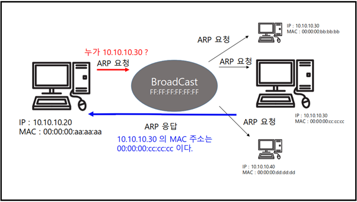

# OSI 1계층 – 물리 계층

## 물리 계층(Physical Layer)
- 물리 계층은 OSI 7계층 중 가장 아래에 있다. 
- 케이블 등의 데이터 신호를 담는 하드웨어 매개체
- 비트 단위의 데이터를 전기적, 광학적 신호( “전기신호” )로 변환하여 전송하는 역할
- 물리 계층은 OSI 7계층의 첫 번째 단계로, 기기 간 데이터 전송의 기본이 되는 부분으로, 데이터 전송을 위한 케이블, 허브, 리피터 등의 하드웨어 구성 요소와 관련된 역할을 담당한다. 이를 통해 데이터가 전기적, 광학적 신호로 변환되어 다양한 기기 간 통신이 가능해진다.

 

    

 

- 그림에서는 ‘아날로그 신호로 변환’ 으로 쓰여있지만, 실제로는 전기적, 광학적 신호로 변환되기도 한다.

 

-	두 대의 컴퓨터가 통신하기 위해서는 0과 1을 서로 주고받을 수 있으면 된다.
-	컴퓨터는 네트워크 관련 연산의 결과로 송신을 위한 0과 1로 된 디지털 신호를 갖고 있다.
-	컴퓨터의 디지털 신호가 물리 신호로 변하려면, 0과 1로 된 디지털 신호를 전선으로 전달해야 한다.
-	전달을 위해 전기를 이용한 아날로그 신호로 바꾸어주어야 한다.
-	0과 1에 해당하는 아날로그 신호를 보냈으면, 일단 물리계층에서 할 일은 끝난다.
즉, 물리계층은 디지털 신호를 받아 아날로그 신호(전기)로 내보낸다.
혹은 아날로그 신호(전기)를 받아 디지털 신호로 받아들인다.

 

    

  
 

### 두대의 컴퓨터가 통신할 수 있는 조건은?

먼저, 물리 계층을 잘 이해하고 네트워크 통신에 대해 이해하는 기반을 다지기 위해서 한가지 전제를 깔고 가자. 우리의 관점에서 네트워크 통신은 복잡한 정보를 주고 받지만 실제로는 0과 1만 사용되며, 이것을 '잘' 주고받을 수 있으면 된다. 0과 1은 흔히 비트(bit) 라고 불린다.

물리 계층은 이러한 0과 1이 다른 컴퓨터로 전달되는 데에 핵심적인 역할을 한다. 0과 1은 신호를 통해 주고받을 수 있는데, 신호의 종류는 아날로그 신호 와 디지털 신호 가 있다.

- 아날로그 신호 : 0 or 1 사이 어딘가의 값을 갖는다.
- 디지털 신호 : 정확히 0 or 1의 값을 갖는다. 매우 정확!

# OSI 2계층 – 데이터 링크계층

## 데이터 링크 계층
: 네트워크 기기 간의 데이터 전송을 담당하며, 오류 검출 및 제어 기능 수행. 즉. 데이터 링크 계층에서는 MAC 주소를 활용하여 정확한 송신자가 의도한 수신자에게 정확하게 전달되도록 하는 계층으로 랜에서 데이터를 정상적으로 주고 받기 위해 규칙을 정하는 계층이다. 

이 때, 같은 네트워크 상에서 발생되는 프레임을 전달하는 것이지, 서로 다른 네트워크로 데이터를 전달하는 라우팅 기술은 더 높은 계층 기능이라, 서로 다른 네트워크로 전달할 수 없다.

이더넷, 맥 주소, 스위치 등이 해당 계층에서 작동하는 예시이다.

- MAC 주소 ? 
    - MAC 주소는 랜카드를 생산할 때 중복되지 않게 유일한 번호로 할당한다.
    - MAC 주소는 총 48비트로 되어 있음

 

    

 

- 상위 계층이 왜 생겼을까?

: 제 1계층만 있다면 네트워크 기기간에 데이터를 전송할 때 엄청난 비효율이 발생한다. 원하는 목적지로 전송할 수 없어서 모든 곳에 동시에 전송하거나 혹은 많은 케이블을 통해 각각의 기기를 모두 연결해야 하는 상황이 발생한다. 그래서 상위 계층이 발생.

# 데이터 전송

목적지로 데이터를 전송하는 것에 대한 예시를 살펴보자.

AA라는 주소를 가진 컴퓨터가 DD라는 주소를 가진 컴퓨터와 스위치라는 모듈과 연결되어 있다. 이 때 데이터 앞쪽에 송신자의 주소인 AA와 수신자의 주소인 DD를 붙이고 그 뒤에 데이터를 전송하면 스위치를 통해 원하는 목적지 까지 데이터 전송이 가능하다.

 

    

 

### 오류검출

오류 검출 및 수정이 진행되는 방식 : 기존 AA 주소 컴퓨터에서 스위치를 통해 DD로 데이터를 보낼 때 AA|DD|010011로 보낸다. 그 뒤에 추가로 오류를 검출할 수 있는 코드를 추가한다. 

 AA|DD|010011 | 0x1A4D  : 해당 데이터가 잘보내졌는지 확인할 수 있는 코드가 추가됨.

### 오류 확인 과정
1.	송신하는 AA에서 계산을 수행하여 오류 확인 코드를 생성하고, 데이터 뒷부분에 추가되어 함께 전송한다.
2.	수신하는 DD에서 도착한 오류코드에 대해 동일한 계산을 수행하고 계산한 값과 프레임에 포함된 원래의 값을 비교한다.
3.	두 값이 일치하면, 데이터 전송이 정상적으로 이루어진 것으로 판단한다.
4.	만약 일치하지 않으면, 오류가 발생한 것으로 간주하고 재전송을 요청한다.

### 이더넷
- 이더넷 : 데이터 링크 계층에서 네트워크 장비 간에 신호를 주고받는 규칙을 정할 때 가장 많이 사용되는 규칙이 이더넷이다. 
- 데이터 링크 계층에는 이터넷 (Ethernet) 프로토콜이 있다.
- 이더넷 프로토콜에서 사용하는 이더넷 주소는 MAC (Media Access Control) 주소, 하드웨어 주소 라고도 부른다.
- 모든 이더넷 장치는 6 바이트의 전세계적으로 고유한 주소를 할당 받는다. ( xx : xx : xx : xx : xx : xx 형태)
- 하나의 네트워크에 속하는 두 컴퓨터는 MAC 주소를 알기 전까지 서로 통신 할 수 없다.
- 그러므로 네트워크에서 MAC 주소를 알아내기 위해서 ARP 를 사용한다.

- 데이터(프레임) = 이더넷헤드 + 트레일러

이더넷 헤드 : 목적지 MAC 주소 +  출발지 MAC 주소 + 프로토콜 로 구성

트레일러 : 데이터 전송 도중에 오류가 발생했는지 확인하는 용도로 추가

스위치

= 레이어 2 스위치 = 스위칭 허브

- 스위치 내부에는 MAC 주소 테이블이 존재. 즉, 스위치와 연결된 기기들의 MAC 주소가 들어있는 데이터베이스다. (어떤 포트에 어떤 MAC 주소를 가지고 있는 기기 정보 포함)
- 정보를 보고 데이터가 들어올 때 스위칭 허브가 요청을 올바른 포트의 기기로 전송할 수 있게된다.

### ARP 프로토콜
- 네트워크 상에서 IP 주소를 물리적 네트워크 주소로 대응 (bind) 시키기 위해 사용되는 프로토콜이다.
- 여기서 물리적 네트워크 주소는 이더넷 주소 ( MAC 주소 ) 또는 토큰링의 48 비트 네트워크 카드 주소를 뜻한다.

 

    

 
 
그림 : IP MAC 둘다 보냄 => ARP 응답

### ARP 작동원리
먼저 IP 주소가 10.10.10.20 인 시스템을 A / IP 주소가 10.10.10.30 인 시스템을 B 라고 부르겠다.
A는 B와 TCP 연결을 맺고 싶다고 가정하자. 

1) A는 먼저 ARP 캐시를 검사해 10.10.10.30 ( B의 IP 주소 ) 에 해당하는 항목이 있는지 검사한다.

2) A는 ARP 캐시에서 해당 항목을 찾지 못했다면 BroadCast 주소로 ARP 요청 메세지를 전송한다.

 😵‍💫이 메세지의 의미는 " IP 주소가 10.10.10.30 인 시스템은 MAC 주소를 00:00:00:aa:aa:aa 로 보내달라"는 의미이다.

3) BroadCast 주소로 전송되므로 모든 시스템이 ARP 요청 메세지를 받지만, ARP 요청 메세지에 해당하는 시스템'만' ARP 응답 메세지를 보낸다. 이 경우 B 가 A 에게 ARP 요청 메세지를 보내게 된다.

4) ARP 요청 메세지를 받는 A 는 ARP 캐시에 < IP 주소 , MAC 주소 > 쌍을 저장하고, 이 저장된 값을 통해 통신한다.

추가내용 참고하기 : [ 네트워크 기초 ] ARP 프로토콜 총정리 : 네이버 블로그 (naver.com)

# 3계층

### 3계층의 기능

(1) 3계층에서 하는 일

3계층은 다른 네트워크 대역 즉, 멀리 떨어진 곳에 존재하는 네트워크까지 어떻게 데이터를 전달할지 제어하는 일을 담당

 

    

  

(2) 라우터

다른 네트워크에 있는 컴퓨터에 데이터 패킷을 보내기 위해서는 라우터라는 네트워크 장비가 필요. 

네트워크 간 통신이 일어날 때, 해당 목적지까지 가는 최적의 경로에 대해 안내해준다. 서로 다른 네트워크 간에 최적의 경로를 찾아내는 알고리즘을 활용해 중계 역할을 해주는 장치다.

(3) 3계층에서 쓰이는 주소: IP 주소(논리적 주소)
 
 

    

 

(4) 3계층 프로토콜 종류
1) ARP프로토콜: IP주소를 이용해 MAC주소를 알아옴
2) IPv4 프로토콜: WAN에서 통신할 때 사용
3) ICMP 프로토콜: 서로가 통신되는지 확인할 때 사용
4) 이외에도 많음

(5) ARP 프로토콜 (Address Resolution Protocol: 주소 변환 프로토콜)
ARP프토토콜은 같은 네트워크 대역에서 통신을 하기 위해 필요한 MAC 주소를 IP주소를 이용해서 알아오는 프로토콜이다. 
(+) ARP프로토콜의 통신과정 영상: [따라學IT] 05. 통신하기 전 반드시 필요한 ARP 프로토콜 - 이론 - YouTube 10분 40초

(6) IPv4프로토콜 (Internet Protocol)

네트워크 상에서 데이터를 교환하기 위한 프로토콜. 

데이터가 정확하게 전달될 것을 보장하지 않음

중복된 패킷을 전달하거나 패킷의 순서를 잘못 전달할 가능성도 있음

데이터의 정확하고 순차적인 전달은 그보다 상위 프로토콜인 TCP에서 보장

(7) ICMP프로토콜

Internet Control Message Protocol(인터넷 제어 메시지 프로토콜)	

특정 대상과 내가 통신이 잘되는지 확인하는 프로토콜

네트워크 컴퓨터 위에서 돌아가는 운영체제에서 오류메시지를 전송받는데 주로 쓰인다.

프로토콜 구조의 Type과 Code를 통해 오류 메시지를 전송받는다.

