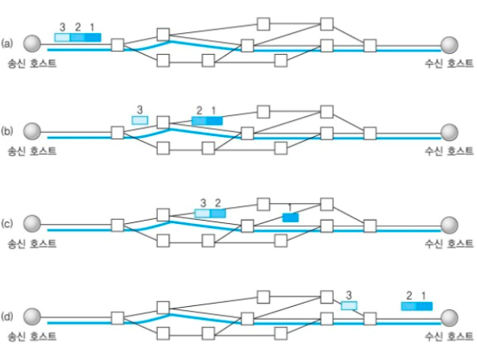
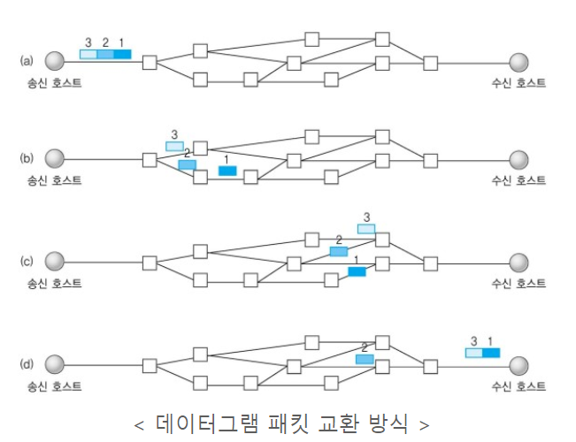
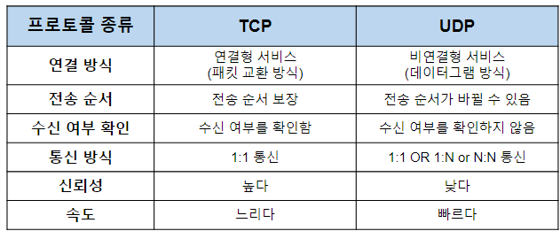
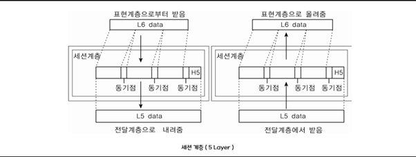
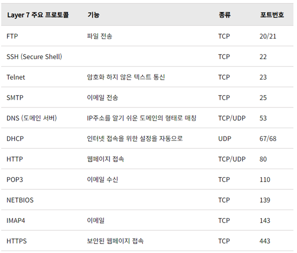

# 4계층. 전송 계층 Transport Layer
- 서비스를 구분하고 데이터의 전송 방식을 담당하는 계층 (프로토콜 : TCP/UDP)

## TCP : Transmission Control Protocol(전송 제어 프로토콜)
컴퓨터가 다른 컴퓨터와 데이터 통신을 하기 위한 규약(프로토콜)의 일종이다. 보통 하위계층 IP 와 엮어서 TCP/IP로 표현하는 경우가 많다.  

## UDP : User Datagram Protocol ()
TCP 와 비슷하다

- 데이터를 전송하고 전송 속도를 조절하며 오류를 정정하는 계층. TCP, UDP 프로토콜을 통해 통신을 활성화 한다. 포트를 열어두고, 프로그램들이 전송을 할 수 있도록 제공해준다. 이를 통해 양 끝 단의 사용자들이 데이터를 주고 받을 수 있다.

- 양 끝단(End to end)의 사용자들이 신뢰성있는 데이터를 주고 받을 수 있도록 해 주어, 상위 계층들이 데이터 전달의 유효성이나 효율성을 생각하지 않도록 해준다.

- 시퀀스 넘버 기반의 오류 제어 방식을 사용한다.

- 전송 계층은 특정 연결의 유효성을 제어하고, 일부 프로토콜은 상태 개념이 있고(stateful), 연결 기반(connection oriented)이다. (이는 전송 계층이 패킷들의 전송이 유효한지 확인하고 전송 실패한 패킷들을 다시 전송한다는 것을 뜻한다.)

- 데이터 전송 단위는 Segment이다.

## TCP 
인터넷상에서 데이터를 메세지의 형태로 보내기 위해 IP와 함께 사용하는 프로토콜
 
 

    

 

### [ TCP 특징 ]
- 연결 지향 방식으로 패킷 교환 방식을 사용한다(가상 회선 방식이 아님).
- 3-way handshaking과정을 통해 연결을 설정하고 4-way handshaking을 통해 해제한다.
- 흐름 제어 및 혼잡 제어.
- 높은 신뢰성을 보장한다.
- UDP보다 속도가 느리다.
- 전이중(Full-Duplex), 점대점(Point to Point) 방식

Q) TCP는 패킷을 어떻게 추적 및 관리하나요?
 
위에서 데이터는 패킷단위로 나누어 같은 목적지(IP계층)으로 전송된다고 설명하였습니다. 예를 들어 한줄로 서야하는 A,B,C라는 사람(패킷)들이 서울(발신지)에서 출발하여 부산(수신지)으로 간다고 합시다. 그런데 A,B,C가 순차적으로 가는 상황에서 B가 길을 잘못 들어서 분실되었다고 합시다. 하지만 목적지에서는 A,B,C가 모두 필요한지 모르고 A,C만 보고 다 왔다고 착각할 수 있습니다. 그렇기 때문에 A,,B,C라는 패킷에 1,2,3이라는 번호를 부여하여 패킷의 분실 확인과 같은 처리를 하여 목적지에서 재조립을 합니다. 이런 방식으로 TCP는 패킷을 추적하며, 나누어 보내진 데이터를 받고 조립을 할 수 있습니다.

## UDP
데이터를 데이터그램 단위로 처리하는 프로토콜

 

    

  

### [ UDP 특징 ]
- 비연결형 서비스로 데이터그램 방식을 제공한다
- 정보를 주고 받을 때 정보를 보내거나 받는다는 신호절차를 거치지 않는다.
- UDP헤더의 CheckSum 필드를 통해 최소한의 오류만 검출한다.
- 신뢰성이 낮다
- TCP보다 속도가 빠르다

### [ UDP 서버의 특징 ]
- UDP에는 연결 자체가 없어서(connect 함수 불필요) 서버 소켓과 클라이언트 소켓의 구분이 없다.
- 소켓 대신 IP를 기반으로 데이터를 전송한다.
- 서버와 클라이언트는 1대1, 1대N, N대M 등으로 연결될 수 있다.
- 데이터그램(메세지) 단위로 전송되며 그 크기는 65535바이트로, 크기가 초과하면 잘라서 보낸다.
- 흐름제어(flow control)가 없어서 패킷이 제대로 전송되었는지, 오류가 없는지 확인할 수 없다.
- 파일 전송과 같은 신뢰성이 필요한 서비스보다 성능이 중요시 되는 경우에 사용된다.

Q) 흐름제어(Flow Control)와 혼잡제어(Congestion Control)이란?
 
흐름제어는 데이터를 송신하는 곳과 수신하는 곳의 데이터 처리 속도를 조절하여 수신자의 버퍼 오버플로우를 방지하는 것입니다. 예를 들어 송신하는 곳에서 감당이 안되게 데이터를 빠르게 많이 보내면 수신자에서 문제가 발생하기 때문입니다.

혼잡제어는 네트워크 내의 패킷 수가 넘치게 증가하지 않도록 방지하는 것입니다. 만약 정보의 소통량이 과다하면
패킷을 조금만 전송하여 혼잡 붕괴 현상이 일어나는 것을 막습니다.

 

    

 

-	1~4계층이 데이터를 전송하는 역할을 담당했다고 하면 5~7계층은 전송 위의 종단 device간(ex 컴퓨터) 통신을 위한 규약으로 보면 됨.

# 5계층: 세션 계층(Session Layer)
-	데이터가 통신하기위한 논리적인 연결 
-	통신 세션을 구성하는 계층(세션 : 종단 간 일회용 논리적 연결)
-	포트(port) 번호를 기반으로 연결한다
-	세션 설정, 유지, 종료, 전송 중단시 복구 등의 기능이 있다 4계층에서도 연결을 맺고 종료 할 수 있기 때문에 4계층과 무관하게 응용 프로그램 관점에서 봐야한다.

 

    

 

-	사용자와 전송 계층 간의 인터페이스 역할을 한다.
-	네트워크 상에서 통신을 할 경우 양쪽 호스트 간에 최초 연결을 하며 연결이 끊어지지 않도록 유지 시켜주는 역할을 한다
-	LAN 사용자가 서버에 접속할 때 이를 관리하는 기능 수행
-	동시 송수신(duplex), 반이중(half-duplex), 전이중(full-duplex) 방식의 통신과 함께 체크 포인팅과 종료 다시 시작 과정 등을 수행한다

#### 동시 송수신:
두 대의 단말기가 데이터를 송수신 하기 위해 동시에 각각 독립된 회선을 사용하는 통신 방식
#### 반이중 방식:
두 개의 통신장치가 각각의 방향으로 양방향 통신을 할 수는 있지만 한 번에 한 쪽 방향으로만 통신이 가능한 통신방식
#### 전이중 방식:
두 개의 통신장치가 동시에 통신이 가능한 통신 방식

이 세 가지 통신에 더불어 체크포인팅과 유휴(어떠한 프로그램에 의해 사용되지 않는 상태), 종료, 다시시작 과정 등을 수행한다

#### 주요 역할
-	접속 설정 및 해제: 세션을 설정 및 해제하는 기능
-	다중화: 여러 세션들이 효율을 높이기 위해 1개의 같은 전송 계층에 접속할 수 있다
-	에러복구
-	토큰을 사용하여 대화 관리: 누가 언제 통신하였는지를 결정하며 토큰을 교환함으로써 구현

#### 데이터 단위
-	메시지

# 6계층: 표현 계층(Presentation Layer)
-	문맥 계층(Syntax Layer)라고도 함
-	네트워크의 데이터 번역자로서 데이터를 어떻게 표현할지 정함
-	네트워크 상의 다양한 데이터 표현 방식을 하나의 통일된 구문으로 변환함
-	응용 계층으로부터 전송받거나 응용 계층으로 전달해야 할 데이터를 인코딩, 디코딩하며 암호화, 압축도 이곳에서 이루어짐
-	인코딩(encoding)=부호화
: 정보의 형태나 형식을 표준화, 보안, 처리 속도 향상, 저장 공간 절약 등을 위해 다른 형태나 형식으로 변환하는 것
-	디코딩(decoding)=복호화
: 부호화된 정보를 부호화되기 전으로 되돌리는 처리 혹은 그 처리방식
-	관련 프로토콜
: ASCII(영문 알파벳), MPEG(비디오), JPEG(이미지), MIDI(디지털 악기) 등

# 7계층: 응용 계층(Application Layer)
-	OSI 7계층 모델에서 최상위 계층이며 사용자가 볼 수 있는 유일한 계층
-	사용자가 실행하는 모든 네트워크 활동의 기반이 되는 인터페이스를 제공
-	일반적으로 사용하고 있는 응용 프로그램을 생각하면 됨
Ex. 구글 크롬, 이메일, 데이터베이스 관리 등
-	관련 프로토콜
 
 

    

 
5, 6, 7계층에 의해 데이터 송수신 관리, 데이터 형식, 네트워크 서비스가 결정됨

5, 6, 7계층의 단위는 데이터(Data)
