# 네트워크란?
컴퓨터 등의 장치들이 통신 기술을 이용하여 구축하는 연결망

노드(node)와 링크(link)가 서로 연결되어 있으며 리소스를 공유하는 집합

-	노드: 전기통신망에서 노드(node)는 재분배 지점 또는 통신 종단점이다. 즉, 네트워크의 기본요소인 지역 네트워크에 연결된 컴퓨터와 그 안에 속한 장비들을 통틀어 하나의 노드라고 한다. 

예를 들어 로컬 영역 네트워크 A에 컴퓨터 20대와 허브 2개 공유기2개, 그리고 라우터가 있다고 하면, 이들 네트워크 A에 속한 장비들을 하나의 노드라고 한다. 물리적인 네트워크 노드는 네트워크에 부착된 능동적인 전자기기이며 통신 채널 상에서 정보를 만들고 수신하고 전송할 수 있다

-	링크: 노드 사이의 패킷을 전달하기 위한 물리적인 통신경로를 칭한다. (연결 매체)

-	네트워크 리소스(네트워크 자원): 망 장치 및 망 장치로 이루어진 망의 내부자원을 총칭.
    - 망장치: 네트워크 스위치(Network Switch), 라우터, 게이트웨이, Multiplexer, Demultiplexer, 모뎀(Modem), 공유기, 무선 네트워크용 안테나 및 리시버, 더 넓게는 네트워크라인까지 포함한다.
    - 망 내부 자원
        - 대역폭(Bandwidth): 쉽게 제공 가능한 전송 속도로 이해할 수 있다. 기본 단위는 bps(bit per second)이다. 우리가 흔히 쓰는 유선 인터넷 선은 100Mbps의 대역폭까지 지원한다.
        - 버퍼(buffer): 네트워크 장치 내부의 메모리 공간. 네트워크 속에 흐르는 정보를 임시로 저장하는 곳으로 네트워크 장치마다 각기 다른 크기를 가진다. 만약, 순간적으로 이 버퍼의 크기 이상으로 데이터가 흘러들어오면, 초과분은 폐기된다.

-	패킷(packet = pack + bucket = 소포):  정보 기술에서 패킷 방식의 컴퓨터 네트워크가 전달하는 데이터의 형식화된 블록

패킷 헤더는 특정 유형의 네트워킹 프로토콜에 의해 연결됩니다. 프로토콜은 모든 컴퓨터에서 데이터를 해석할 수 있도록 데이터 형식을 지정하는 표준화된 방법입니다. 다양한 프로토콜 덕분에 인터넷이 작동합니다. 이러한 프로토콜 중 일부는 해당 프로토콜과 관련된 정보가 있는 패킷에 헤더를 추가합니다. 최소한, 인터넷을 통과하는 패킷에는 대부분 전송 제어 프로토콜(TCP) 헤더와 인터넷 프로토콜(IP) 헤더가 포함됩니다.

정보를 보낼 때 특정 형태를 맞추어 보낸다는 말

데이터를 통으로 보내지 않는 이유: 큰 데이터는 대역폭을 너무 많이 차지하기 때문.

Ex) ip 패킷

-	라우터: 둘 이상의 패킷 전환 네트워크 또는 서브네트워크를 연결하는 장치

(패킷의 위치를 추출하여, 그 위치에 대한 최적의 경로를 지정하며, 이 경로를 따라 데이터 패킷을 다음 장치로 전향시킨다.)

Route(경로)를 설정하고 가장 빠른 길로 트래픽을 이끌어주는 네트워크 장비

Django urls.py 에서 variable routing 을 생각해보자!

NAT(Network Address Translation), 방화벽, VPN(Virtual Private Network), QoS(Quality of Service)등 다양한 부가 기능을 함께 제공
	

## 처리량과 지연시간
### 처리량
링크를 통해 전달되는 단위 시간당 데이터 양

단위: bps(bits per second)

처리량은 사용자들이 많이 접속할 때마다 커지는 트래픽, 

네트워크 장치 간의 대역폭(주어진 시간 동안 네트워크 연결을 통해 흐를 수 있는 최대 비트 수), 

네트워크 중간에 발생하는 에러, 장치의 하드웨어 스펙에 영향을 받는다.

 

    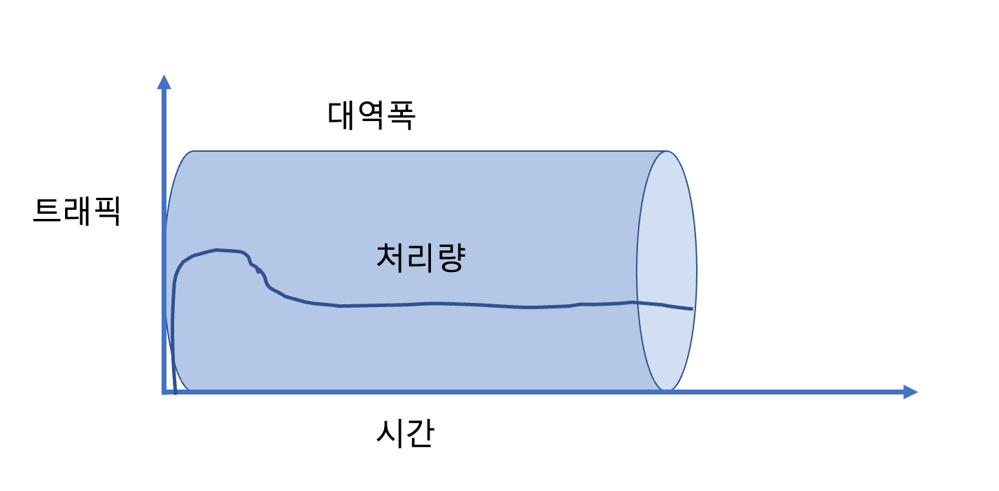

 

### 트래픽 : 주어진 시점에 네트워크를 경유한 데이터의 양
대역폭은 전송할 수 있는 데이터의 양이고, 처리량은 실제 네트워크 제한에 따라 특정 순간에 전송할 수 있는 실제 데이터 양입니다. 큰 대역폭은 속도나 우수한 네트워크 성능을 보장하지 않지만 대역폭이 클수록 처리량이 많아집니다.

Q1. 트래픽이 전체 데이터라면, 처리량은 '그 중에 네트워크 장치가 처리해낼 수 있는 양' 정도의 느낌으로 이해했습니다. 즉 무조건 트래픽중에 일부가 처리량이 된다~ 라는 느낌으로요.

A1.

네 맞습니다. 다만 "트래픽중에 일부가 처리량이 된다" 는 것은 아니고 이렇게 말씀하시면 옳은 문장입니다. "트래픽 중 전체 혹은 일부가 처리가 되는 것이고 이 처리되는 양을 처리량이라고 한다."

트래픽이 발생했을 때 >> 해당 트래픽을 얼마만큼 처리할 수 있느냐가 처리량

### 트래픽이란.
서버에 저장된 파일(문서,이미지,동영상 등)을 클라이언트(사용자)가 다운로드 시 발생되는 데이터의 누적량을 뜻합니다.

예를 들어 제가 이미지나 동영상을 요청했을 때 서버에는 다음과 같은 트래픽이 발생하게 됩니다.

- 100KB 이미지를 1,000명이 다운로드 시 누적 트래픽     100KB x 1,000 = 100,000KB(100MB)
- 10MB 동영상을 10명이 다운로드 시 누적 트래픽          10MB x 10 = 100MB
### 대역폭이란.
네트워크에서 전송되는 데이터의 범위로 허용할 수 있는 동시접속자수와 같은 의미입니다.

예를 들어 고속도로의 차선이 2차선보다 8차선일 때 더욱 원활하게 교통이 이루어지듯이 대역폭이 높을수록 사용자에게 빠른 서비스를 제공 할 수 있습니다.

자, 예를 들어 100Mbps라는 대역폭을 가진 서버가 있다고 해봅시다. (실제로는 네트워크 장비지만 포괄적으로 서버라는 용어를 쓸게요. * 대역폭의 단위는 bps입니다.)

이 때 한사용자당 100kbps로 동영상 파일을 요청한다고 해봅시다. 그러면

- 100Mbps / 100kbps = 약 1000명 

이정도의 사람의 요청을 처리할 수 있는 셈이죠

## 지연시간(latency)
지연시간이란 요청이 처리되는 시간을 말하며 어떤 메시지가 두 장치 사이를 왕복하는데 걸린 시간이다.

매체 타입(유선, 무선), 패킷 크기, 라우터의 패킷 처리 시간에 영향을 받음

	

## 네트워크 토폴로지와 병목 현상
### 네트워크 토폴로지
네트워크 토폴로지(network topology)는 노드의 링크가 어떻게 배치되어 있는지에 대한 방식이자 연결 형태를 의미

-	트리 토폴로지(계층형 토폴로지)

노드의 추가, 삭제가 쉬우며 특정 노드에 트래픽이 집중될 때 하위 노드에 영향을 끼칠 수 있음
 

    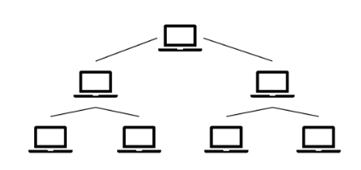

  

-	버스 토폴로지

중앙 회선 하나에 여러 개의 노드가 연결되어 공유하는 네트워크 구성(LAN)

설치비용이 적고 신뢰성이 우수하며 중앙 통신 회선에 노드 추가/삭제가 쉬움. 그러나 스푸핑이 가능

  

    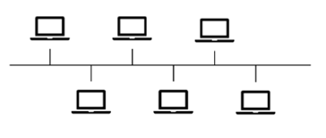

  

(ex)스푸핑

LAN 상에서 송신부의 패킷을 송신과 관련 없는 다른 호스트에 가지 않도록 하는 스위칭 기능을 마비시키거나 속여서 특정 노드에 해당 패킷이 오도록 처리하는 것을 말함

악의적인 노드를 만들어서 정보를 받는 것.

 

    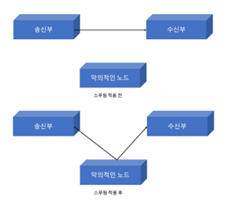

   

-	스타 토폴로지

중앙에 있는 노드에 모두 연결된 네트워크 구성

노드 추가 및 에러를 탐지하기 쉽고 패킷의 충돌 발생 가능성이 적음. 어떤 노드에 장애가 발생해도 쉽게 에러를 발견할 수 있음. 장애 노드가 중앙 노드가 아닐 경우 다른 노드에 영향을 적게 끼침. 중앙 노드에 장애 발생시 네트워크 전체가 마비됨. 고가.

 

    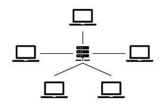

 

-	링형 토폴로지

각각의 노드가 양 옆의 두 노드와 연결하여 전체적으로 고리처럼 하나의 연속된 길을 통해 통신을 하는 망 구성 방식. 데이터는 노드에서 노드로 이동하게 되며, 각각의 노드는 고리 모양의 길을 통해 패킷 처리.

노드 수가 증가되어도 네트워크상의 손실이 거의 없고 충돌이 발생되는 가능성이 적고 노드의 고장 발견을 쉽게 할 수 있음.

네트워크 구성 변경이 어렵고 회선에 장애가 발생하면 전체 네트워크에 영향을 끼침.
 
 

    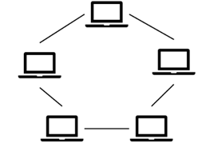

  

-	메시 토폴로지

망형 토폴로지라고도 하며 그물망처럼 연결되어 있는 구조

한 단말 장치에 장애가 발생해도 여러 개의 경로가 존재하므로 네트워크를 계속 사용 가능하고 트래픽 분산 처리도 가능.

노드의 추가가 어렵고 구축 비용과 운용 비용이 고가
 
 

    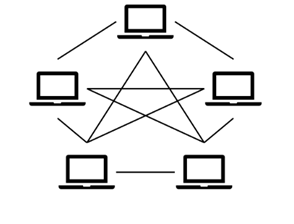

  

### 병목현상

병목 현상은 전체 시스템의 성능이나 용량이 하나의 구성 요소로 인해 제한을 받는 현상

트래픽을 잘 관리하지 못하면 생기는 현상

 

    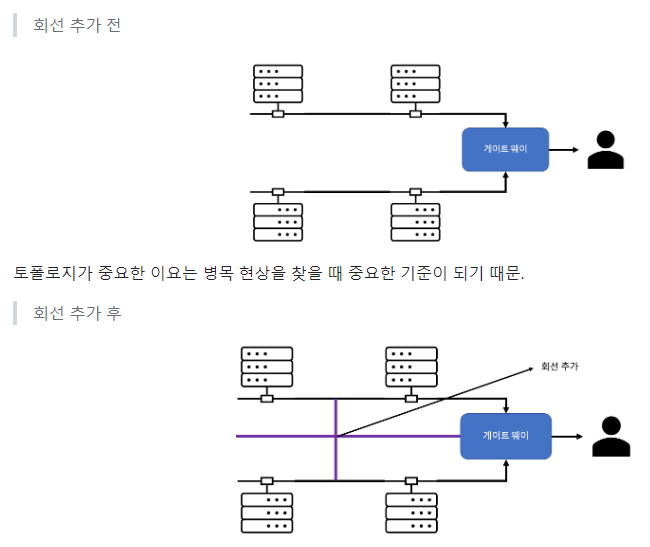

   

네트워크 토폴로지가 어떻게 되어있나 확인하고, 서버와 서버 간 그리고 게이트 웨이로 이어지는 회선을 추가해서 병목을 해결

네트워크가 어떤 경로, 어떤 토폴로지로 이루어져 있는지 알아야한다.

### 네트워크 분류

#### 네트워크 분류
: 네트워크 규모에 따라 네트워크를 분류할 수 있다.

LAN(Local Area Network)

MAN(Metropolitan Area Nework)

WAN(Wide Area Network)

### LAN (근거리 통신망)
근거리 통신망을 의미하며 전송 속도가 빠르고 혼잡하지 않다. 보통 집, 사무실, 학원 등 상대적으로 좁은 공간에서 사용한다.

### MAN (도시 지역 통신망)
인천시와 같은 시처럼 도시 규모에서 사용되는 네트워크를 의미한다.
전송 속도는 보통이며 LAN보다는 혼잡하다는 특징이 있다.

### WAN (광역 통신망)
국가나 대륙과 같이 광범위한 지역을 연결하는 네트워크이다.
전송 속도는 낮으며 MAN보다 혼잡하다.

### 네트워크 성능분석 명령어

- 네트워크로부터 발생한 문제점인 것을 확인하고 성능 분석을 한다

1. Ping (Packet INternet Groper)

 네트워크 상태를 확인하려는 대상 노드를 향해 일정 크기의 패킷을 전송하는 명령어이다. 해당 노드까지 패킷 수신 상태, 도달하기까지 시간, 네트워크 연결이 잘 돼 있는지 확인할 수 있다. ICMP 프로토콜(OSI 3계층)을 사용한다.

 

    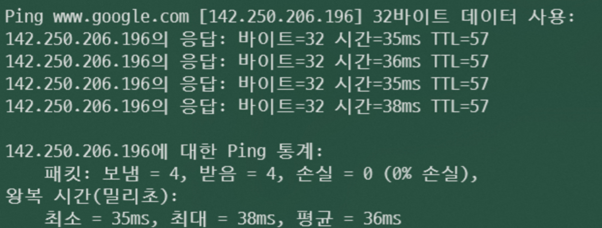

   

2. netstat

접속되어 있는 서비스들의 네트워크 상태를 표시하는 데 사용되며 네트워크 접속, 라우팅 테이블, 네트워크 프로토콜 등 리스트를 보여준다.

<참고> https://yoo11052.tistory.com/40 라우팅 테이블이란?

 

    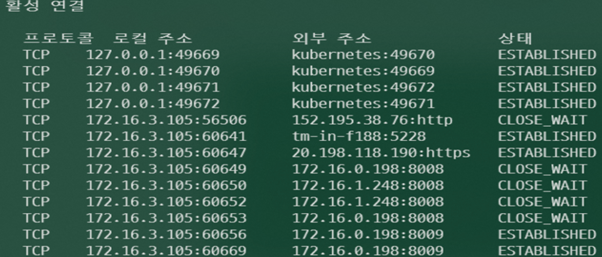

  

3. nslookup

DNS에 관련된 내용을 확인하기 위해 사용하는 명령어이다. 특정 도메인에 매핑된 IP를 확인할 때 사용한다. 서버의 네트워크가 제대로 설정되었는지 확인 할 때 사용

https://www.lesstif.com/system-admin/nslookup-20775988.html

4. tracert(Windows), traceroute(Linux)

목적지 노드까지 네트워크 경로를 확인할 때 사용하는 명령어이다. 목적지 노드까지 구간들 중 어느 구간에서 응답시간이 느려지는지를 확인할 수 있다.
 
 

    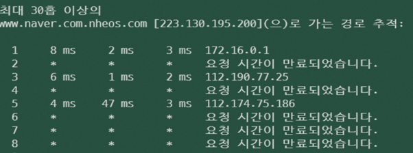

  

### 네트워크 프로토콜 표준화

네트워크 프로토콜은 다른 장치들이 서로 데이터를 주고받기 위해 설정된 인터페이스이다. 이런 프로토콜은 기업, 개인이 정하는 것이 아니라 IEEE 혹은 IETF 표준화 단체가 정한다.

IEEE802.3은 유선 LAN 프로토콜이다. 유선으로 LAN을 구축할 때 사용한다. 이를 이용해 다른 장치가 서로 데이터 수신이 가능하다.

예를 들면 우리는 HTTP 프로토콜로 웹에 접속한다. 그러면 HTTP를 활용해서 노드들은 웹 서비스 기반으로 데이터를 주고받을 수 있다.

프로토콜은 계층적 구조로 정의되어 있고, 계층별 역할이 구분된다(OSI 7계층에서 자세히 다룰것)

# 대역폭

공학에서는 ‘특정 기능을 수행할 수 있는 주파수 범위의 폭’
혹은 ‘단위시간 당 전송할 수 있는 데이터의 최대 용량’

Hz 단위로 측정. ( 전송 속도의 단위는 bps (초당 비트 수)를 사용한다. )

C=W*log(1+S/R) ( C=채널용량(bps), W=대역폭, S=신호의 전력, R=노이즈의 전력)

위 공식에 의해 대역폭의 Hz가 높아지면 bps 역시 높아지므로, 혼용하는 경향이 있다.

 

    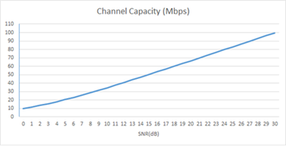

  
 
셰년-하틀리 정리에 따른 대역폭 : SNR(신호 대 잡음비) 그래프 -> 채널 용량

왜 알아야할까?

 

    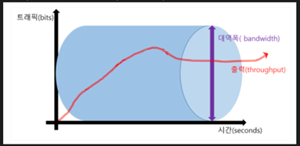

  
 
네트워크의 출력 = 물이고, 대역폭 = 파이프 라고 생각해보자.

물을 아무리 많이 집어넣어도 파이프의 크기가 작다면 적은 양의 물(출력)만 나올 것이다.

반대로 파이프의 크기가 물에 비해 너무 크다면, 비효율적인 파이프 크기로 비용이 낭비된다.

IF ) 100 bytes/s라면, 100 * 8 bits/s = 800bps로 볼 수 있다.

출력 > 대역폭인 현상이 발생하는 경우 (병목)
-	네트워크 지연 : 예상하지 못한 시간이 데이터 전달에 소요되는 현상
-	네트워크 혼잡 : 전달해야 하는 데이터의 양이 네트워크에 몰리는 현상
-	패킷 손실 : 예상하지 못한 패킷이 전달하는 동안 손실되는 현상

 

    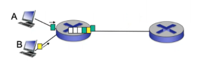

  

Delay : 패킷이 라우터에 도착했을 때, 라우터 버퍼에 패킷이 남아있으면 쌓이는 현상

Loss : 패킷이 쌓여 버퍼의 메모리 사이즈를 넘으면 버린다. 

https://www.websiterating.com/ko/web-hosting/glossary/what-is-bandwidth/

### 대역폭(bandwidth)

 

    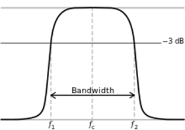

  

- 신호를 전송할 수 있는 주파수 범위 또는 폭
- 증폭기에서 신호가 차지하는 연속된 주파수 범위에서 기준값을 넘는 가장 큰 주파수와 가장 작은 주파수를 의미
- 한 가지로 정확하게 정의하기 모호하고 분야에 따라 구체적으로 정의되는 바가 다르므로 여기서는 컴퓨팅, 네트워크에서의 대역폭으로 한정지어 설명하고자 함

컴퓨팅에서의 대역폭(bandwidth) = 네트워크 대역폭(network bandwidth)
= 데이터 대역폭(data bandwidth) = 디지털 대역폭(digital bandwidth)
- 주어진 데이터를 전송하는데 필요한 주파수폭
- 주어진 시간 동안 인터넷 연결을 통해 전송할 수 있는 최대 데이터의 양
- 주파수폭이므로 단위는 Hz로 표시함
- 대역폭이 클수록 더 많은 데이터가 포함될 수 있으므로 더 짧은 시간에 더 많은 데이터를 전송할 수 있음
- 일반적으로 대역폭의 크기와 전송 속도는 비례관계이나 항상 그렇지는 않음

Ex. 그림과 같이 데이터를 압축할 경우 대역폭이 다르더라도 전송속도가 같아짐

 

    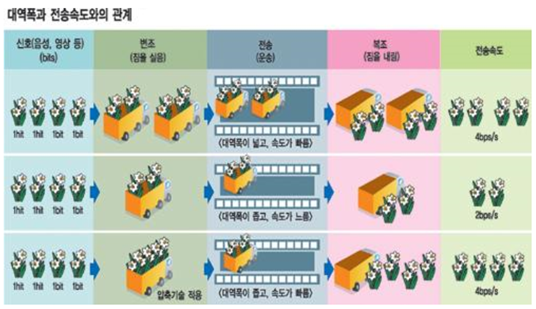

  

- 또한 전송 속도와 대역폭은 비슷하지만 다른 개념

Cf. 전송 속도: 어떤 네트워크 또는 시스템의 한 지점에서 다른 지점으로 데이터가 이동하는 속도, 대역폭 = N차선 도로 / 전송 속도 = 그 도로를 달리는 자동차의 속도

데이터 전송 속도 단위
-	초당 비트(bps: bits per second)
    - 디지털 데이터의 최소 단위
    - 10초 동안 전송할 수 있는 비트 수를 측정

-	초당 메가비트(Mbps: megabits per second)
    - 일반적으로 사용되는 대역폭 측정
    - 많은 양의 대역폭이 필요한 스트리밍 비디오 및 온라인 게임과 같은 작업에 중요

-	초당 기가비트(Gbps: gigabits per second)
    - 가장 높은 대역폭 측정값
    - 대량의 데이터에 대해 고속 데이터 전송이 필요한 대기업 및 데이터 센터에 중요

### 대역폭 조절

: 인터넷 서비스 공급자(ISP)가 사용자가 사용할 수 있는 네트워크 대역폭의 양을 제한하는 데 사용하는 기술

: 네트워크 정체를 관리하고 네트워크의 모든 사용자가 사용 가능한 대역폭을 공평하게 공유하도록 하기 위해, 인터넷 요금제에 따라 속도가 달라지는 것처럼 이익을 목적으로 등 다양한 이유로 수행됨

### 대역폭 종류: 인터넷 사용량에 따라 어떤 종류를 선택하는지 결정이 달라짐
-	대칭 대역폭
    - 업로드 및 다운로드 속도가 동일한 경우
    - 화상 회의, 대용량 파일 전송 및 클라우드 컴퓨팅과 같은 작업을 위해 고속 인터넷이 필요한 기업에 이상적
    - 집에서 일하거나 네트워크에 연결된 장치가 많은 사람들에게 유용

-	비대칭 대역폭
    - 업로드 속도와 다운로드 속도가 다른 경우
    - ISP에서 제공하는 가장 일반적인 유형의 광대역 연결
    - 일반 브라우징, 비디오 스트리밍 및 파일 다운로드를 위해 인터넷을 사용하는 사람들에게 적합
    - 주로 URL에 대한 접근 요청만 보내면 되는 업로드보다 파일 및 미디어를 다운로드하는 것이 더 많이 사용되기 때문에 다운로드 속도가 더 빠름
    - 우리가 알고 있는 데이터 전송 속도는 보통 다운로드 속도

